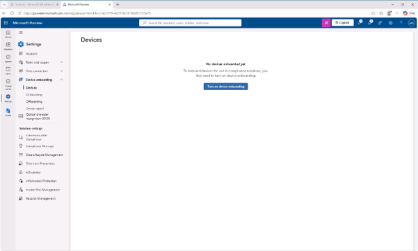
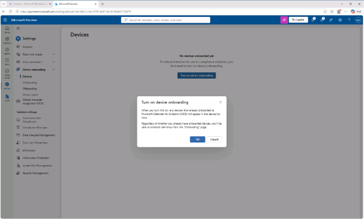

# 작업 2: 장치 온보딩 활성화

장치 온보딩을 활성화를 위한 작업을 진행합니다. 
1.	Purview 관리자 포탈화면에서 [설정]을 클릭하여 나타나는 화면에서 [장치(Device)]를 클릭합니다. 
  

2.	장치 온보딩의 설정이 비활성화 된 상태를 확인하고 [장치 온보딩 켜기(Turn on device onboarding)]을 클릭합니다. 
 

📝 참고: 이제 디바이스 온보딩이 활성화되어 Endpoint DLP 정책으로 보호할 디바이스를 온보딩할 수 있습니다. 이 기능을 활성화하는 과정은 최대 30분이 걸릴 수 있습니다.
