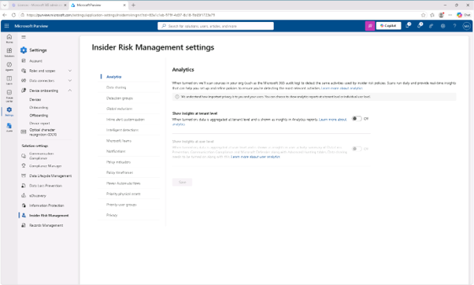
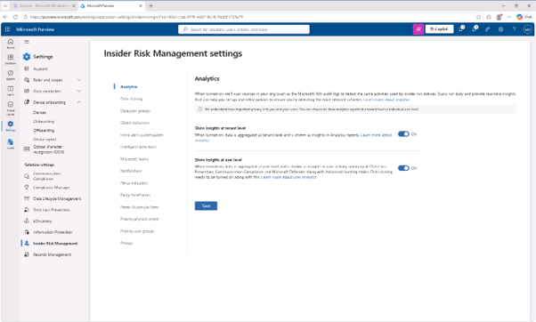
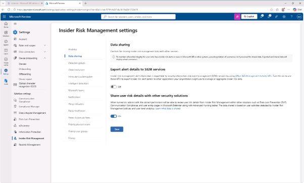

# 작업 3: 내부자 위험 분석 및 데이터 공유 활성화

내부자 위험 과리(IRM)을 위한 분석과 데이터 공유를 활성화 합니다. 

1.	Purview 관리자 포탈에서 [설정]에서 [솔루션 설정(Solution Seeting)] – [Insider Risk Management]를 클릭합니다.  
 

 

2.	Insider Risk Management Setting 화면에서 [테넌트 레벨의 인사이트 나타내기(show insight at tenant level)]과 [사용자 수준의 인사이트 나타내기(show insight at user level)]를 설정 후 [저장(save)]를 클릭합니다. 
 

 

3.	[데이터 공유(Data sharing)] 메뉴를 클릭하면 나타나는 화면에서 [다른 보안 솔루션과 사용자 위험 정보 공유(Share user risk details with other security solutions)]를 설정하고 [저장(save)]를 클릭합니다.  내부자 위험 관리를 위한 분석 및 데이터 공유를 활성화 됩니다.  

 

