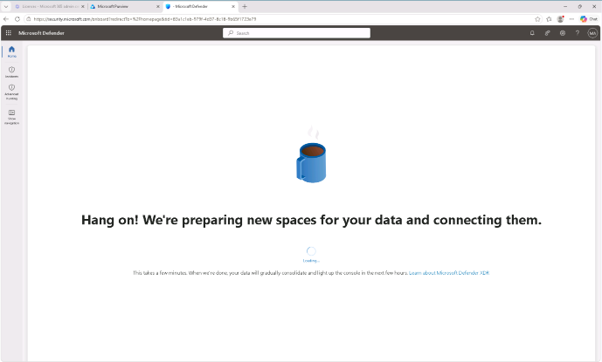

# 작업 4: Microsoft Defender XDR 초기화

Microsoft Defender XDR를 사용하기 위한 초기화 설정을 진행합니다. 

1.	Microsoft Edge에서 https://security.microsoft.com/ 로 이동해 Microsoft Defender를 엽니다.
 

2.	Microsoft Defender XDR이 이미 초기화되어 있는지에 따라 내비게이션이 다르게 보일 수 있습니다. 초기화가 완료되면, Incidents 및 경고가 조사 및 대응 대신 최상위 옵션으로 나타납니다.

 
3.	Microsoft Defender XDR이 준비 중이라는 메시지가 뜰 것입니다. 이 과정은 자동으로 진행되며 몇 분이 걸릴 수 있습니다. 설정이 끝나는 동안 다른 작업을 계속할 수 있습니다. 

 

