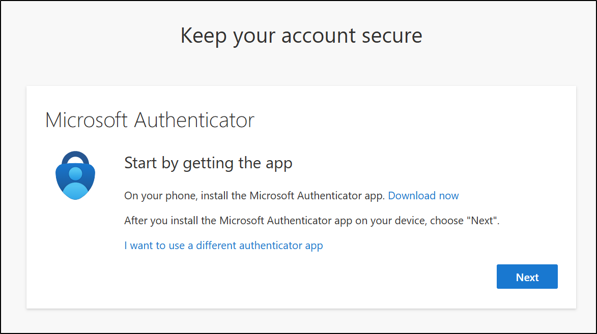

# 작업 5: Microsoft Entra에서 다단계 인증 구성

관리자 계정에 대해 다중 인증(MFA)을 설정하여 Microsoft Entra 및 기타 연결된 Microsoft 365 서비스에 안전하게 접근할 수 있도록 합니다.  

1.	Microsoft Edge에서 https://entra.microsoft.com/ 위치로 이동해 Microsoft Entra를 엽니다. 

2.	앱 시작 화면에서 기기 앱 스토어에서 Microsoft Authenticator 앱을 설치하거나, 이미 설치되어 있다면 실행한 후 [다음(Next)]을 클릭합니다. 

 

3.	QR 코드 스캔 화면에서 기기의 Microsoft Authenticator 앱을 사용해 화면에 표시된 QR 코드를 스캔한 후 [다음]을 선택합니다.
 

4.	휴대폰에서 브라우저에 표시된 번호를 입력하여 로그인 요청을 [승인]합니다.
 

5.	요청을 승인하면 [승인된 알림] 화면이 나타납니다. 다음을 선택합니다.
 

6.	성공! 화면에서 기본 로그인 방식에 Microsoft 인증기가 표시되어 있는지 확인한 후 [완료]를 선택하세요.
 

7.	다시 로그인하라는 메시지가 나오면, 휴대폰에서 로그인 요청을 승인하여 신원을 확인하게 됩니다. 
 

8.	승인이 완료되면 Microsoft Entra 관리자 센터로 연결됩니다.
 

📝 참고: Microsoft Entra에서 관리자 계정의 다중 인증(multifactor authentication)을 성공적으로 설정하고 검증이 완료되었습니다.
