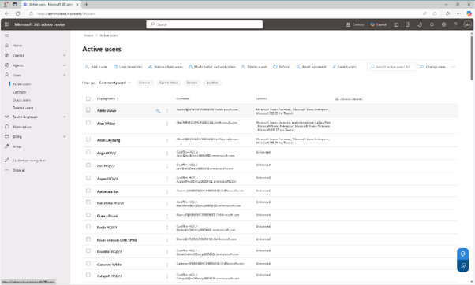
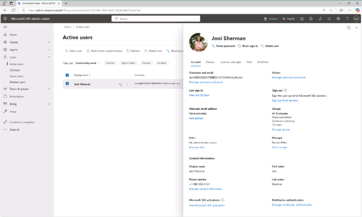
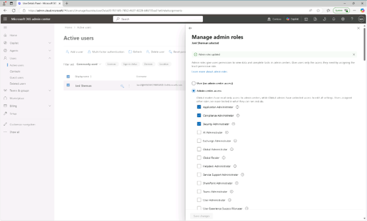

# 작업 1: 행정 역할 할당

1.Microsoft Edge를 열고 https://admin.microsoft.com 에서 MOD 관리자 이름으로 Microsoft 365 관리자 센터에 로그인 합니다.  

 
2.왼쪽 사이드바에서 사용자 항목을 펼친 후 [사용자(users)] - [활성 사용자(Active Users)]를 를 클릭합니다. 
 
 

 
3.활성 사용자 페이지에서 'Joni Sherman'을 검색한 후 Joni 계정의 속성은 오른쪽에 플라이아웃 패널에 나타나면, [역할 관리(Manages roles)]를 클릭합니다.
  

 
4.관리자 역할 관리 패널에서 관리자 센터 접근을 선택한 후 아래로 스크롤하여 '카테고리별로 모두 보기'를 펼치면 나타나는 관리자 중에서 세가지 관리자 권한을 선택한 후 [저장] 합니다.
* 애플리케이션 관리자(Application Administrator)
* 컴플라이언스 관리자(Compliance Administrator)
* 보안 관리자(Security Administrator)
  

 
5.“관리자 역할이 업데이트됨”이라는 메시지를 확인합니다. 

6.관리자 역할 관리 페이지에서 플라이아웃 패널 오른쪽 상단의 X 버튼을 선택해 패널을 닫습니다. 지정한 Joni Sherman에게 이 실험실의 업무를 완료하는 데 필요한 컴플라이언스 및 보안 관리자 역할을 성공적으로 배정됩니다. 
 
