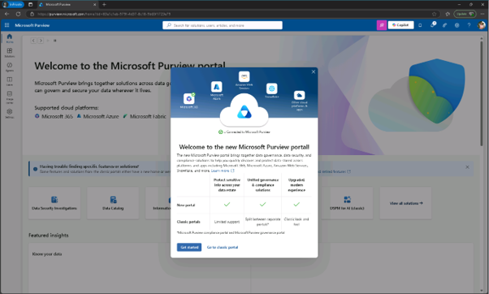
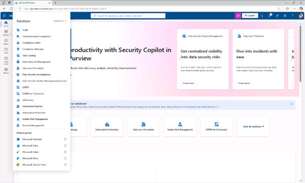

# 작업 2: Microsoft Purview 포털 탐색

조니 셔먼(Joni) 으로 로그인하여 정상적으로 관리자 권한을 부여 받았는지를 Microsoft Purview 포털을 탐색이 가능한지 확인합니다.  

1.Microsoft Edge에서 https://purview.microsoft.com 로 이동하세요.
 

 
 
2.새로운 Microsoft Purview 포털에 관한 메시지가 화면에 나타납니다. 새 포털에 접근하려면 시작하기 선택을 하세요. 

 

3.새로운 Microsoft Purview 포털의 레이아웃과 내비게이션을 탐색해 보세요. 끝나면 브라우저 창을 열어두고, 조니 셔먼으로 성공적으로 로그인했으며 랩을 계속할 준비가 됩니다.
 

 
