# Lab02 - 민감한 정보 유형 생성 및 관리

## 작업 1: 사용자 지정 민감 정보 유형 생성
이 작업에서는 "Employee"와 "ID" 키워드 근처의 직원 ID 패턴을 인식하는 새로운 사용자 지정 민감 정보 유형을 생성하게 됩니다.

1.	Microsoft Edge에서는 https://purview.microsoft.com 로 이동해 Microsoft Purview 포털에 로그인 합니다. (Joni 계정)  
2.	왼쪽 사이드바에서 [솔루션(Solutions)]을 선택한 후 [정보 보호(Information Protection)]를 선택하세요. 
 
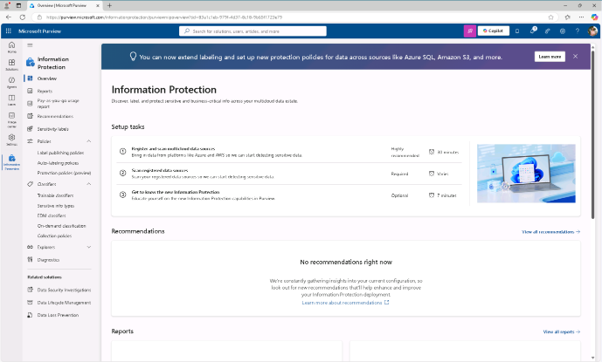 
3.	왼쪽 사이드바에서 [분류기(classifiers)] 를 펼친 후 [민감 정보 유형(Sensitive info types)]을 선택하세요. 

4.	민감한 정보 유형 페이지에서 [+ 민감한 정보 유형 만들기(Create sensitive info type)]를 선택해 민감한 정보 유형 구성을 시작합니다. 
 

 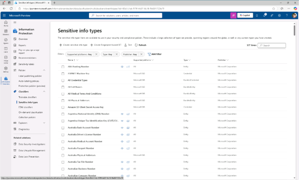
 
5.	'민감한 정보 이름 지정' 페이지에 다음을 입력한 후 다음(Next)을 선택 클릭합니다.
* 이름: Contoso Employee IDs
* 설명: Pattern for Contoso employee IDs. 
 
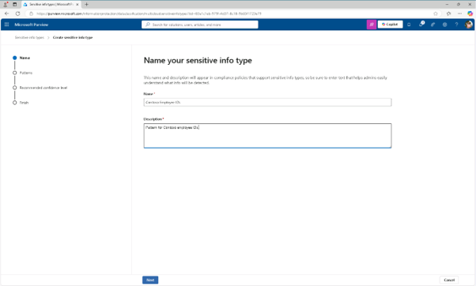 

6.	이 민감한 정보 유형 유형을 위한 패턴 정의 페이지에서 [패턴 생성(Create Pattern)]을 클릭합니다.   
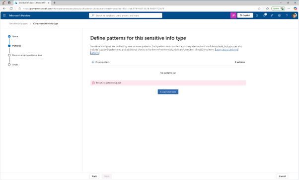 

7.	New pattern flyout 패널에서 [+ Add primary element] – [정규 표현식(regular expression)]을 클릭합니다.  

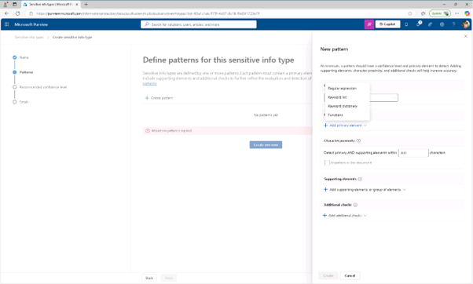 

8.	오른쪽에 정규 표현식 플라이아웃 패널을 추가하고, 다음을 입력합니다: 

* ID: Contoso IDs
* 정규 표현식: [A-Z]{3}[0-9]{6}
* [스트링 매치(String match)]를 위해 라디오 버튼을 선택 후 패널 하단에서 완료를 클릭합니다. 

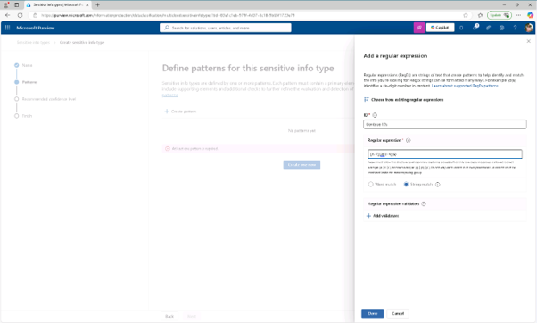 
 

9.	새 패턴 플라이아웃 패널에서 지원 요소 아래에서 + 지원 요소 추가(Add supporting elements) 또는 요소 그룹 드롭다운 메뉴를 선택한 후 [키워드 리스트(Keyword Lists)]를 클릭합니다. 

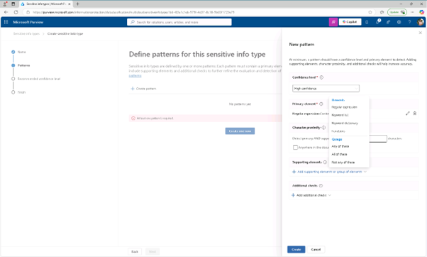
  

10.	오른쪽의 키워드 리스트 추가(Add a keyword list) 플라이아웃 패널에서 다음을 입력하세요: 
* ID: Employee ID keywords
* 대문자 구분 없음: Employee / ID(엔터로 구분)
* [단어 일치(word match)]를 위해 라디오 버튼을 선택하고, 패널 하단에서 [완료]를 클릭합니다.
  
 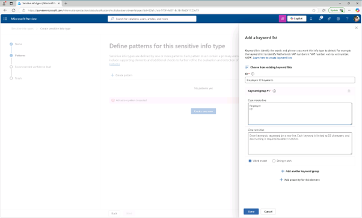
 

11.	다시 New pattern 패널의 Character proxity에서 Detect primary와 지원 요소 값을 “100”으로 설정한 후 패널 하단의 [생성(Create)] 버튼을 클릭합니다. 
 
 
 
12.	이 민감한 정보 유형 유형 패턴 정의 페이지에서 [다음(Next)]을 클릭합니다. 
 
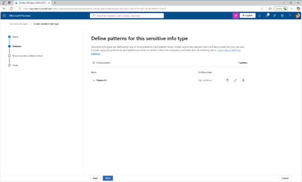 
13.	컴플라이언스 정책에 표시할 권장 신뢰 수준 선택 페이지에서 기본값을 사용한 후 [다음(next)]를 클릭합니다. 

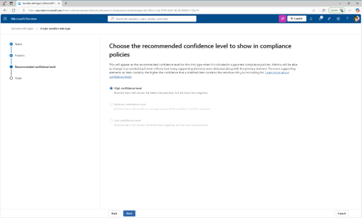 
 

14.	설정 검토와 완료 페이지에서 설정을 검토한 후 [생성(Create)]를 클릭합니다.  

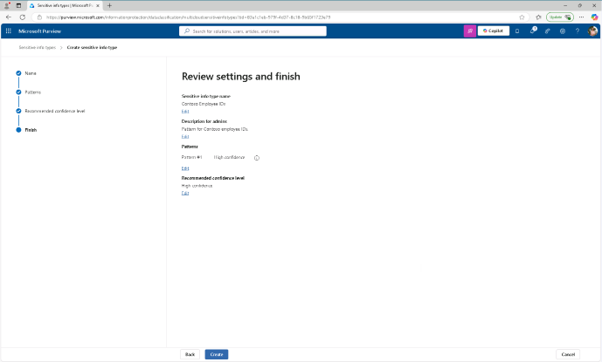
 

15.	성공적으로 생성되면 [완료]를 클릭하여 3개의 대문자, 6개의 숫자, 그리고 100자 범위 내에서 'Employee' 또는 'IDS' 키워드로 구성된 패턴으로 직원 ID를 식별하는 새로운 민감한 정보 유형을 성공적으로 생성하셨습니다. 
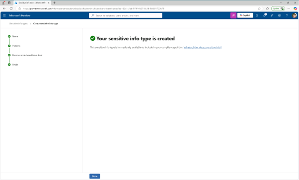 
 

