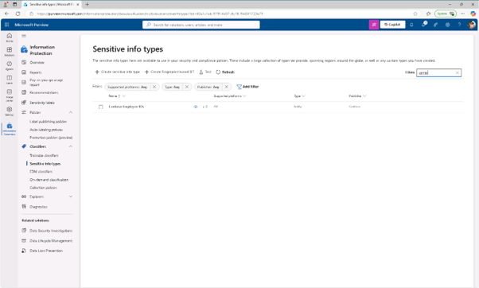
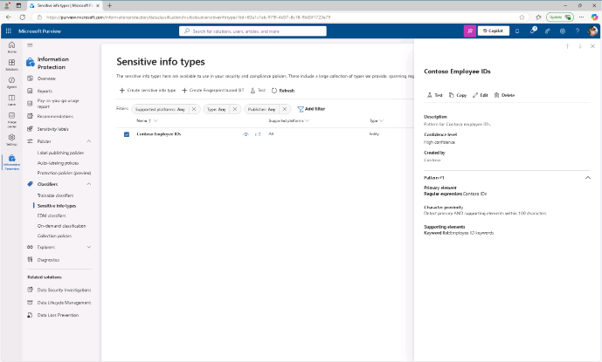
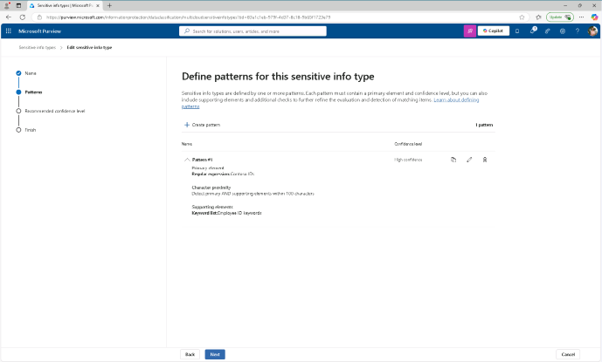
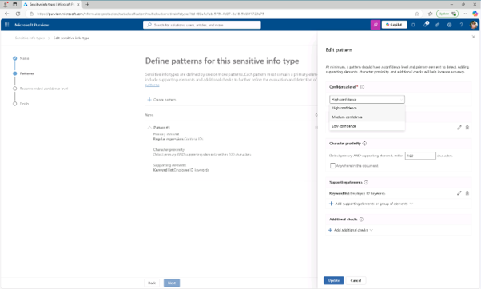
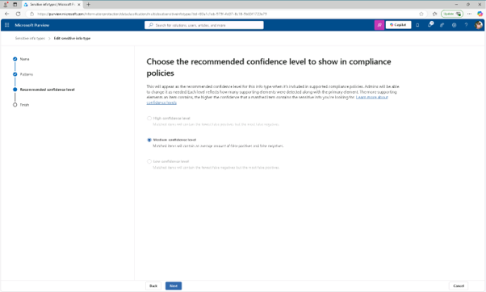

# 작업 2: 신뢰 수준을 수정하여 거짓 양성을 줄이세요

직원 신분증이 포함된 일부 문서가 감지되지 않는다는 보고를 탐지 범위를 높이기 위해 Employee ID SIT에서 패턴의 신뢰도를 낮춰 부분적인 증거만 발견되어도 트리거되도록 하여 탐지 가능성을 높입니다. 이로 인해 테스트 및 정책 시뮬레이션 중 탐지가 증가합니다.

 
1.	왼쪽 내비게이션에서 [정보 보호(Information Protection)] - 분류기 (Classifiers)] - [민감 정보 유형(Sensitive info types)]을 클릭합니다.  

 

 
2.	목록에서 검색하여 SIT 이름에서 [Contoso Employee IDs]를 선택하면 세부 정보 페이지를 나타나고, 페이지 상단에서 [편집(edit)]을 선택하여 SIT를 수정합니다.  
 
 

 
3.	'민감한 정보 이름 지정' 페이지에서 다음(Next)을 선택하세요. 

 
4.	이 민감한 정보 유형 패턴 정의 페이지에서 [패턴 #1]을 펼치고 설정을 검토 하고, 오른쪽에 있는 [연필 아이콘]을 선택해 패턴을 편집합니다. 

 

 
5.	편집 패턴 플라이아웃에서 신뢰 수준 드롭다운을 [중간 신뢰도(Medium confidence)]로 설정하면, 증거가 적은 매칭을 높은 신뢰도보다 허용되며, 플라이아웃 하단에서 [업데이트]를 클릭합니다. 

  
6.	리뷰 설정 및 완료 페이지에 도달할 때까지 [다음]을 클릭합니다. 
 

 
7.	저장을 선택한 후 [완료]를 선택하면 민감한 정보 유형을 업데이트 됩니다. 사용자 지정 SIT의 민감도를 높이기 위해 신뢰도 수준을 성공적으로 낮추었고, 부분적으로 일치하는 내용이 있는 문서가 플래그될 가능성을 높이는 데 도움을 줍니다. 
