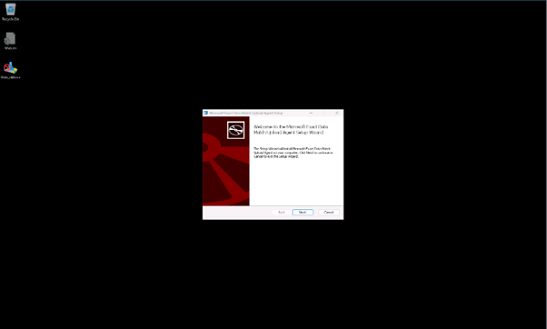
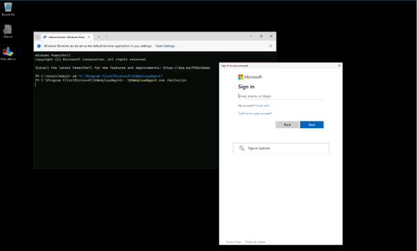
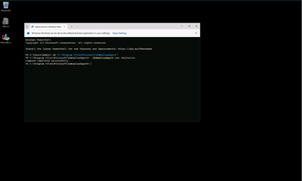
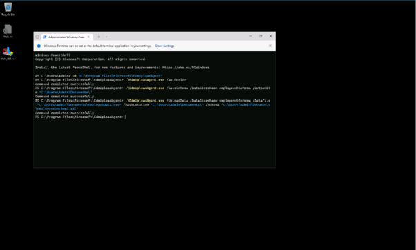
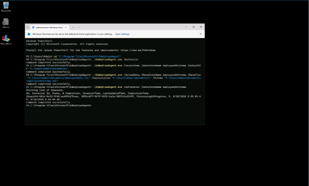
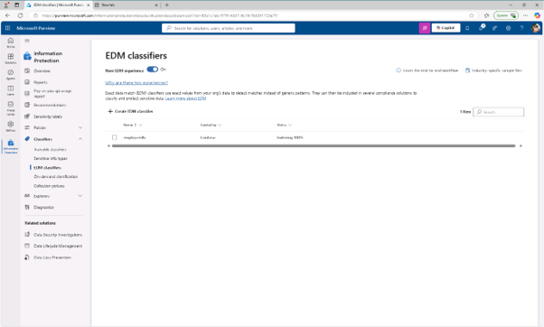

# 작업 5 : EDM 기반 분류 데이터 소스 생성
이 작업에서는 EDM 기반 분류 민감 정보 유형의 실제 데이터를 해시화하여 EDM 업로드 에이전트 도구를 통해 업로드합니다.

 
1.	Microsoft Edge에서 https://go.microsoft.com/fwlink/?linkid=2088639 로 이동해 EDM 업로드 에이전트를 다운로드하세요. 

 
2.	다운로드가 완료되면, Microsoft Edge 브라우저 창에서 파일 열기를 선택하여 Microsoft Exact Data Match Upload Agent Setup 마법사를 실행하여 설치를 완료 합니다.
 
 
 

 
3.	메모장을 실행하고, 다음 내용을 입력합니다.
Name,Birthdate,StreetAddress,EmployeeID
Joni Sherman,01.06.1980,1 Main Street,CSO123456
Lynne Robbins,31.01.1985,2 Secondary Street,CSO654321
메모장에서 [EmployeeData.csv] 파일 이름으로 [저장]니다. 
 

 
4.	작업 표시줄에서 Windows 심볼을 우클릭하고 터미널(관리자)을 실행합니다.
 

 
5.	터미널 창에서 EDM 업로드 에이전트 디렉터리로 이동합니다
cd "C:\Program Files\Microsoft\EdmUploadAgent"
 

 
6.	cmdlet을 실행하여 귀하의 계정으로 데이터베이스를 테넌트에 업로드할 권한을 부여 합니다.
.\EdmUploadAgent.exe /Authorize
 

 
7.	계정 선택 창이 뜰 때는 Jonis 계정으로 로그인합니다.
  

 
8.	터미널 창에서 이 스크립트를 PowerShell로 실행하여 EDM 기반 분류 민감 정보 유형의 데이터베이스 스키마 정의를 다운로드 합니다.  DataStoreName의 경우, 이전 작업에서 저장한 스키마 이름을 여기서 사용합니다. 
.\EdmUploadAgent.exe /SaveSchema /DataStoreName employeedbSchema /OutputDir "C:\Users\Admin\Documents\"
명령이 성공적으로 완료되었다는 메시지가 뜰 것입니다.
  

 
📝 참고: 마지막 명령어가 실패하면 EDM_DataUploaders 그룹 구성원 부여가 적용되기까지 더 많은 시간이 걸릴 수 있습니다. 스키마 파일을 다운로드할 수 있을 때까지 최대 1시간이 걸릴 수 있습니다.

 
9.	데이터베이스 파일을 해시하고 다음 스크립트를 PowerShell에서 실행하여 EDM 기반 분류 민감 정보 유형으로 업로드하기한 명령어를 실행합니다.
.\EdmUploadAgent.exe /UploadData /DataStoreName employeedbSchema /DataFile "C:\Users\Admin\Documents\EmployeeData.csv" /HashLocation "C:\Users\Admin\Documents\" /Schema "C:\Users\Admin\Documents\employeedbSchema.xml"
명령이 성공적으로 완료되었다는 메시지가 뜰 것입니다.
  

 
10.	이 명령어로 업로드 진행 상황을 확인하세요:
.\EdmUploadAgent.exe /GetSession /DataStoreName employeedbSchema
  

 
11.	터미널 창에서 상태가 완료되면, EDM 데이터는 사용 준비가 완료 합니다.
  

 

 
12.	Microsoft Purview 포털의 EDM 분류기 창을 새로고침하여 해시 상태를 확인할 수도 있습니다. 상태가 인덱스 완료로 설정되면 해시가 완료됩니다. 참고로 이 과정은 시간이 좀 걸릴 수 있습니다. 상태가 해시가 완료되었다고 표시되기 전에 GetSession 스크립트를 실행하거나 EDM 분류기 페이지를 여러 번 새로고침해야 할 수도 있습니다.
  

 
13.	터미널 창을 닫고, EDM 기반 분류 민감 정보 유형에 대한 데이터베이스 파일을 성공적으로 해시하고 업로드하셨습니다.
 