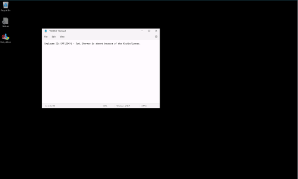
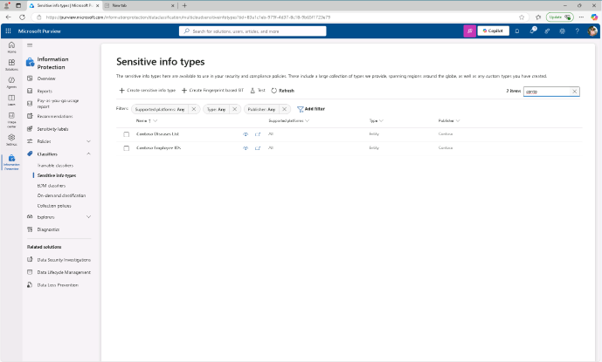
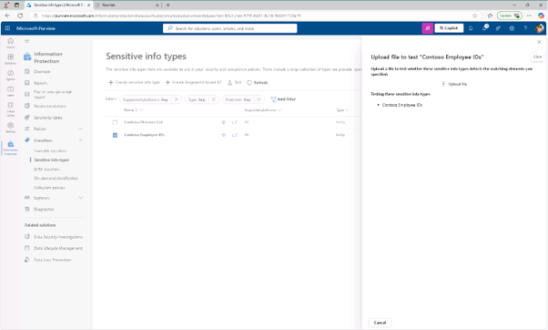
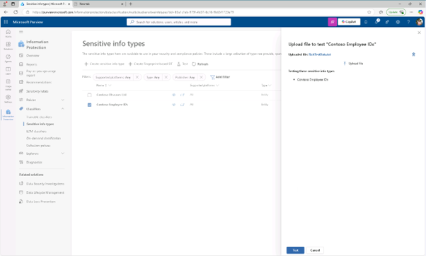
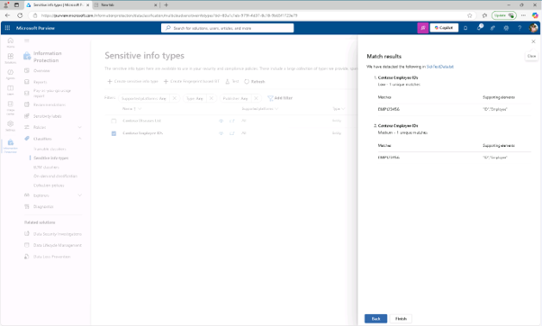

# 작업 7 : 사용자 지정 민감 정보 유형 테스트
정책에 사용하기 전에 항상 사용자 지정 민감 정보 유형을 테스트하세요. 그렇지 않으면 패턴이 잘못 구성되어 데이터 손실이나 누수가 발생할 수 있습니다.

 
 
1.	메모장을 실행하고, 다음 내용을 입력하고, SickTestData.txt 파일로 저장합니다.
Employee ID: EMP123456 - Joni Sherman is absent because of the flu/influenza
 
 
 

 
2.	Purview 관리자 페이지의 Sensitive info 유형 페이지에서 오른쪽 상단 검색창에서 “contoso”를 입력하여 검색합니다. 
  

 
3.	Contoso 직원 ID를 선택하고 [테스트(Test)]를 클릭합니다.  

 
4.	오른쪽의 "Contoso 직원 ID" 표시 패널을 테스트하는 업로드 파일에 생성한 파일 SickTestData.txt 업로드 합니다. 
  

 
5.	분석을 위하여 [테스트(Test)]를 클릭합니다.
  

 
6.	매치 결과 페이지에서 매치를 검토한 후 [종료((Finish))를 선택하여 테스트를 종료합니다. 두 가지 사용자 지정 민감 정보 유형을 성공적으로 테스트하셨고, 검색 패턴이 기대한 대로 작동하는지 검증하셨습니다.
 

 
7.	민감한 정보 유형으로 돌아가서 Contoso로 검색하여, 이번에는 [Contoso 질병 목록( Contoso Diseases List)] 민감한 정보 유형을 선택한 후 검사를 선택합니다. 
 

 
8.	오른쪽의 "Contoso Diseases List" 플라이아웃 패널을 테스트하기 위한 업로드 파일에서 업로드 파일을 선택하세요.
 

 
9.	왼쪽 창에서 문서를 선택하고 SickTestData.txt 파일을 선택한 후 열기를 선택하세요.
 

 
10.	분석을 시작하려면 테스트를 선택하세요.
 

 
11.	매치 결과 페이지에서 매치를 검토한 후 [마침(Finish)]를 클릭하여 테스트를 종료하세요.
 

 

