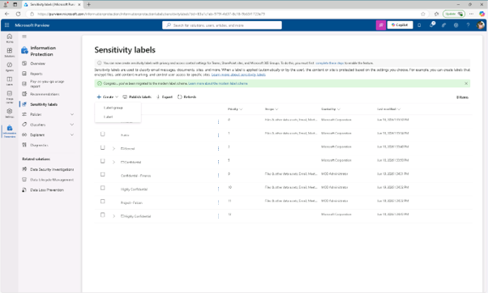
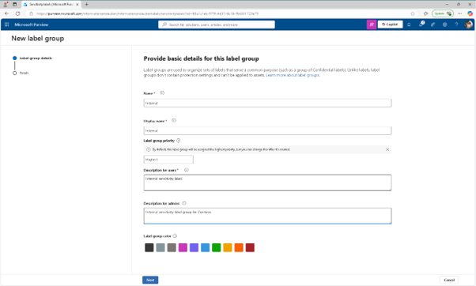
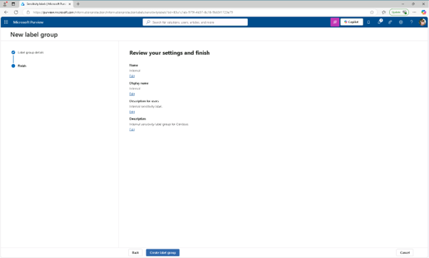
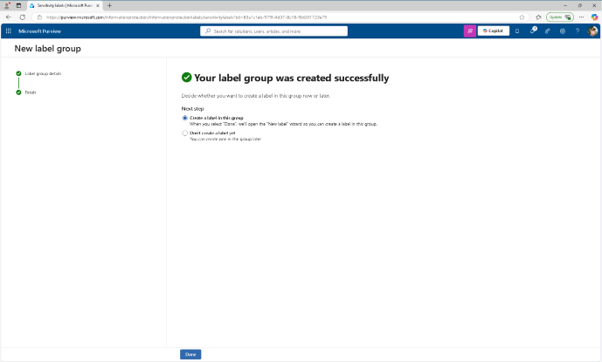

# 작업 2: 라벨 그룹 생성

이 작업에서는 내부 민감도 라벨을 정리하는 라벨 그룹을 생성하게 됩니다. 라벨 그룹은 부서나 사업부 분류와 같은 관련 라벨의 컨테이너 역할을 합니다.

 
1.	Microsoft Purview 포털에서 왼쪽 사이드바에서 솔루션(Solutions)을 선택한 후 정보 보호(Information Protection)를 클릭합니다.
 

 
2.	Microsoft 정보 보호 페이지의 왼쪽 사이드바에서 [민감도 라벨(sensitivity labels)]을 클릭합니다. 
 

 
3.	민감도 라벨 페이지에서 [+ 레이블 생성 그룹(label group)]을 클릭합니다.
 
 
 

 
4.	새로운 라벨 그룹 구성이 시작됩니다. 이 라벨 그룹의 기본 정보 제공 항목에 다음을 입력하세요:

+ 이름: Internal
+ 디스플레이명: Internal
+ 사용자 설명: Internal sensitivity label.
+ 관리자용 설명: Internal sensitivity label group for Contoso.
[다음(Next)]을 클릭합니다.
  

 
5.	설정 검토 및 완료 페이지에서 [라벨 그룹 생성]을 클릭합니다.
 

 
 
6.	'귀하의 라벨 그룹이 성공적으로 생성되었습니다' 페이지에서 '아직 라벨을 만들지 않음'을 선택한 후 [완료(Done)]을 클릭합니다. [내부용(Interanl)]으로 라벨 그룹을 만들었고, 이 그룹은 특정 부서나 데이터 카테고리에 대한 관련 라벨 관리를 도와줍니다.
 
 

