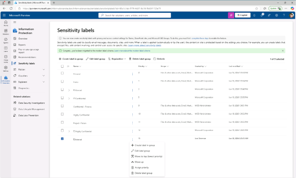
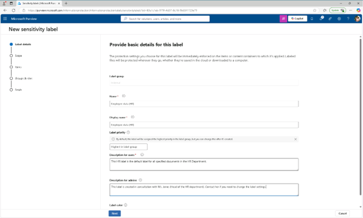
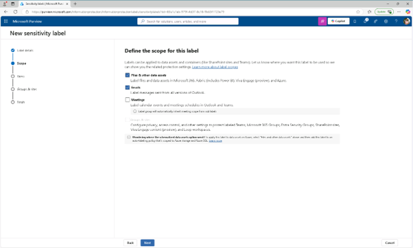
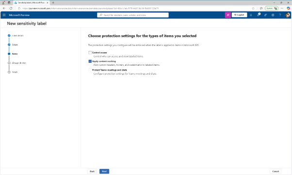
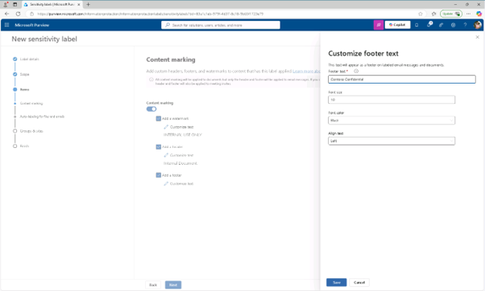
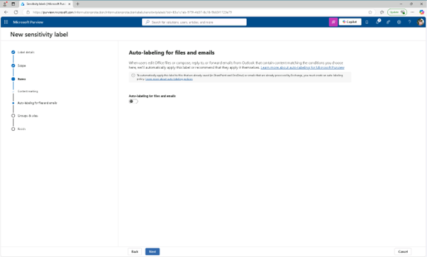
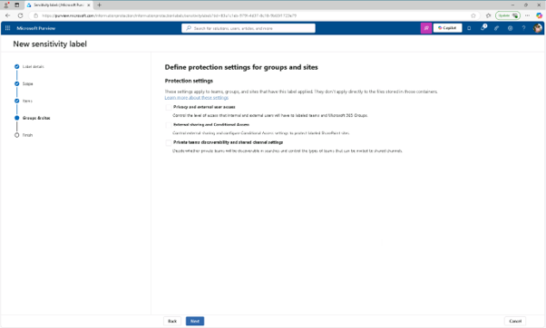
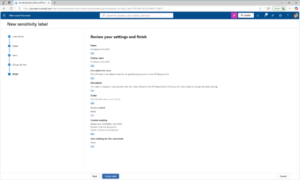
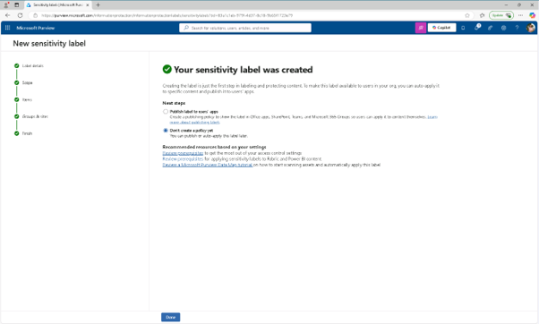

# 작업 3: 하위 라벨 만들기

라벨 그룹을 만들었으니, HR 관련 콘텐츠를 위한 자식 라벨을 추가하면 됩니다. 이 라벨은 인사 데이터를 무단 접근으로부터 보호하기 위해 암호화와 콘텐츠 표시를 강제합니다.

 
1.	민감도 라벨 페이지에서 내부 민감(Internal)도 라벨 그룹을 찾으세요. 그 옆에 있는 세로 타원(...)을 선택한 후, 드롭다운 메뉴에서 [+그룹 안에 레이블 생성]을 클릭합니다.
  

 
2.	새로운 민감도 라벨 마법사가 시작됩니다. 이 라벨에 대한 기본 정보 제공 페이지에 다음을 입력하세요:

+ 이름: Employee data (HR)
+ 디스플레이명: Employee data (HR)
+ 사용자 설명: This HR label is the default label for all specified documents in the HR Department.
+ 관리자용 설명: This label is created in consultation with Ms. Jones (Head of the HR department). Contact her if you need to change the label settings.
[다음(Next)]을 클릭합니다.
  

 
3.	이 라벨의 범위를 정의하는 페이지에서 파일 및 이메일을 선택하고, 회의(Meetings) 체크박스가 선택되어 있다면, 반드시 해제하고, [다음(Next)]을 클릭합니다.
  

 
4.	라벨링된 항목에 대한 보호 설정 선택 페이지에서 [콘텐츠 표시 적용(Apply content marking)] 옵션을 선택한 후 다음을 선택하세요.
  

 
5.	콘텐츠 표시 페이지에서 토글을 선택해 콘텐츠 표시를 활성화 합니다.
 

 
6.	다음 각 표시 유형에 대해 체크박스를 선택한 후 편집 아이콘을 선택하여 텍스트를 입력 합니다. 

+ 워터마크 : INTERNAL USE ONLY
+ 머릿글 : Internal Document
+ 바닥글 : Contoso Confidential
[다음(Next)]을 클릭합니다. 
  

 
7.	파일 및 이메일 자동 라벨링 페이지에서 [다음]을 클릭합니다.
  

 

 
8.	그룹 및 사이트에 대한 보호 설정 정의 페이지에서 [다음]을 클릭합니다. 
  

 
9.	설정 검토 및 완료 페이지에서 [라벨 생성]을 선택하세요.
  

 
10.	'Your sensitive label was created' 페이지에서 [아직 정책을 만들지 않음(Don't create a policy yet)]을 선택한 후 [완료]를 클릭합니다. 내부(Internal) 라벨 그룹 내에 자식 라벨을 생성하였고, 이 라벨은 인사 문서에 암호화 및 내용 표시를 적용하여 민감한 데이터를 쉽게 식별하고 정책에 의해 보호할 수 있도록 합니다.
 
 

