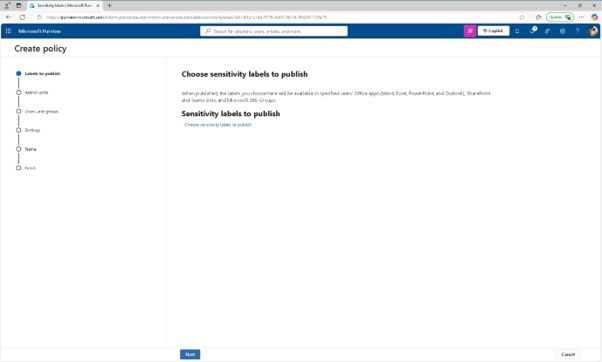
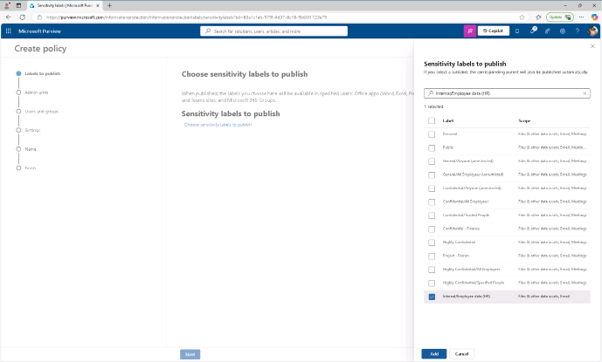
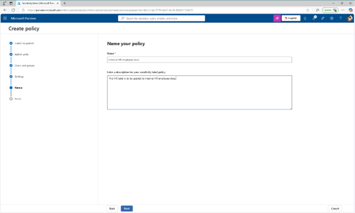
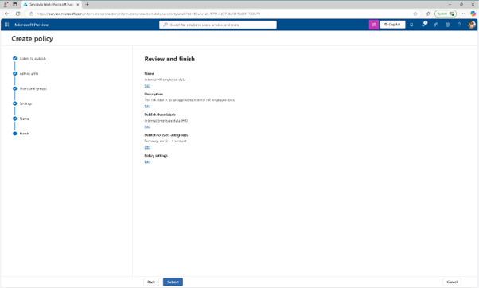
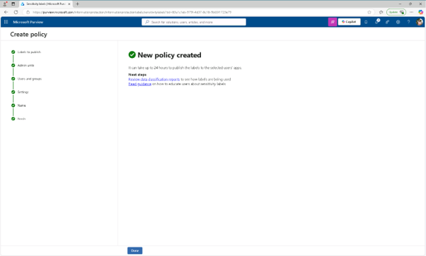

# 작업 4: 라벨 게시
다음으로, 내부 라벨 그룹에서 HR 라벨을 게시하여 HR 부서 사용자가 자신의 문서에 적용할 수 있도록 합니다.

 
1.	민감성 라벨 페이지에서 [레이블 게시]를 선택하세요.
  

 
2.	게시 민감도 라벨 설정이 시작됩니다. 게시할 민감도 라벨 선택 페이지에서 [게시할 민감도 라벨 선택]을 클릭합니다.
 

 
3.	민감성 라벨 투 게시 플라이아웃 패널에서 [내부/직원 데이터(HR)( Internal/Employee data (HR))] 체크박스를 선택한 후, 플라이아웃 페이지 하단의 추가를 선택하세요. '게시할 민감도 라벨 선택' 페이지에서 다음(Next)을 클릭합니다.
  

 
4.	관리자 단위 할당 페이지에서 [다음]을 클릭합니다.
 
5.	사용자 및 그룹에 게시 페이지에서 [다음]을 클릭합니다.
 
6.	정책 설정 페이지에서 [다음]을 클릭합니다.
 
7.	문서의 기본 설정에서 [다음]을 클릭합니다.
 
8.	이메일 기본 설정에서 [다음]을 클릭합니다.
 
9.	회의 및 캘린더 이벤트의 기본 설정에서 [다음]을 클릭합니다.
 
10.	Fabric 및 Power BI 콘텐츠 기본 설정에서 [다음]을 클릭합니다.
 
11.	'정책 이름 표시' 페이지에서 이름과 설명을 입력합니다. 

+ 이름: Internal HR employee data
+ 민감도 라벨 정책의 설명: This HR label is to be applied to internal HR employee data.
[다음]을 클릭합니다.
 
 
 

 
12.	리뷰 및 마무리 페이지에서 [제출(Summit)]을 클릭합니다.
  

 

 
13.	새 정책 생성 페이지에서 완료를 선택하여 라벨 정책 게시를 완료합니다. 내부 라벨 그룹과 그 HR 라벨을 공개하셨으니, 사용자가 HR 문서에 적용할 수 있습니다. 정책이 서비스 전반에 전파되는 데 최대 24시간이 걸릴 수 있습니다.
  

