# 작업 5: 자동 라벨링 설정

이제 금융 데이터에 대해 자식 라벨을 생성하고, 신용카드나 은행 라우팅 번호와 같은 금융 식별자가 포함된 콘텐츠에 자동으로 적용되도록 설정하세요.

 
1.	Microsoft Purview 포털에서 [정보 보호] – [민감도 라벨]을 클릭합니다.
 

 
2.	민감도 라벨 페이지에서 내부 민감도(Internal) 라벨에서 (...)을 선택한 후, 드롭다운 메뉴에서 [+그룹 내 라벨 생성]을 클릭합니다.
 

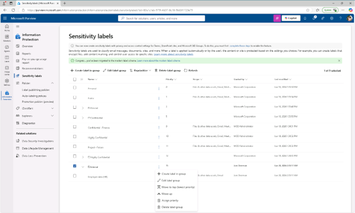 

 
3.	이 라벨의 기본 정보 제공 페이지에 다음을 입력하세요:

+ 이름 : Financial Data
+ 디스플레이 이름 : Financial Data
+ 사용자 설명 : This content contains financial data that must be labeled and protected.
+ 관리자용 설명  : This label is used for content that includes sensitive financial identifiers.
다음(Next)을 클릭합니다.
  

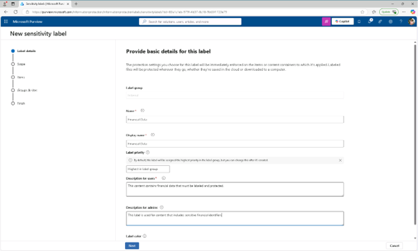
 
4.	이 라벨의 범위를 정의하는 페이지에서 [파일] 및 [이메일]을 선택하세요. [회의] 체크박스가 선택되어 있다면, 반드시 해제하고, [다음(Next)]을 클릭합니다.
  

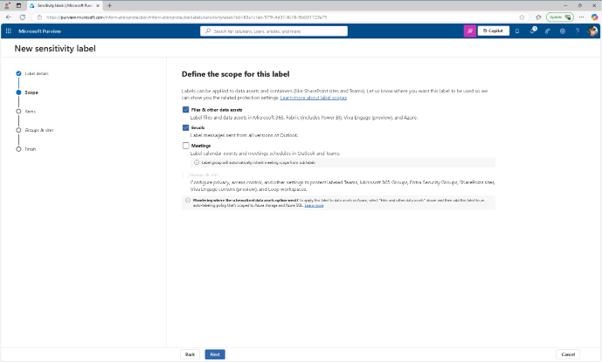
 
5.	라벨이 붙은 항목에 대한 보호 설정 선택 페이지에서 [다음(Next)]을 클릭합니다.
  

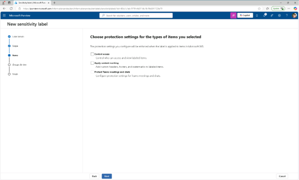
 
6.	파일 및 이메일 자동 라벨링 페이지에서 파일과 이메일의 [자동 라벨링을 활성화]로 설정합니다. 
 
 

 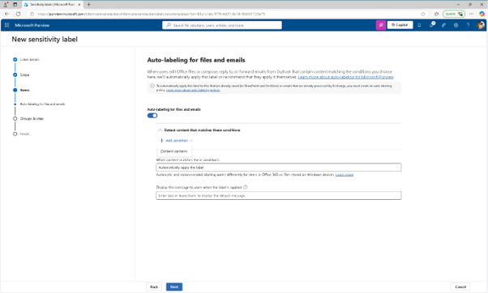

 
7.	'이 조건에 맞는 콘텐츠 감지' 섹션에서 [+'콘텐츠 포함 조건 추가] 선택하세요.
  

 
8.	콘텐츠 포함 섹션에서 [민감 정보 유형]을 선택하여 추가 합니다.
  

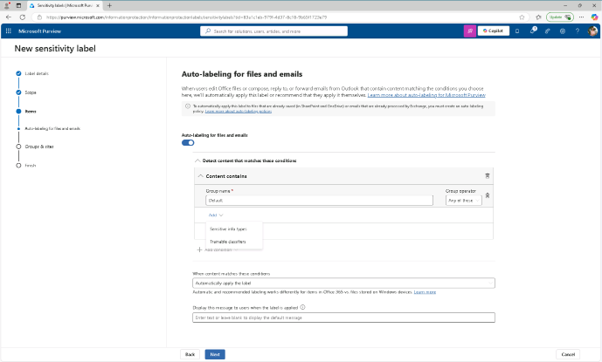

 
9.	민감 정보 유형 플라이아웃 페이지에서 다음 민감 정보 유형을 검색하고 선택하세요:

+ Credit Card Number
+ ABA Routing Number
+ SWIFT Code
[추가(add)]를 클릭합니다.
  

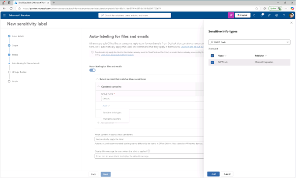
A.	Credit Card Number

 
10.	파일 및 이메일 자동 라벨링 페이지로 돌아가 [다음]을 클릭합니다.
  

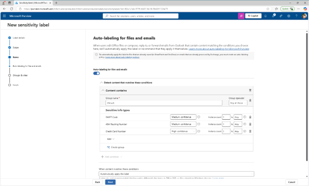

  
11.	그룹 및 사이트에 대한 보호 설정 정의 페이지에서 [다음]을 클릭합니다. 

 
12.	설정 검토 및 완료 페이지에서 [라벨 생성]을 클릭합니다.
 
13.	'Your sensitive label was created' 페이지에서 '민감한 콘텐츠에 라벨을 자동으로 적용'을 선택한 후 [완료(Done)]을 클릭합니다.
 
 
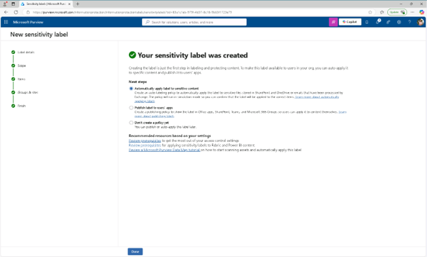
 
14.	자동 라벨링 정책 생성 플라이아웃 페이지에서 [정책 검토]를 클릭합니다.

 
15.	자동 라벨링 정책 이름 페이지에서 기본값을 남긴 후 [다음]을 클릭합니다.
 

 
16.	자동 적용할 라벨 선택 페이지에서 내부/재무 데이터 라벨(Internal/Financial Data label)이 선택되었는지 확인한 후 [다음]을 클릭합니다. 
  

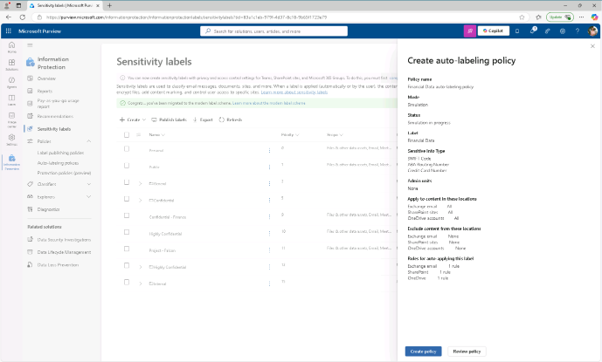

 
17.	관리자 단위 할당 페이지에서 [다음]을 클릭합니다.
  

 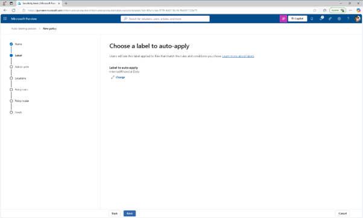

 
18.	라벨을 붙이고자 하는 위치 선택 페이지에서 다음 옵션을 선택하세요:

+ Exchange 이메일
+ SharePoint 사이트
+ OneDrive 계정
[다음(Next)]을 클릭합니다.
  

 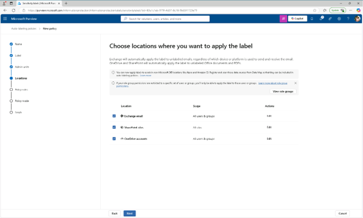

 
19.	'설정 공통 또는 고급 규칙' 페이지에서 [기본 공통 규칙]을 선택한 후 [다음]을 클릭합니다. 
  

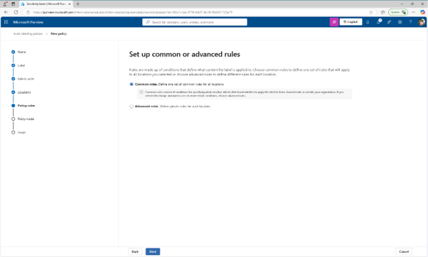

 
20.	'모든 장소의 콘텐츠에 대한 규칙 정의' 페이지에서 금융 데이터 규칙을 펼쳐 예상되는 규칙이 정의되었는지 확인한 후 [다음]을 클릭합니다.
  

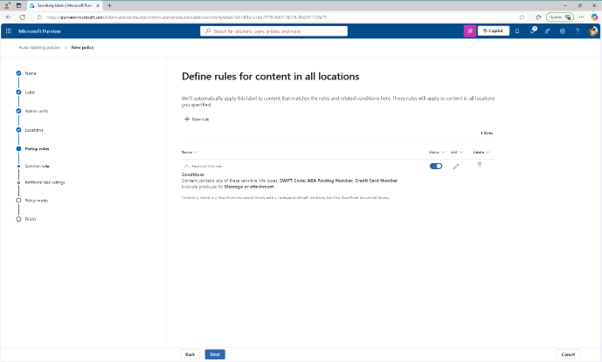

 
21.	이메일 추가 설정 페이지에서 [다음]을 클릭합니다.
 

 
22.	'지금 정책을 테스트할지 나중에 할지 결정할지' 페이지에서 시뮬레이션 모드에서 정책 실행 옵션을 선택하고, [시뮬레이션 7일 후 수정되지 않으면 정책 자동 켜기] 체크박스를 선택하고, 다음(Next)을 클릭합니다.
 
 
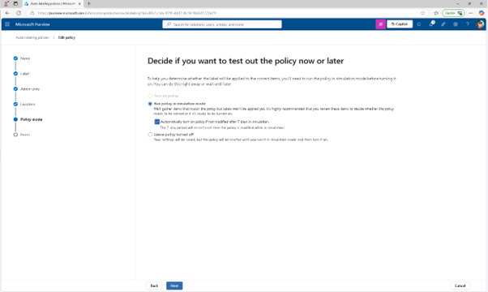
 
23.	검토 및 완료 페이지에서 [정책 생성]을 클릭합니다.
 
 

 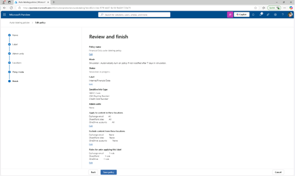
 
24.	자동 라벨링 정책이 생성되었습니다 페이지에서 [완료(Done)]를 클릭하여 완료 합니다. 금융 데이터를 위한 자식 라벨을 만들고, 금융 정보가 포함된 콘텐츠를 감지하고 라벨을 붙이는 자동 라벨링 정책을 설정하셨습니다.
  

 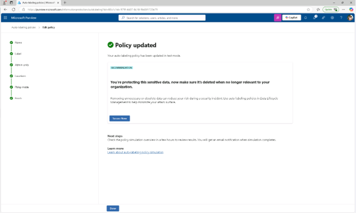

