# 작업 6: 기밀 콘텐츠에 대한 DKE 라벨을 생성하고 게시한다

다음으로, 내부 그룹에 자식 라벨을 생성하여 이중 키 암호화(DKE)와 동적 워터마킹을 사용하여 기밀 법률 콘텐츠를 보호합니다.

 
1.	Microsoft Purview 포털에서 [정보 보호] – [민감도 라벨] 솔루션 선택을 클릭합니다. 
 

 
2.	민감도 라벨 페이지에서 [내부 민감도 라벨 그룹]에서(...)을 선택한 후, 드롭다운 메뉴에서 [+ 그룹 내 라벨 생성]을 클릭합니다. 
  

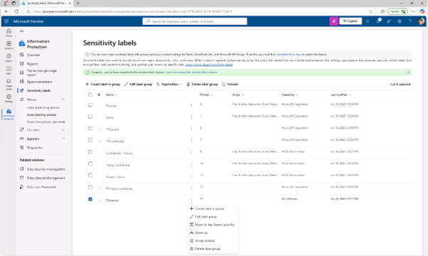
 
3.	이 라벨의 기본 정보 제공 페이지에 다음을 입력하세요:

+ 이름 : Confidential Legal
+ 디스플레이 이름 : Confidential Legal
+ 사용자 설명 : Use this label for highly sensitive legal content that must be encrypted using Double Key Encryption.
+ 관리자용 설명 : Label configured with DKE and dynamic watermarking for highly sensitive legal content.
[다음(Next)]을 클릭합니다.
  

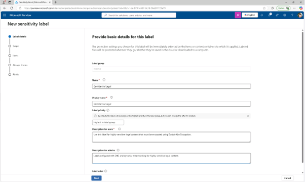

 
4.	이 라벨의 범위를 정의하는 페이지에서 [파일] 및 [이메일]을 선택하고, [회의] 체크박스가 선택되어 있다면, 반드시 해제해 합니다.
  

 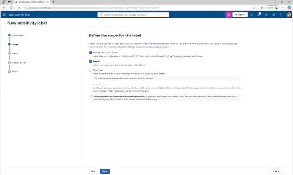

 
5.	선택한 항목 유형에 대한 보호 설정 선택 페이지에서 [접근 제어(Access Control)]를 선택한 후 [다음]을 클릭합니다. 
  

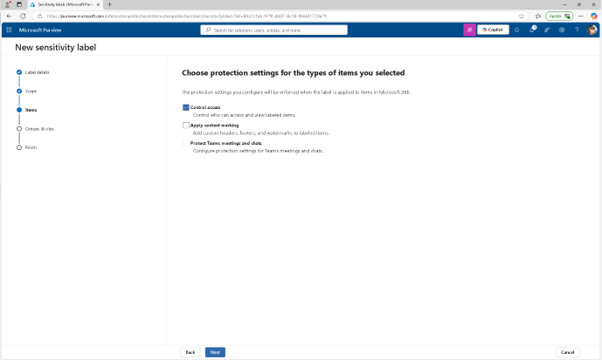

 
6.	접근 제어 페이지에서 '접근 제어 설정 설정'을 선택하세요.
 

 
7.	암호화 설정을 다음 옵션으로 설정하세요: 

+ 지금 권한 할당할까요, 아니면 사용자가 결정하게 할까요?: 지금 권한 할당(Assign permissions now)
+ 사용자 콘텐츠 접근 종료: 라벨 부착 후 며칠 후(A number of days after label is applied)
+ 라벨이 붙은 후 이 날짜가 지나면 접근 권한이 만료됩니다: 5
+ 오프라인 접근 허용: 안함(Never)
  
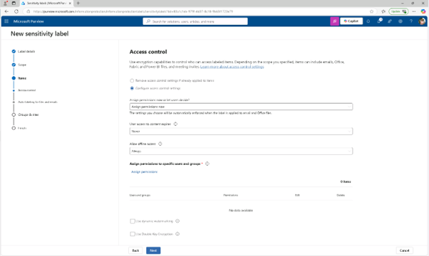

 
8.	권한 할당 링크를 선택하세요. 권한 할당 플라이아웃 패널에서 [+사용자 또는 그룹 추가]를 클릭하고, [사용자 또는 그룹 추가] 플라이아웃 페이지에서 검색하여 [Legal Team]과 [Joni Sherman]를 추가 후 권한 할당 페이지에서 [저장]을 클릭합니다.
  

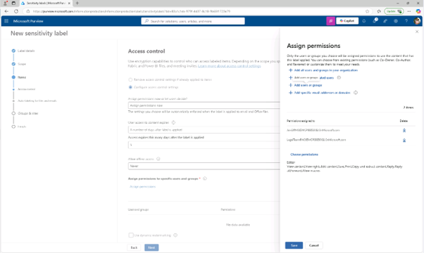

 
9.	접근 제어 페이지로 돌아가 [동적 워터마킹 사용] 체크박스를 선택한 후 텍스트 맞춤(선택 사항)을 선택합니다.
 

 
10.	워터마크에 맞춤 텍스트 추가(선택 사항) 페이지에서 , “Confidential”을 입력한 후 UPN과 타임스탬프를 선택하고, 플라이아웃 페이지 하단에서 [저장]을 클릭합니다. 
  

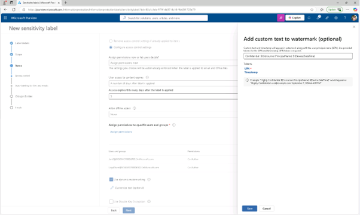
 
11.	접근 제어 페이지로 돌아가 [이중 키 암호화 사용] 체크박스를 선택하고 이중 키 암호화 서비스의 URL을 입력하세요. https://testingdke1.azurewebsites.net/Test 한 후 [다음(Next)]을 클릭합니다.
  

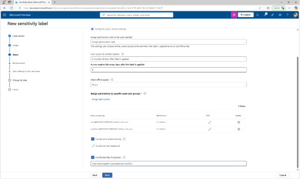
 
12.	파일 및 이메일 자동 라벨링 페이지에서 [다음]을 클릭합니다. 

 
13.	그룹 및 사이트에 대한 보호 설정 정의 페이지에서 [다음]을 클릭합니다.
 

 
14.	설정 검토 및 완료 페이지에서 [라벨 생성]을 클릭합니다.
 

 
15.	'Your sensitive label created ed' 페이지에서 'Publish label'을 사용자의 앱에 선택한 후 [완료(Done)]을 클릭합니다.
  

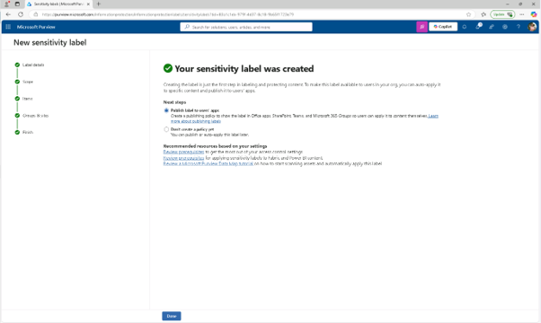
 
16.	Publish 라벨 플라이아웃 페이지에서 [새 라벨 정책 만들기]를 클릭합니다.
  

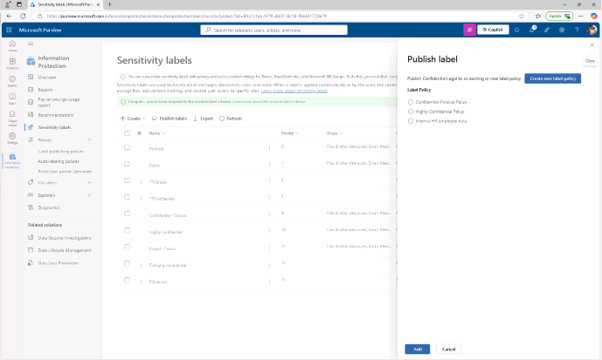
 
17.	'게시할 민감성 라벨 선택' 페이지에서 '게시할 민감성 라벨 선택'을 선택하고 [내부/기밀 법률 라벨(Internal/Confidential Legal)]을 을 추가한 후 [추가]를 클릭한 후 [다음(Next)]을 클릭합니다.
  

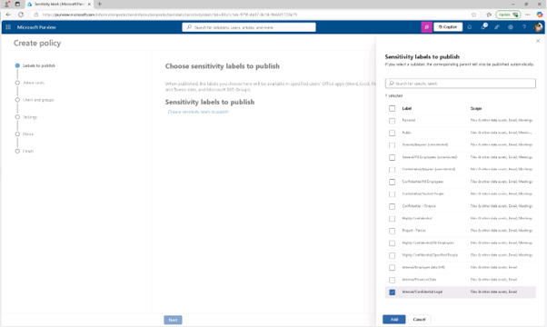
 
18.	관리자 단위 할당 페이지에서 [다음]을 클릭합니다.
 

 
19.	사용자 및 그룹에 게시 페이지에서 기본값을 선택한 후 [다음]을 클릭합니다.
 

 
20.	정책 설정 페이지에서 [사용자가 라벨을 제거하거나 분류를 낮추기 위한 정당성을 제공해야 한다(Users must provide a justification to remove a label or lower its classification)]체크박스를 선택한 후 [다음]을 클릭합니다.
 

 
21.	문서 기본 설정 페이지에서 [다음]을 클릭합니다. 
22.	이메일 기본 설정 페이지에서 [다음]을 클릭합니다. 
23.	회의 및 캘린더 이벤트 기본 설정 페이지에서 [다음]을 클릭합니다.  
24.	Fabric 및 Power BI 콘텐츠 기본 설정에서 [다음]을 클릭합니다. 

 
25.	'정책 이름 표시' 페이지에서 다음을 입력하세요:

+ 이름: Confidential Legal
+ 설명: Enables manual use of the DKE label for confidential content accessible by Legal.
[다음]을 클릭합니다.
  

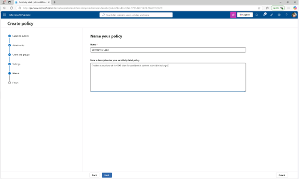

 
26.	리뷰 및 마무리 페이지에서 [제출]를 클릭합니다.
  

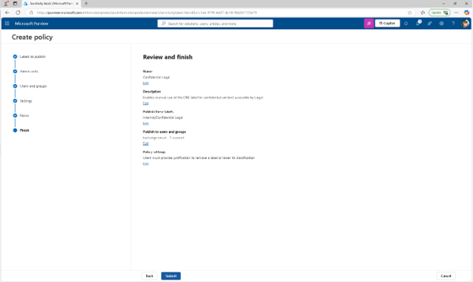
 
27.	새 정책 생성 페이지에서 [완료]를 클릭합니다. 이중 키 암호화와 동적 워터마킹을 사용해 자식 브랜드를 생성하고 게시하셨습니다. 이 라벨은 권한 있는 사용자의 접근을 제한하고 분류 하향 조정에 대한 정당성을 강화합니다.
 

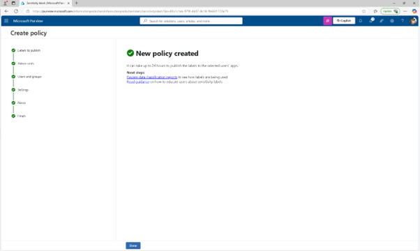