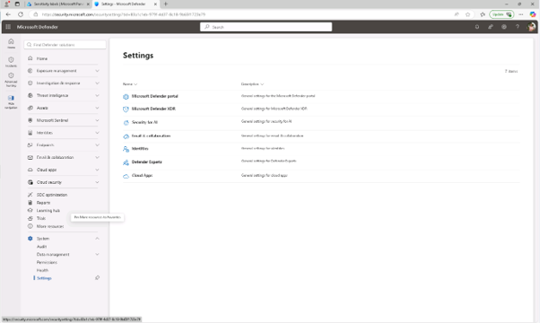
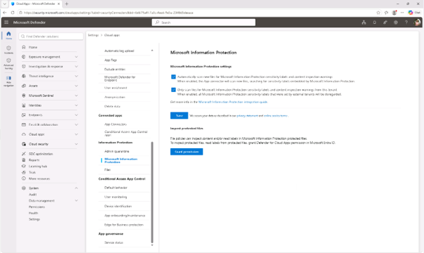
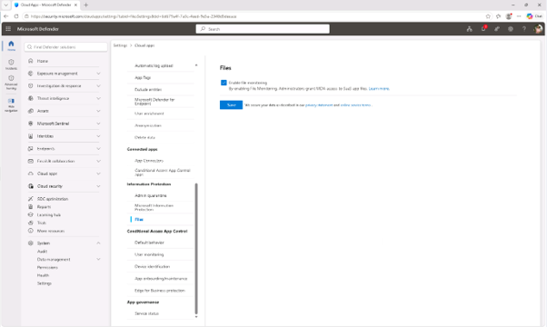

# 작업 7: Defender for Cloud Apps에서 Microsoft Purview 통합 활성화

민감도 라벨을 생성하고 게시하면, 이제 Microsoft Purview와 Microsoft Defender for Cloud Apps를 통합할 수 있습니다. 이 통합을 통해 디펜더는 민감도 라벨을 스캔하고 파일 모니터링을 적용할 수 있습니다.

 
1.	Microsoft Edge를 열고, https://security.microsoft.com 관리 사이트로 이동합니다. 

 
2.	왼쪽 내비게이션에서 [시스템] – [설정] – [Cloud App]을 클릭합니다. 

 
3.	왼쪽 창의 [정보 보호 섹션] – [Microsoft 정보 보호]를 클릭합니다. 

 
4.	Microsoft 정보 보호 페이지에서 제공되는 두 체크박스를 모두 선택하세요. 

+  Microsoft 정보 보호 민감성 라벨과 콘텐츠 검사 경고를 위해 새 파일을 자동으로 스캔 Defender for Cloud Apps가 Microsoft Purview의 민감성 라벨 및 콘텐츠 검사 경고를 위해 새 파일 또는 수정된 파일을 자동으로 스캔]
+ [이 테넌트의 Microsoft 정보 보호 민감성 라벨과 콘텐츠 검사 경고만 스캔하세요 스캔을 자신의 조직에서 생성한 라벨과 경고로 제한하고 외부 사용자가 붙인 라벨은 무시]
설정을 적용하려면 [저장]을 클릭합니다.
  

 
5.	왼쪽 창의 [정보 보호 섹션] – [파일]을 클릭합니다.
 

 
6.	파일 페이지에서 [파일 모니터링 활성화]을 클릭한 후 [저장]을 클릭합니다Defender for Cloud Apps에서 Microsoft Purview 통합을 활성화하셨습니다. Defender는 이제 민감성 라벨을 감지하고 정책 평가 및 거버넌스 작업을 위한 파일을 모니터링할 수 있습니다.
  

