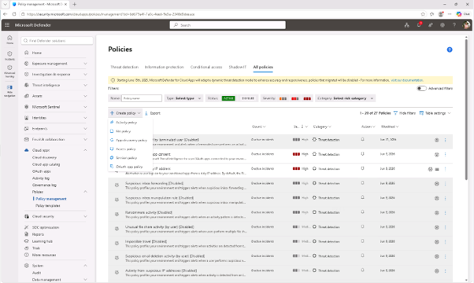
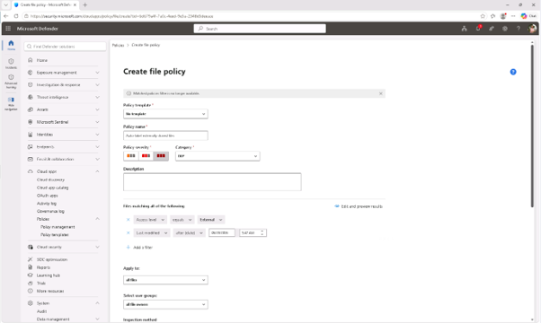
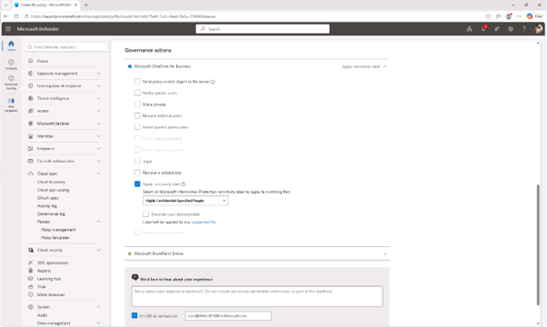
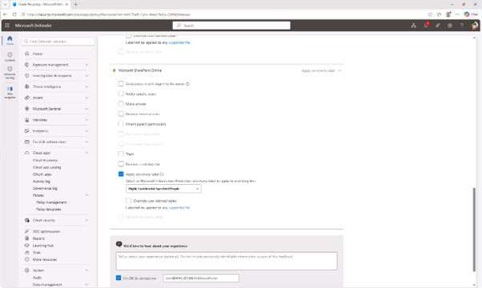
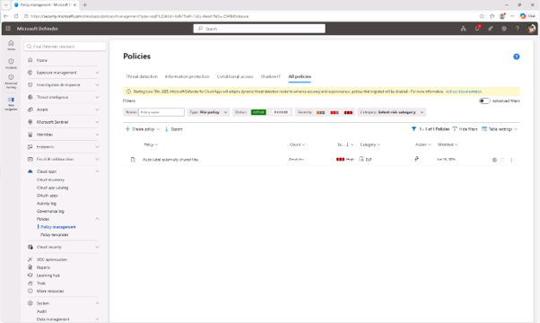

# 작업 8: 외부 공유 파일에 레이블을 붙이는 파일 정책 생성

외부에서 공유되는 파일에 자동으로 민감성 라벨을 적용하는 파일 정책을 만듭니다. 이로 인해 민감한 콘텐츠는 조직 외부에 공유되더라도 보호받을 수 있습니다.

 
1.	Microsoft Defender에서 왼쪽 내비게이션에서 [Cloud app] – [정책 관리(Policy management)를 클릭합니다.
 

 
2.	정책 화면에서 [+정책 생성] –[파일 정책]을 클릭합니다.
  

 
3.	파일 정책 생성 페이지에서 다음을 설정하세요:

+ 정책 명칭: Auto-label externally shared files
+ 정책 중증도: 높은
+ 카테고리: DLP
+ 다음 섹션 모두를 일치하는 파일에서:
+ 액세스 레벨 : 외부
+ 마지막 수정 이후로 설정하고 오늘의 날짜를 설정
+ 거버넌스 행동 항목에서 Microsoft OneDrive for Business를 확장하고, [민감도 라벨 적용 체크박스] 선택하고 [Highly Confidential-Specified People]라벨을 지정합니다. 
+ Microsoft SharePoint Online에서도 같은 과정을 반복하세요
+ [민감도 라벨 적용 체크박스] 선택하고 [Highly Confidential-Specified People]라벨을 지정합니다. 
파일 정책 생성을 마치려면 [생성(Create)]를 클릭합니다.
  

 

 
 
 

 
 
4.	외부 공유 파일에 민감도 라벨을 적용하는 파일 정책을 생성하였고, 이 정책은 클라우드 저장 콘텐츠까지 정보 보호 전략을 확장합니다.
  

