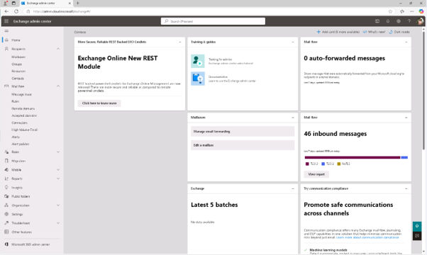
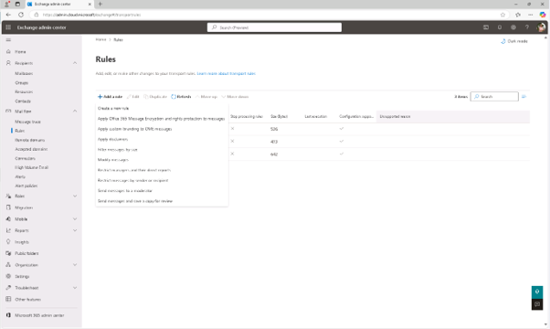
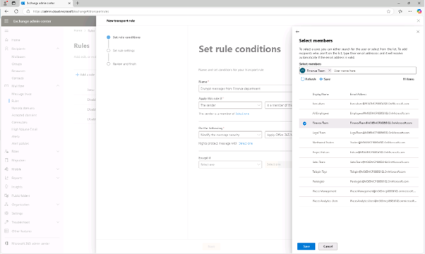
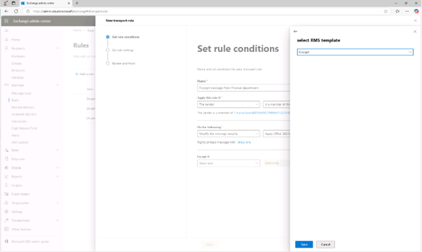
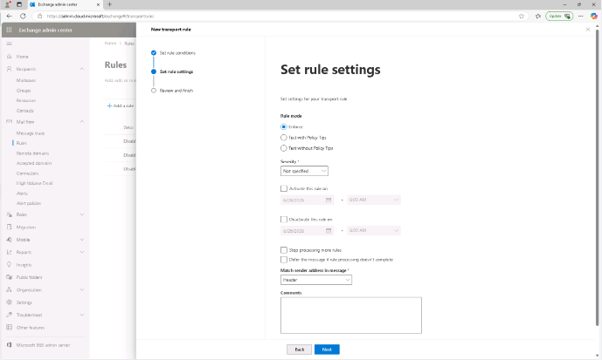
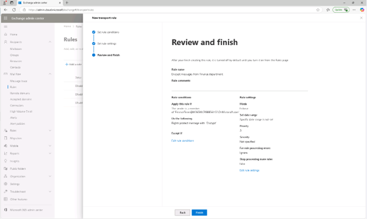
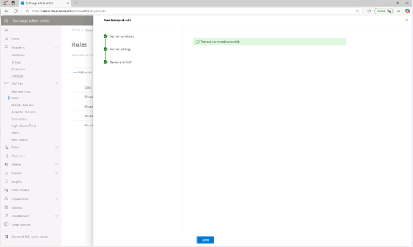
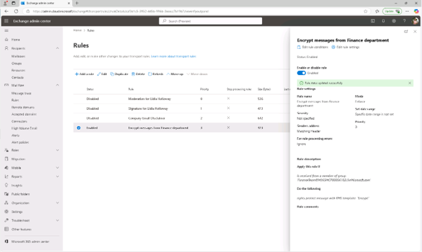

# Lab04 - Microsoft Purview 메시지 암호화 배포
## 작업 1: 재무 부서에서 온 메시지를 암호화하는 메일 플로우 규칙을 만드세요

이 작업에서는 Exchange 관리자 센터를 사용하여 재무팀 그룹의 모든 메시지에 Microsoft Purview 메시지 암호화를 적용하는 메일 흐름 규칙을 생성하게 됩니다.

 
1.	Microsoft Edge에서 https://admin.exchange.microsoft.com 로그인 합니다.(JoniS 계정)
  

 
2.	왼쪽 내비게이션 창에서 [메일 흐름(Mail flow)] – [규칙(Rule)를 클릭합니다.
 

 
3.	규칙 페이지에서 [규칙 추가(Add a rule)] - [+ Office 365 메시지 암호화 및 메시지 권한 보호 적용(Apply Office 365 Message Encryption and rights protection to messages)]를 클릭합니다.
  

 
4.	Set 규칙 조건 페이지에서 다음을 구성하세요:

+ 이름: Encrypt messages from Finance department
+ '이 규칙 적용' Encrypt messages from Finance department:
+ 드롭다운 1: 발신자(The Sender)
+ 드롭다운 2: 이 그룹의 회원인 경우(is a member of this group)으로 선택하고, [Finance Team]선택
  

 
5.	[메시지 보안 수정(Modify the message security)]을 선택하고, Office 365 메시지 암호화 및 권리 보호 적용(Apply Office 365 Message Encryption and rights protection)]을 선택합니다.
 

 
6.	다음 항목 하기 섹션에서 [하나 선택 링크(Select one)]'를 클릭합니다.
 

 
7.	RMS 템플릿 선택 플레이아웃에서 [암호화(Encrypt)]를 선택한 후 [저장]을 클릭합니다.
 

 

 
8.	규칙 조건 설정 페이지에서 [다음]을 클릭합니다.
 

 
9.	규칙 설정 페이지에서 기본값을 선택한 상태로 두고, [다음]을 클릭합니다.
 

 

 
10.	검토 및 완료 페이지에서 메일 흐름 규칙을 검토한 후 [완료]를 클릭합니다.
  

 
11.	메일 흐름 규칙이 생성되면 [완료]를 클릭합니다.
  

 
12.	생성된 메일 규칙을 선택하고, [사용함]으로 설정하여 완료 합니다. Microsoft Purview 메시지 암호화를 사용해 재무 부서에서 전송된 메시지를 암호화하는 메일 흐름 규칙을 성공적으로 만들었습니다. 이 규칙은 민감한 금융 커뮤니케이션이 조직을 떠나기 전에 보호되도록 보장합니다.
  

