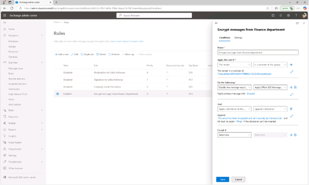
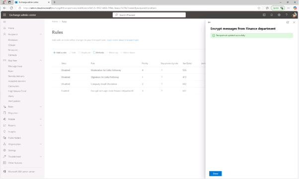

# 작업 2: 암호화된 메시지에 면책 조항을 추가하세요

다음으로, 기존 암호화 규칙을 수정하여 면책 조항을 덧붙이게 됩니다. 이 면책 조항은 간단한 메시지 브랜딩 형태로, 수신자에게 메시지가 Contoso Ltd.에서 안전하게 발송되었음을 알립니다.

 
1.	규칙 페이지에서 새로 생성한 규칙 [재무 부서에서 새로 생성된 암호화 메시지]를 선택하고, 편집을 클릭합니다.
 

 
2.	규칙 조건 편집을 선택하세요.

+ 다음 [행동 섹션] 오른쪽의 + 버튼을 선택해 다른 행동을 추가하세요.
+ 새로 생성된 And 섹션에서:
+ 드롭다운 1: 메시지에 면책 조항을 적용(Apply a disclaimer to the message)
+ 드롭다운 2에서는 면책 조항을 붙이기(append a disclaimer)
+ 드롭다운에서 '텍스트 입력'을 선택한 후, '이 이메일은 Contoso Ltd.가 암호화 및 안전하게 발송되었습니다'를 입력하세요.
 
플라이아웃 하단에서 [저장]을 클릭합니다. 
 

 
3.	추가 링크를 클릭하여 메시지와 [Wrap]으로 설정한후 [저장]을 클릭합니다. 

 
4.	재무 부서에서 새로 생성된 암호화 메시지 화면에서 메시지 암호화 규칙의 하단의 [저장]을 클릭합니다.
  

 
5.	규칙이 변경되면 전송 규칙이 성공적으로 업데이트되었다는 메시지가 뜨고, 플라이아웃을 닫으려면 플라이아웃 오른쪽 상단의 X 버튼을 선택하여 완료 합니다. 암호화 규칙을 업데이트하여 각 보호 메시지에 면책 조항을 추가하셨습니다. 이로 인해 수신자는 이메일이 암호화되어 Contoso Ltd.에서 안전하게 전송되었음을 명확히 알 수 있습니다.
  

