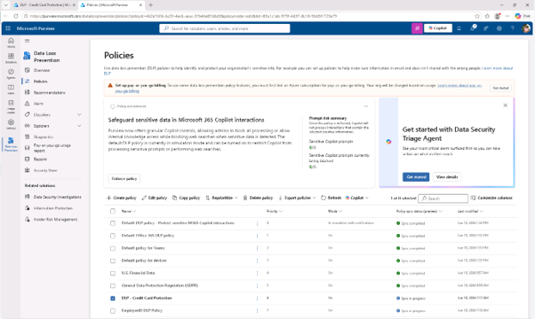
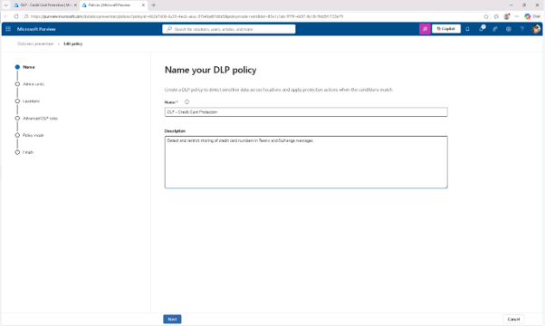
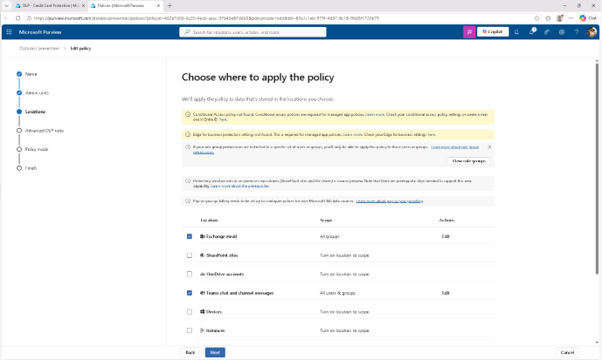

# 작업 2: DLP 정책 수정
이 작업에서는 기존 DLP 정책의 범위를 Exchange 이메일까지 확장하게 됩니다. 이는 추가 통신 채널에서 일관된 보호를 보장하는 데 도움이 됩니다.

 
1.	정책 페이지에서 최근에 생성된 [DLP - 신용카드 보호(DLP - Credit Card Protection)]를 체크박스를 선택한 후, 정책 구성을 열기 위해 [정책 편집(Edit Policy)]를 클릭합니다.
  

 
2.	DLP 정책 이름 페이지에서 설명을 다음과 같이 수정합니다.
A.	Detect and restrict sharing of credit card numbers in Teams and Exchange messages.
[다음(Next)]을 클릭합니다.
  

 
3.	관리자 단위 할당 페이지에서 [다음]을 클릭합니다.
 

 
4.	'정책 적용 위치 선택' 페이지에서 [Exchange 이메일] 체크박스를 선택하여 이 위치를 DLP 정책에 추가합니다.
  

 
5.	리뷰 및 완료 페이지에 도달할 때까지 [다음]을 클릭합니다.
 

 
6.	검토 및 완료 페이지에서 [제출(Summit)]을 클릭하여 변경 사항 정책을 적용 합니다.
 

 
7.	정책이 업데이트되면 정책 업데이트 페이지에서 [완료(Done)]를 클릭합니다.
 

 
8.	이메일 메시지와 Teams 메시지를 함께 스캔하도록 정책을 성공적으로 업데이트하셨습니다.
 

