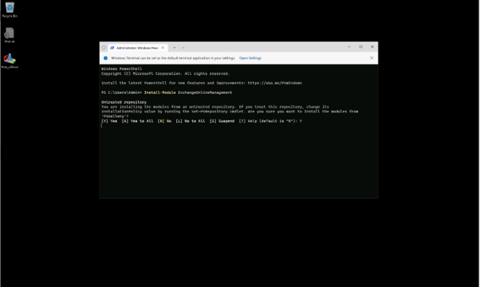
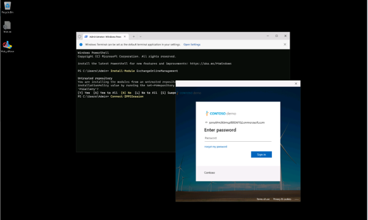
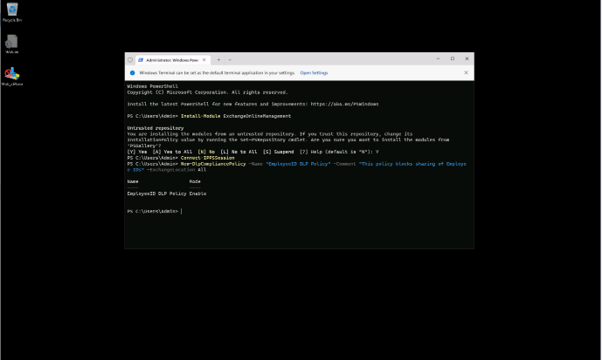
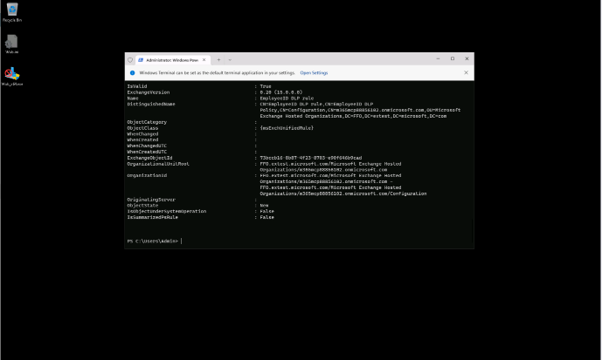
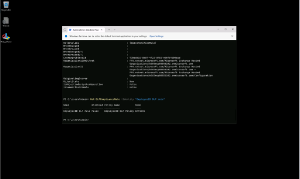

# 작업 3: PowerShell에서 DLP 정책 생성

이 작업에서는 PowerShell을 사용해 이메일을 통한 직원 ID 공유를 차단하는 DLP 정책을 만듭니다. 이 접근법은 스크립트를 통해 정책 설정을 정의하고 집행하는 방법을 보여줍니다.

<br>
1.	작업 표시줄에서 [시작] 버튼을 우클릭 한 메뉴에서 [터미널(관리자)]를 클릭하여 실행합니다.
<br>


<br>
2.	터미널 창에서 Install Module cmdlet을 실행하여 최신 Exchange Online PowerShell 모듈 버전을 설치하세요:

``` PowerShell
Install-Module ExchangeOnlineManagement
```
<br>


<br>
3.	신뢰받지 않는 저장소 보안 대화상자에서 [Y(예)]를 선택해 확인한 후 Enter를 누르세요. 이 과정은 완료하는 데 시간이 걸릴 수 있습니다.
 <br>



<br>
4.	Connect-IPPSSession 명령어를 실행하여 보안 및 컴플라이언스 PowerShell에 연결하세요:

``` PowerShell
Connect-IPPSSession
```
<br>

<br>
5.	로그인 팝업 창에서 Joni Sherman으로 로그인하세요.
<br>


<br>
6.	이 기기의 모든 데스크톱 앱과 웹사이트에 자동 로그인 옵션이 뜨면, [아니요, 이 앱만 사용]을 클릭합니다.
 <br>



<br>
7.	New-DlpCompliancePolicy cmdlet을 실행하여 모든 Exchange 메일박스를 스캔하는 DLP 정책을 생성하세요:

``` PowerShell
New-DlpCompliancePolicy -Name "EmployeeID DLP Policy" -Comment "This policy blocks sharing of Employee IDs" -ExchangeLocation All
```
 <br>



<br>
8.	New-DlpComplianceRule cmdlet을 실행하여 이전 단계에서 만든 DLP 정책에 DLP 규칙을 추가하세요. 이 정책은 이전 작업에서 생성된 Contoso 직원 ID의 민감한 정보 유형을 사용합니다:

``` PowerShell
New-DlpComplianceRule -Name "EmployeeID DLP rule" -Policy "EmployeeID DLP Policy" -BlockAccess $true -ContentContainsSensitiveInformation @{Name="Contoso Employee IDs"}
```
 <br>




<br>
9.	EmployeeID DLP 규칙을 검토하려면 Get-DLPComplianceRule cmdlet을 실행하세요:

``` PowerShell
Get-DLPComplianceRule -Identity "EmployeeID DLP rule"
```
 <br>


<br>
10.	PowerShell을 사용해 직원 ID 공유를 차단하는 DLP 정책을 성공적으로 만들었습니다.
<br>