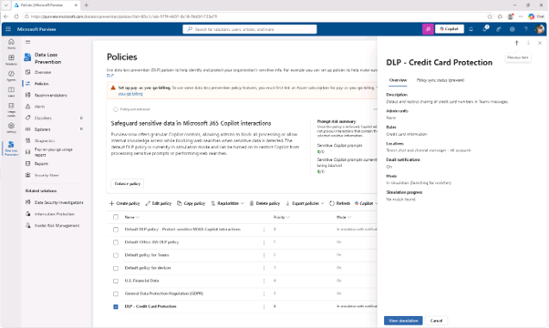
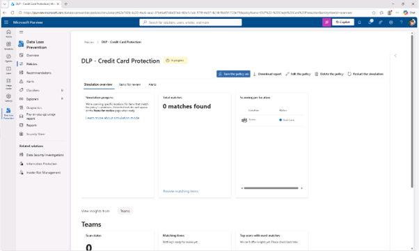
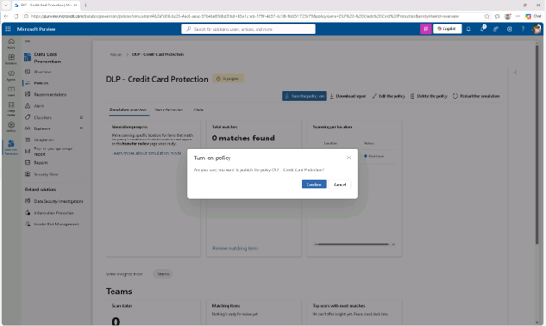
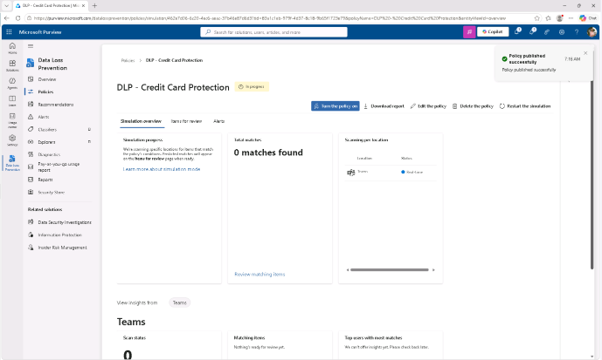

# 작업 4: 시뮬레이션 모드에서 정책 활성화
이제 DLP 정책이 시뮬레이션에서 테스트되었으니, 그 정책을 활성화하여 행동을 강제하기 시작할 것입니다.

 
1.	Purview 관리자 포탈에서 [솔루션(solution)] – [데이터 손실 방지(Data Loss Prevention)]를 클릭합니다.
 

 
2.	정책 페이지에서 [DLP - 신용카드 보호 정책( DLP - Credit Card Protection)]를 클릭합니다.
 

 
3.	오른쪽 플라이아웃 하단에서 [시뮬레이션 보기(view simulation)]를 클릭합니다.
 
 

 
4.	시뮬레이션 페이지에서 시뮬레이션 

+ 개요 탭 : 스캔 진행 상황, 총 매칭 수, 위치별 스캔 상태를 보여 줌
+ 검토용 항목 탭 : 예측된 경기가 공개되면 표시
+ Alerts 탭 : 시뮬레이션 모드에서 트리거된 모든 알림이 나열
 

 

 
5.	시뮬레이션 모드에서 인사이트를 탐색한 후, 정책 활성화를 위해 [정책 켜기(Tuen the policy on)]를 클릭하여 DLP 정책을 활성화 합니다.
  

 
6.	정책이 성공적으로 배포 되면, 오른쪽 상담에 안내 메시지 창이 나타납니다. 
  

