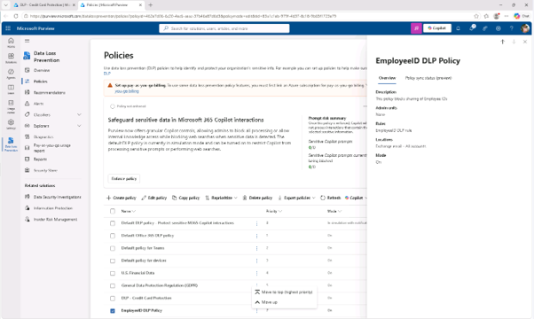

# 작업 5: 정책 우선순위 수정

여러 정책이 존재할 경우, 우선순위에 따라 어느 정책이 먼저 적용되는지 결정됩니다. 이 작업에서는 직원 ID 정책을 가장 높은 우선순위로 옮깁니다.

 
1.	정책 페이지에서 [EmployeeID DLP] 정책에서 […]을 클릭하며 나타나는 메뉴에서 ['최상단(최우선순위) Move to top (highest priority)]를 클릭합니다.
  

 
2.	데이터 손실 방지 창에서 [새로고침(refresh)]을 클릭하면 선택한 정책이 가장 상단에 나열됩니다. 

 
3.	EmployeeID DLP이 다른 정책보다 우선하도록 정책 우선순위를 변경하였습니다 .
 
