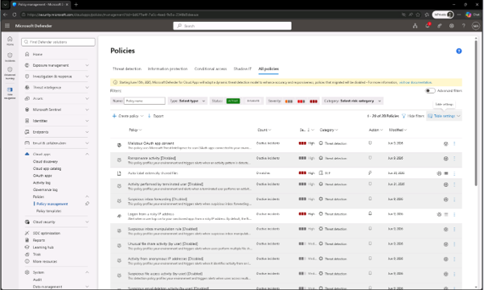
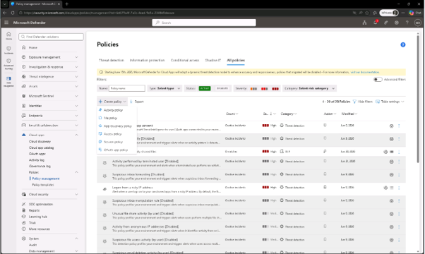
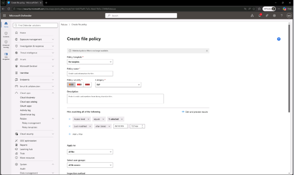
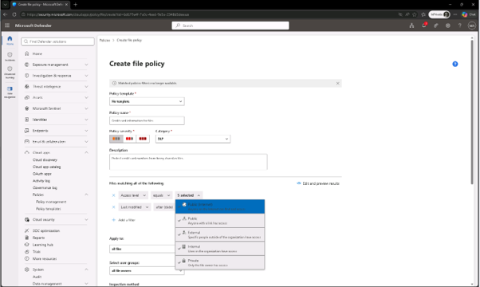
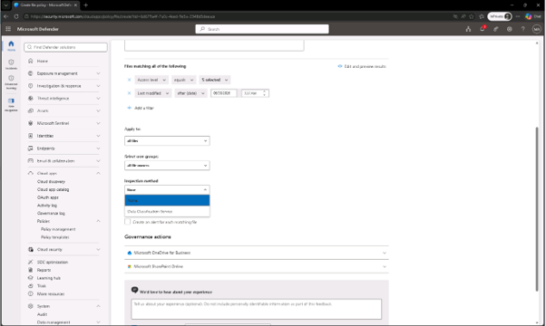
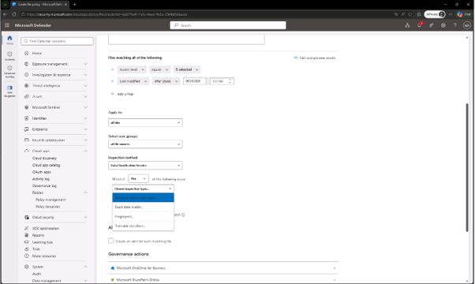
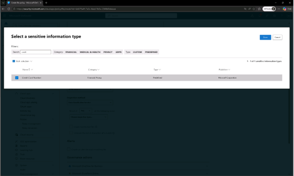
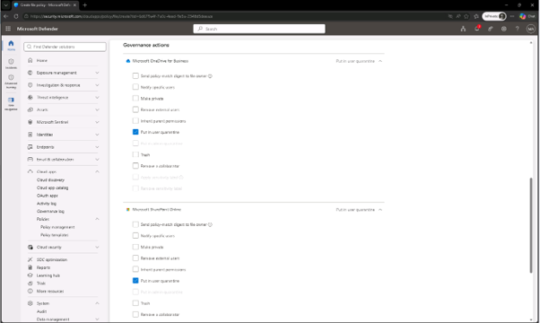
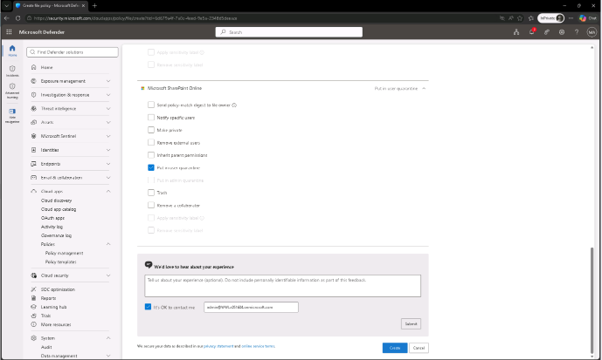
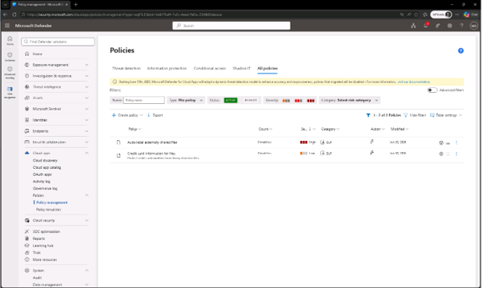

# 작업 7: Microsoft Defender 파일 정책 생성
이 작업에서는 Microsoft Defender에서 OneDrive와 SharePoint에 신용카드 번호가 포함된 파일을 식별하고 격리하는 파일 정책을 만듭니다.

 
1.	Microsoft Defender 포털에서 [Cloud Apps] –[Policies] – [Policy management]를 클릭합니다. 

 
2.	정책 페이지에서 [+ 정책 생성] – [파일 정책(File Policy)]을 클릭합니다.
  

 
3.	파일 정책 생성 페이지에서 다음을 설정하세요:

+ 정책 명칭: Credit card information for files
+ 정책 심각도: 낮음
+ 카테고리: DLP
+ 설명: Protect credit card numbers from being shared in files.
  

 
4.	다음 섹션 모두를 일치하는 파일에서:

+ 첫 번째 필터 : Access Level 는 Public(인터넷), External, Public, 그리고 Internal 추가입니다
+ 두 번째 필터 : '마지막 수정 날짜 이후'로 설정하고 오늘의 날짜를 사용
  

 
 

 

 
5.	검사 방법(Inspection method) 드롭다운 메뉴에서 [데이터 분류 서비스( Data Classification Service)를 클릭합니다.
  

 
6.	검사 유형 선택에서는 [민감한 정보 유형(Select a sensitive information type)]를 클릭합니다.
  

 
7.	'민감한 정보 유형 선택' 대화상자에서 Credit Card Number 검색한 후 체크박스를 선택 하고, '민감한 정보 선택 유형' 대화상자 오른쪽 상단에서 [완료]를 클릭합니다.
  

 
8.	거버넌스 행동 항목에서 Microsoft OneDrive for Business와 Microsoft SharePoint Online를 확장하세요: [사용자 격리(Put in user 격리)] 체크박스를 선택 합니다.
  

 
9.	페이지 하단에서 [생성(create)]를 클릭하여 파일 정책을 생성하세요. 
  

 
10.	민감한 신용카드 데이터가 포함된 파일을 감지하고 격리하는 파일 정책을 성공적으로 만들었습니다.
  

 

