# Lab06 – 엔드포인트 DLP 구현 및 관리

새로 채용된 정보 보안 관리자는 회사 기기에 대한 DLP 통제를 강화해 달라는 요청을 받았습니다. 일부 직원들은 민감한 고객 정보를 USB 드라이브로 복사하여 데이터 노출 위험을 높이고 있습니다. 이 연구실에서 Joni는 이러한 전송을 차단하는 엔드포인트 DLP 정책을 설정할 것입니다.

## 작업 1: 엔드포인트 DLP용 장치 온보딩
이 작업에서는 Windows 11 기기를 온보딩하여 엔드포인트 DLP 정책으로 보호할 수 있도록 준비하게 됩니다.

 
1.	VM Client2 사용하여 로그인 합니다. 
 

 
2.	Microsoft Edge를 열고 https://purview.microsoft.com 조니 셔먼(Joni Sherman)으로 Microsoft Purview 포털에 로그인합니다. 
 

 
3.	왼쪽 사이드바에서 [설정]을 클릭합니다.  

 
4.	왼쪽 사이드바에서 [디바이스 온보딩]-[온보딩]을 클릭합니다. 

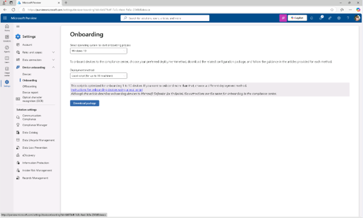
 
 
5.	온보딩 페이지에서 배포 방법 드롭다운 메뉴에서 로컬 스크립트(최대 10대의 머신용)를 선택한 후 패키지 [다운로드]를 클릭합니다.
 
 
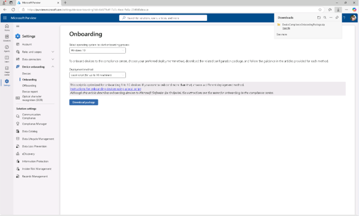
 
6.	압축 파일을 압축 해제하세요. DeviceComplianceLocalOnboardingScript.cmd라는 스크립트를 확인합니다. 
  

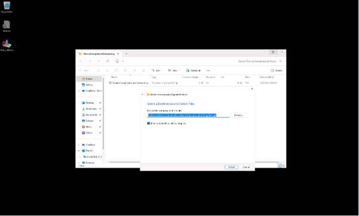

 
7.	[DeviceComplianceLocalOnboardingScript.cmd] 파일을 우클릭한 후 관리자로 실행 하고,사용자 계정 제어 대화 창에서 [예]를 클릭합니다. 
  

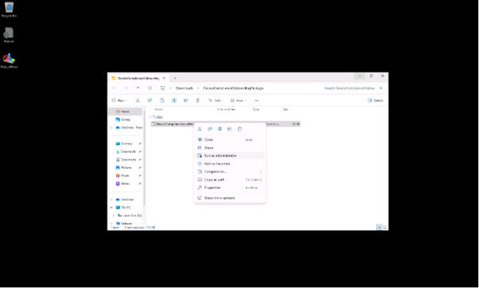

 
8.	명령 프롬프트 화면에서 Y를 입력해 확인한 후 엔터를 누르세요.
  

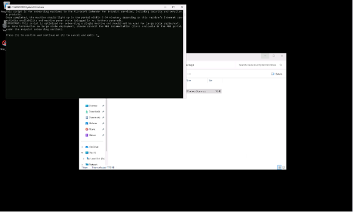
  
9.	스크립트가 완성되면 성공 메시지가 뜨고 계속하려면 아무 키 누르기나 하라는 안내가 뜨게 됩니다. 명령어 창을 닫으려면 아무 키를 누르세요. 온보딩을 완료하는 데 1분이 걸릴 수 있습니다.
  

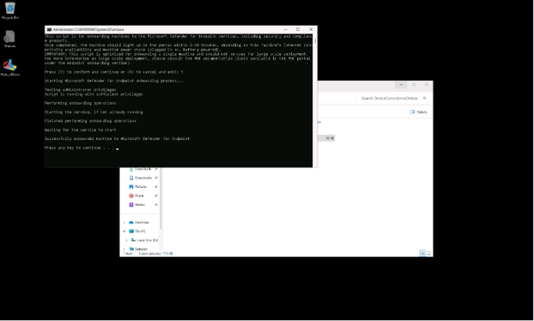

 
10.	윈도우 [설정] – [사용자 계정] – [직장 또는 학교 계정 추가창에서 [연결]을 클릭합니다. 
  

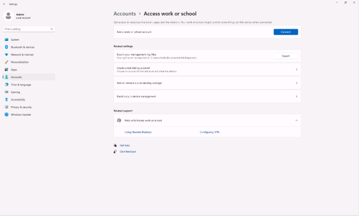

 
11.	'회사 또는 학교 계정 설정 대화상자'에서 [이 장치에 Microsoft Entra ID로 가입] 링크를 선택하고 Joni Sherman으로 로그인합니다.
  

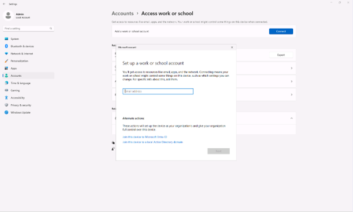

 
12.	'이것이 귀하의 조직인지 확인하기' 대화 상자에서 테넌트 URL을 확인하고 [가입(Join)]을 클릭합니다. 
  

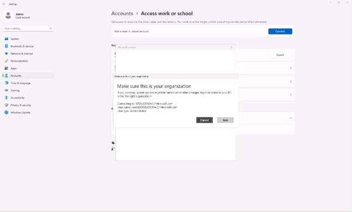

 
13.	기기가 연결되면 '완료됨!' 화면에서 [완료]를 클릭합니다.
   

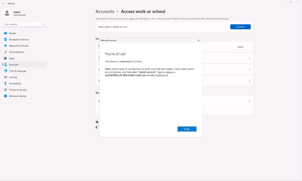

 
14.	클라이언트 2 VM을 재부팅합니다. 

 

 
15.	클라이언트 1 VM에 다시 로그인합니다. 
 

 
16.	Microsoft Purview 관리자 [설정] – [디바이스 온보딩] –[디바이스] 창에서 디바이스 온보딩이 되었는지 확인합니다. 디바이스가 성공적으로 온보딩하고 Microsoft Entra ID에 연결하셨습니다. 이제 엔드포인트 DLP 정책으로 보호할 수 있습니다.
  
 
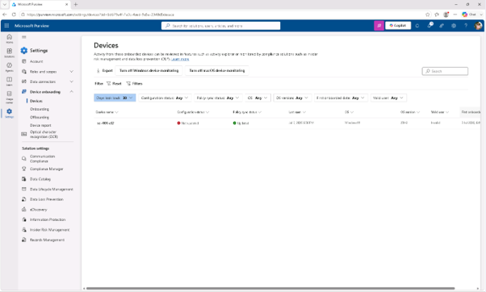
