# 작업 2: 엔드포인트 DLP 정책 생성
이 작업에서는 민감한 정보를 USB 드라이브로 전송하는 것을 차단하는 DLP 정책을 만듭니다. 이는 허가 없이 데이터가 외부로 유출될 위험을 줄이는 데 도움이 됩니다.

 
1.	Microsoft Purview 포털에서 [솔루션] – [데이터 손실 방지]를 클릭합니다.  

 
2.	왼쪽에서 내비게이션 창에서 정책을 선택한 후 [+ 정책 생성] 버튼을 클릭합니다.  

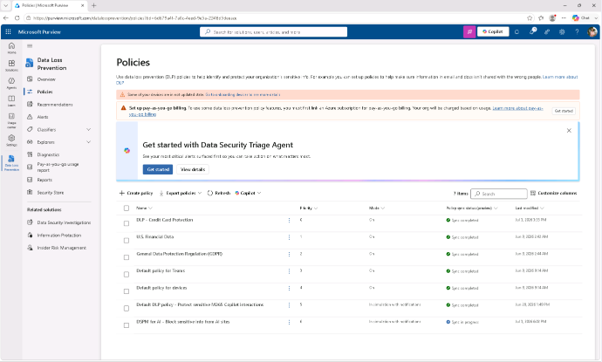
 

 
3.	'무엇을 보호하고 싶은가?' 페이지에서 [Enterprise 애플리케이션 및 장치]를 클릭합니다. 
 
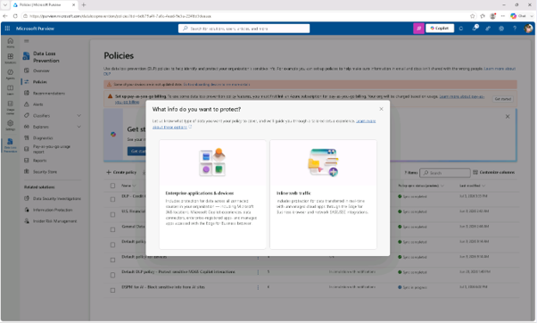

 
4.	템플릿으로 시작하거나 맞춤 정책 생성 페이지에서 Custom 및 Custom 정책을 선택한 후 다음을 선택하세요. 
 
 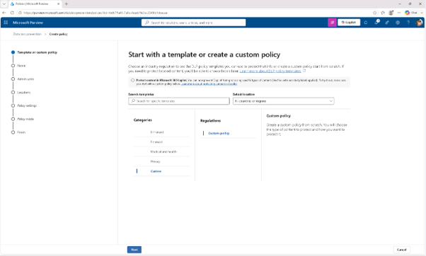

 
5.	'DLP 정책 이름 지정' 페이지에서 다음을 입력하세요:

+ 이름: Block USB transfers
+ 설명: Prevent transferring sensitive data to USB devices.
[다음]을 클릭합니다. 
  

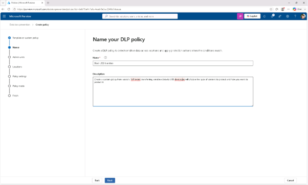
 
6.	관리자 단위 할당 페이지에서 [다음]을 클릭합니다. 

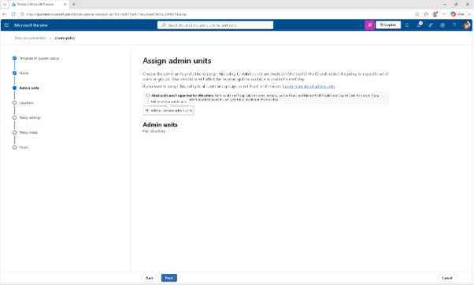

 
7.	'정책 적용 위치 선택' 페이지에서 [디바이스]만 선택되었는지 확인하세요. 다른 위치가 선택되어 있으면 해당 위치를 해제한 후 [다음]을 선택하세요.
 

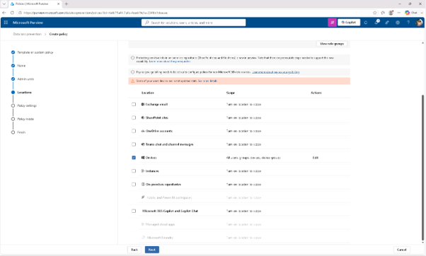

  
8.	'정책 설정 정의' 페이지에서 고급 DLP 규칙 생성 또는 [커스터마이즈]를 선택한 후 [다음]을 클릭합니다. 
  

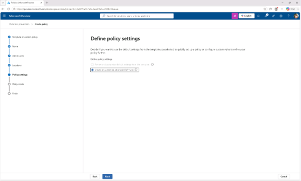
 
9.	고급 DLP 규칙 사용자 지정 페이지에서 [+ 규칙 만들기]를 클릭합니다.
  

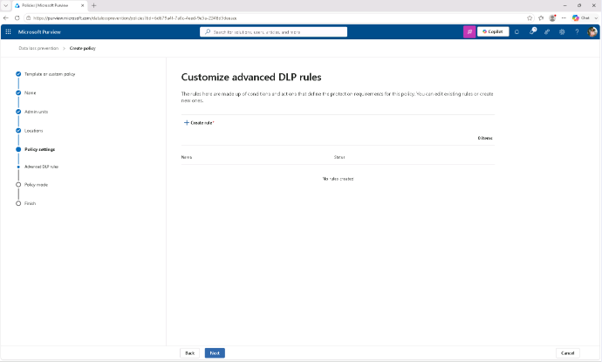

 
10.	규칙 생성 페이지에서 다음을 입력하세요:

+ 이름: USB transfer rule
+ 설명: Block USB transfers of sensitive data.
  

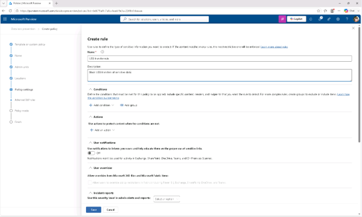
 
11.	조건에서 [+ 추가 조건]을 선택한 후 [콘텐츠 포함(Content contains)]를 클릭합니다. 

+ 새로운 콘텐츠 포함 섹션: [민감 정보 유형(Sensitive info types)] 선택
+ 민감 정보 유형 페이지에서 다음 민감한 정보 유형을 검색하세요:
  - Credit Card Number
  - U.S. Social Security Number (SSN)
  - U.S. Driver's License Number
+	Contoso Employee IDs
 
 
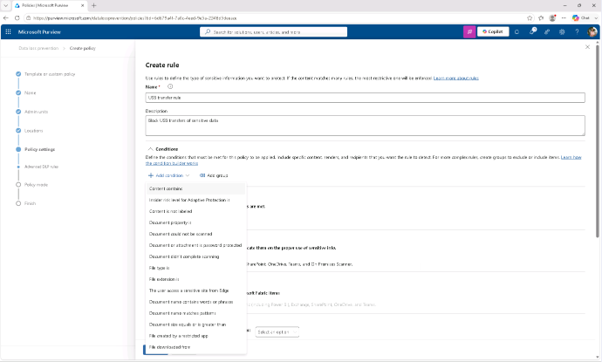

 

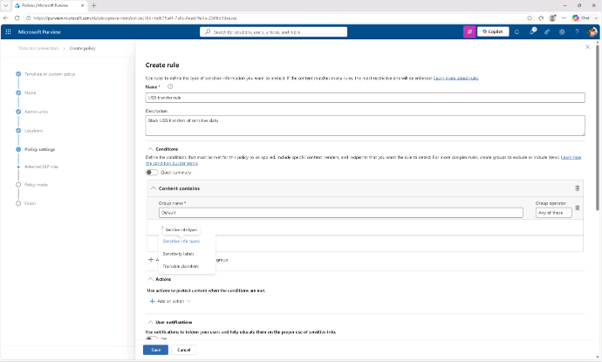

 

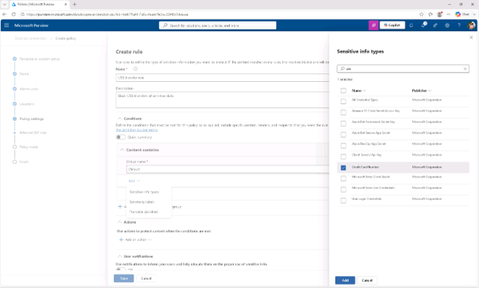
 
 
12.	Actions 아래에서 [+ 액션추가(Add a Action)] – [장치의 활동 제한(Audit or restrict activities on devices)]를 클릭합니다. 
  

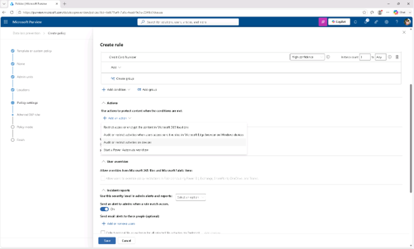
 
13.	새로운 기기 감사 또는 활동 제한 섹션에서:

+ '모든 앱의 파일 활동' 섹션에서 [이동식 USB 장치에 복사(Copy to a removable USB device)]가 선택되어 있는지 확인
+ 'Copy to a Removable USB device' 왼쪽 드롭다운을 선택해서 [Audit only]에서 [Block]으로 변경
 
  

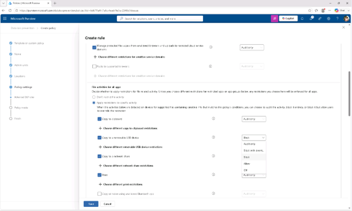

 
14.	사용자 알림 항목에서:

+ 사용 알림 토글을 [켜서] 사용자에게 정보를 알리고 민감한 정보의 올바른 사용법을 인지 시켜줄 수 있고, [활동이 제한될 때 정책 팁 알림(Show users a policy tip notification when an activity is restricted)]을 보여주는 체크박스를 선택하세요.
 
Create rule flyout의 하단에서 [저장(Save)]를 클릭합니다. 
  

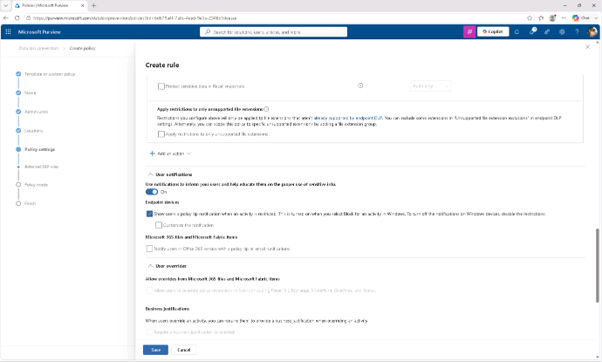
 
15.	‘고급 DLP 규칙 맞춤'에서 [다음(Next)]을 클릭합니다. 
  

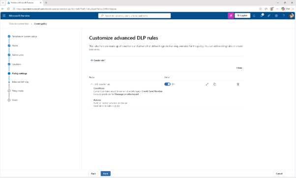
 
16.	정책 모드 페이지에서 [시뮬레이션 모드에서 정책을 실행하기]를 선택하고, [시뮬레이션 모드에서 정책 팁 표시] 체크박스를 선택하고, 또한, [시뮬레이션 후 15일 이내에 수정하지 않으면 정책을 켜]는 체크박스를 선택하고, [다음(Next)]을 클릭합니다. 
  

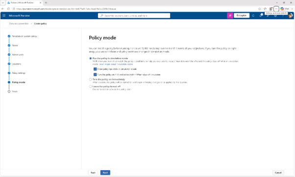

 
17.	검토 및 완료 페이지에서 정책 설정을 검토한 후 [제출]를 클릭하여 정책을 생성하세요.
  

 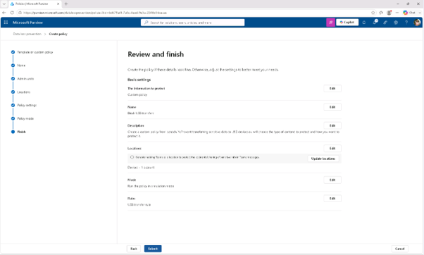

 
18.	정책이 생성되면 새 정책 생성 페이지에서 [완료]를 클릭합니다. 시뮬레이션 모드에서 민감한 데이터의 USB 전송을 차단하는 DLP 정책을 성공적으로 만들었습니다. 정책이 수정되지 않으면 15일 후에 자동으로 활성화됩니다.
  

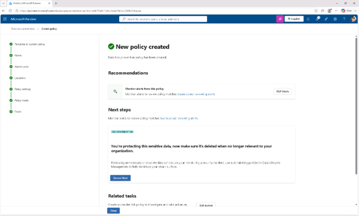
