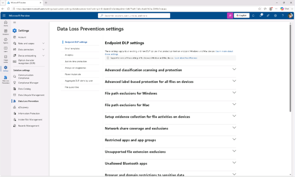
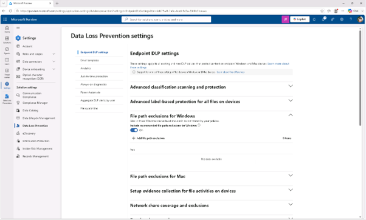
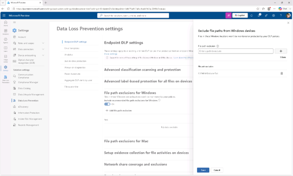
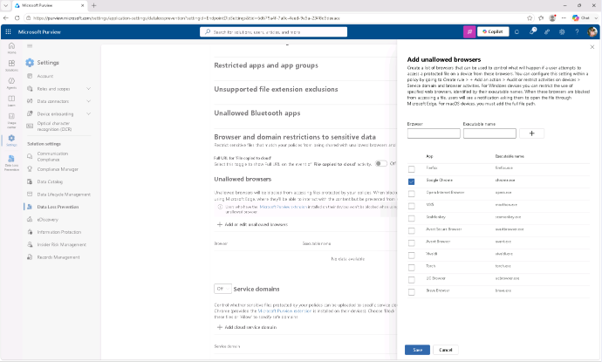
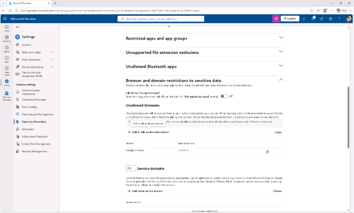
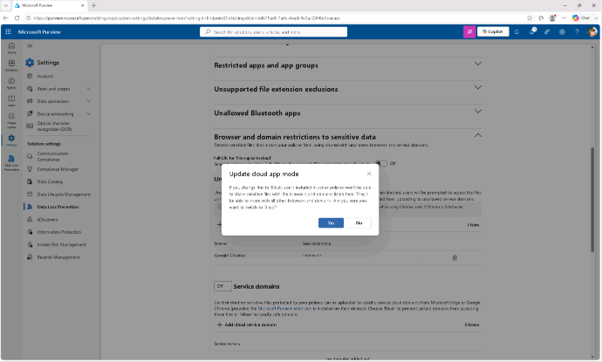
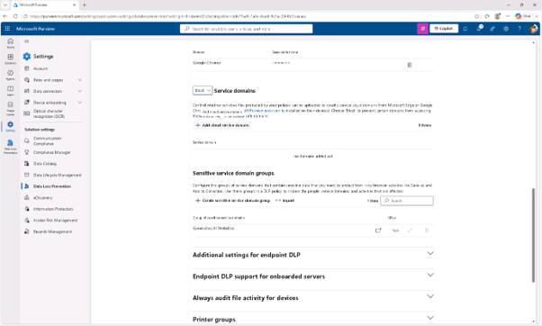
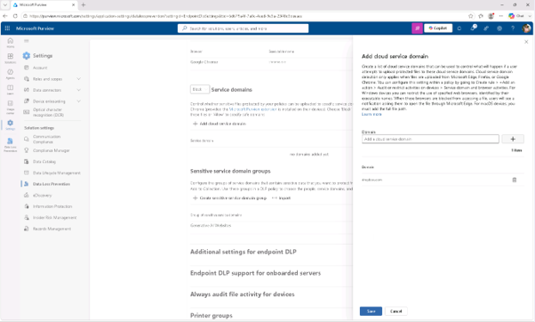

# 작업 3: 엔드포인트 DLP 설정 설정
이 작업에서는 로컬 폴더를 제외하고, 브라우저 제한을 설정하며, 클라우드 도메인을 차단하는 등 엔드포인트 DLP 설정을 세밀하게 조정해야 합니다.

 
1.	Microsoft Purview에서 왼쪽 내비게이션 창에서 [설정] – [데이터 손실 방지]를 클릭합니다. 

 
 
2.	데이터 손실 방지 설정 페이지가 엔드포인트 DLP 설정으로 열리고, Endpoint DLP 설정 페이지에서 Windows 파일 경로 제외 항목을 확장한 후 [+ Add file path exclusion]를 클릭합니다. 
 

 
 
3.	'Windows 장치에서 파일 경로 제거' 플라이아웃 페이지의 파일 경로 제외 필드에서 C:\FilePathExclusionTest 를 입력하고 오른쪽의 [+]를 클릭합니다. 
  

 

 
4.	엔드포인트 DLP 설정 페이지로 돌아가 민감한 데이터로 브라우저 및 도메인 제한을 펼친 후 + 허용되지 않은 브라우저 추가 또는 편집을 선택하세요.
  

 
5.	'허용되지 않는 브라우저 추가' 프라이아웃 페이지에서 [구글 크롬] 체크박스를 선택하고 저장을 선택하세요.
  

 
 
 
 
6.	엔드포인트 DLP 설정 페이지로 돌아가 서비스 도메인 드롭다운을 선택하고 [끄기]에서 [차단]으로 변경합니다. 
  

 

 
7.	클라우드 앱 업데이트 모드 대화 상자에서 [예]를 선택해 차단 모드를 활성화합니다.
  

 
8.	서비스 도메인에서 [+ Cloud 서비스 도메인 추가]를 클릭합니다.
  

 
9.	Cloud Service 도메인 추가 페이지에서 도메인 필드에 dropbox.com 입력한 후 [+(플러스)]아이콘을 선택해 경로를 추가하고, 설정을 저장하려면 [저장]을 클릭합니다.
  

