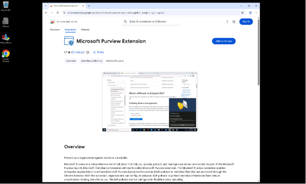
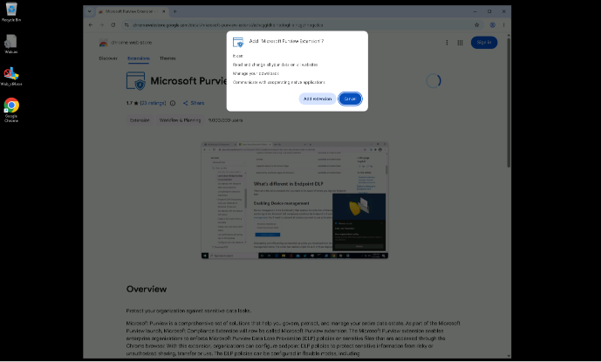
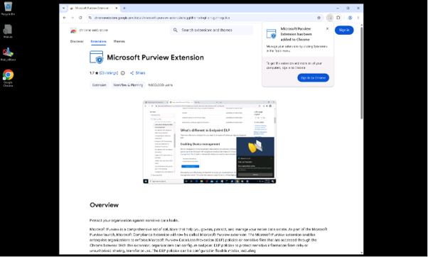
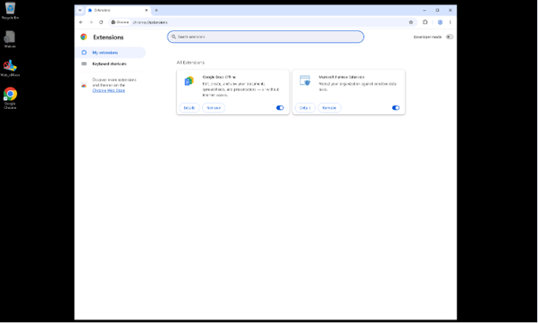

# 작업 4: Microsoft Purview 확장 구성

이 작업에서는 온보딩된 장치로 전환하여 Google Chrome에 Microsoft Purview 확장 프로그램을 설치하여 지원되는 브라우저에서 엔드포인트 DLP 정책 동작을 테스트합니다.

 
1.	새로 설치된 크롬 브라우저 창이 열리면, 크롬 웹 스토어에서 곳에서 Microsoft Purview 확장 프로그램으로 이동하세요:
https://chrome.google.com/webstore/detail/microsoft-purview-extensi/echcggldkblhodogklpincgchnpgcdco
  

 
2.	올바른 확장 프로그램 페이지에 있는지 확인한 후 [크롬에 추가]를 클릭합니다.
  

 
3.	Microsoft Purview 확장 기능 추가 창에서 [확장 기능 추가]를 클릭합니다. 
  

 
4.	Chrome에 추가되는 확장 프로그램 알림을 닫고 chrome://extensions 로 이동합니다. 
 

 
5.	Microsoft Purview 확장 기능이 보이고 활성화되어 있는지 확인 합니다. 
  

  
6.	크롬을 성공적으로 설치하고 Microsoft Purview 확장 프로그램을 추가하셨습니다. 기기는 이제 엣지와 크롬 모두에서 DLP 정책 강제를 지원합니다.
 
