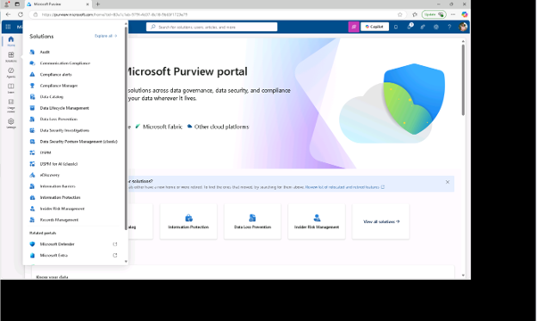
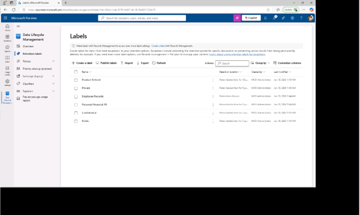
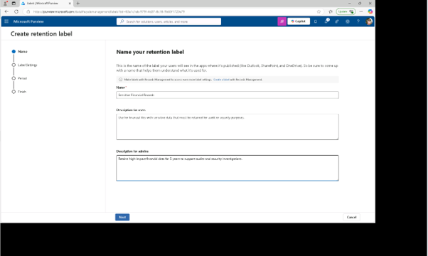
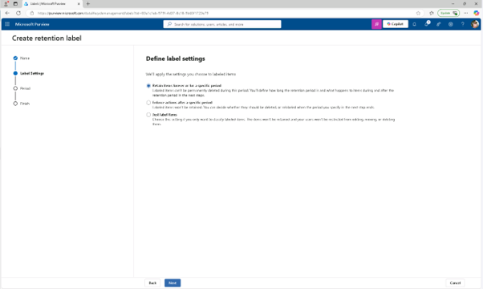
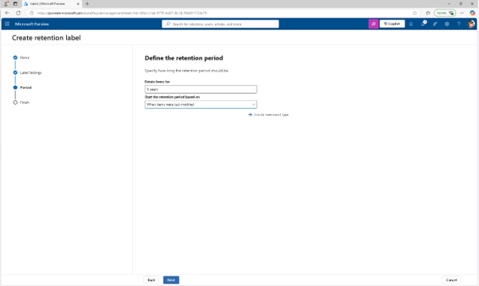
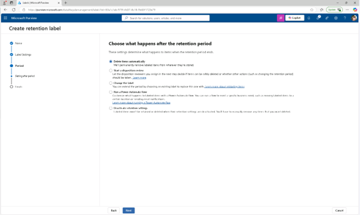
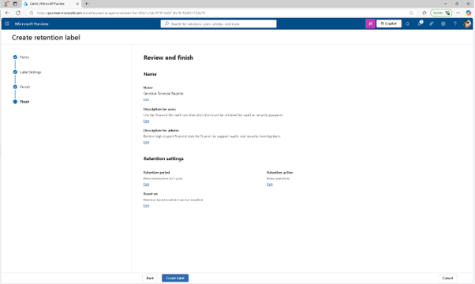
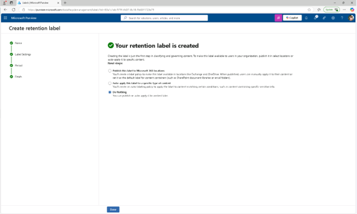

# Lab07 – 보존 실행 및 관리

이 회사는 금융 데이터와 특권 통신과 관련된 위험 노출을 줄이기 위해 데이터 보안 전략을 강화하고 있습니다. 감사 준비를 지원하고, 불필요한 데이터 보존을 제한하며, 민감한 커뮤니케이션에 대한 적절한 감독을 보장하는 Microsoft Purview 보존 솔루션을 구성하라는 요청을 받았습니다.

## 작업 1: 보존 라벨 생성
이 작업에서는 감사 및 조사 목적으로 보관해야 하는 민감한 금융 데이터를 위한 보존 라벨을 생성하게 됩니다.

 
1.	새로운 Microsoft Purview 포털에 접속합니다.(Jonis 계정) 

 
2.	[솔루션] – [데이터 수명 주기 관리(Data Lifecycle Managemnet)]를 클릭합니다. 

  
3.	[보존 라벨(Retention labels)]를 클릭하고, 라벨 페이지에서 [+ '라벨 만들기'(Create Label)]를 클릭합니다.
  

 
4.	보유 라벨 이름 붙이기 페이지에 다음을 입력하세요:

+ 이름: Sensitive Financial Records
+ 사용자 설명: Use for financial files with sensitive data that must be retained for audit or security purposes.
+ 관리자용 설명: Retains high-impact financial data for 5 years to support audits and security investigations.
 
한 후 [다음(Next)]을 클릭합니다.
  

 
5.	Define label settings 페이지에서 [영원한 보존 기간 또는 특정 기간(Retain items forever or for a specific period)]를 선택한 후 [다음(Next)]을 클릭합니다.
  

 
6.	기간을 정의하는 페이지에서 보존 기간 구성 입력값을 설정합니다.

+ 아이템 보유 기간: 5년
+ 보존 기간은 다음 기준으로 시작하세요: 항목이 마지막으로 수정된 시기(When items were last modified) 
 
설정 후 [다음(Next)]을 클릭합니다.
 

 
7.	'보존 기간 이후 무슨 일이 일어나는지 선택하기' 페이지에서 [항목을 자동으로 삭제( Delete items automatically)]를 선택한 후 [다음]을 클릭합니다.
  

 
8.	리뷰 및 완료 페이지에서 [라벨 생성(create labels)]를 클릭합니다.
  

 
9.	보존 라벨 생성 완료 패이지에서 [아무것도 하지 않기(Do nothing)] 옵션을 선택한 후 [완료]를 클릭합니다. 금융 콘텐츠를 5년간 보관하고 데이터 노출을 줄이기 위해 삭제하는 보존 라벨을 만들었습니다.
  

