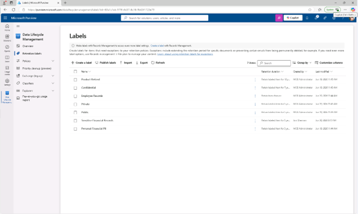
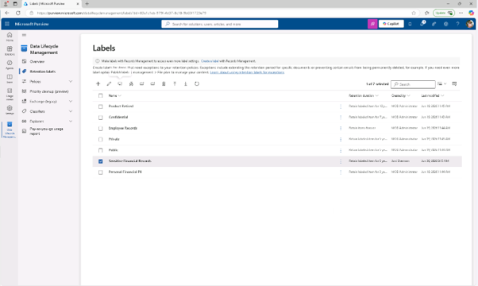
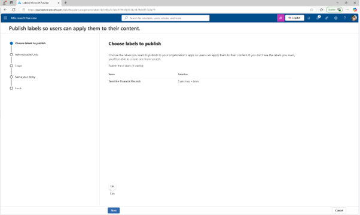
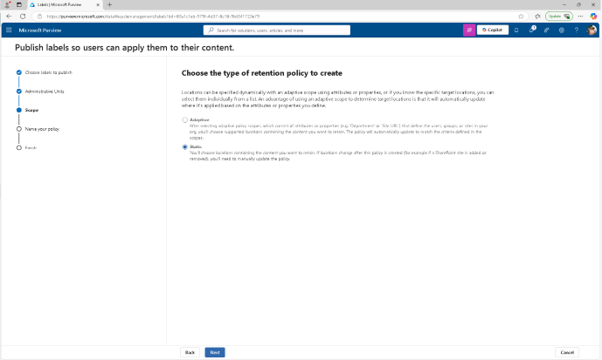
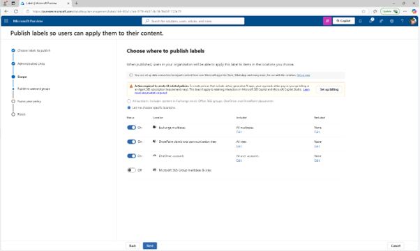
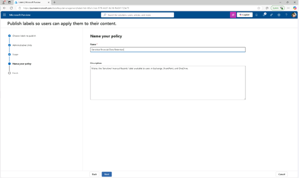
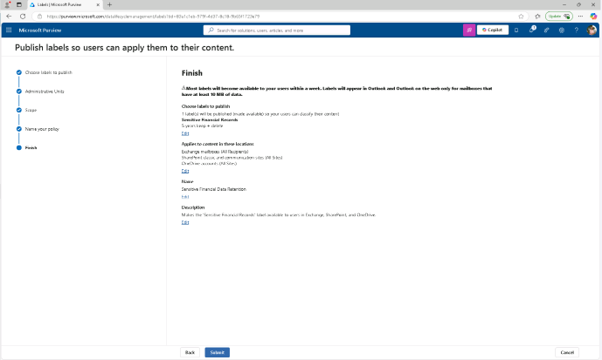
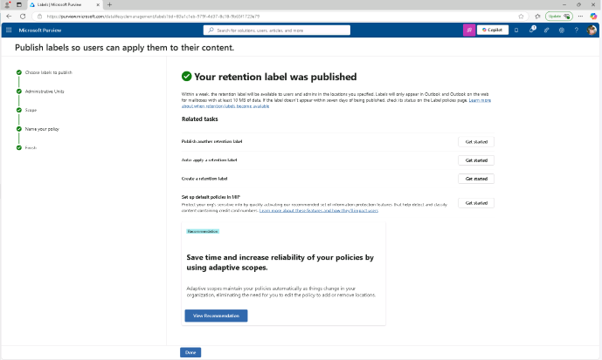

# 과제 2: 보존 라벨 게시
이 작업에서는 사용자가 Exchange, SharePoint, OneDrive 같은 Microsoft 365 서비스에 적용할 수 있도록 유지 라벨을 게시합니다.

 
1.	Microsoft Purview에서 [솔루션] - [데이터 라이프사이클 관리] – [보존 라벨]를 클릭합니다.
  

 
2.	[Sensitive Financial Records] 라벨 옆에 체크박스를 선택한 후, [Publish labels] 아이콘을 클릭해 보존 라벨 게시를 진행합니다.
  

 
3.	게시할 레이블 선택 페이지에서 [Sensitive Financial Records] 라벨이 선택되었는지 확인한 후 [다음]을 클릭합니다.
  

 
4.	정책 범위 페이지에서 [다음]을 클릭합니다.
 

 
5.	보존 정책 유형을 선택하고, 페이지를 만드는 단계에서 [정적(Static)]을 선택한 후 [다음(Next)]을 클릭합니다.
  
 
 

 
6.	라벨 게시 선택 페이지에서 다음을 선택하세요:

+ 메일 사서함
+ SharePoint 클래식 및 커뮤니티 사이트
+ OneDrive 계정 
외 다른 모든 위치를 선택 해제하고 [다음]을 클릭합니다.
 
  

 
7.	보존 정책 명칭에 다음과 같은 입력이 있습니다:

+ 이름: Sensitive Financial Data Retention
+ 설명: Makes the 'Sensitive Financial Records' label available to users in Exchange, SharePoint, and OneDrive.
 입력 후 [다음(Next)]을 클릭합니다.
 

 
8.	검토 페이지에서 [제출]을 클릭합니다.
  

 
9.	귀하의 유지 라벨이 게시됨 페이지에서 [완료(Done)]를 클릭합니다. 보존 라벨을 게시하여 사용자가 Microsoft 365의 주요 서비스에 적용할 수 있도록 했습니다.
  

