# 작업 3: 자동 적용 보존 라벨 정책 생성

콘텐츠에 자동으로 보존 라벨을 적용하는 정책을 설정해야 합니다.

 
1.	Microsoft Purview에서 [솔루션(Solutions)]-[데이터 라이프사이클 관리] – [정책] –[라벨 정책(Label policies)]를 클릭합니다.
  

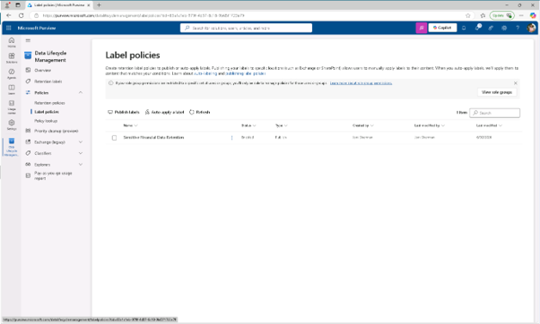

 
2.	라벨 정책 페이지에서 라벨 구성을 시작하려면 [자동 적용 라벨(auto-apply a label)]를 클릭합니다.
 

 
3.	'Let's get started' 페이지에서 다음을 입력하세요:

+ 이름: Auto-apply Personal Financial PII
+ 설명: Applies this label to personal financial data to help meet audit and investigation requirements. Retains content for 3 years.
 입력 후 [다음(Next)]을 클릭합니다.
  

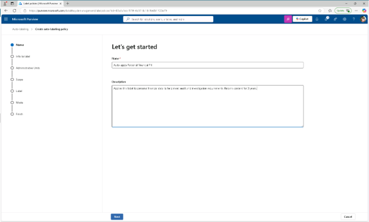

 
4.	페이지에 이 라벨을 적용할 [민감한 정보가 포함된 콘텐츠에 라벨( Apply label to content that contains sensitive info)]을 선택한 후 [다음]을 클릭합니다.
  

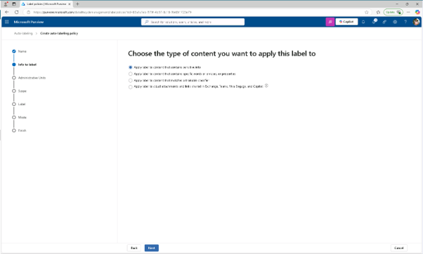

 
5.	민감한 정보가 포함된 콘텐츠 페이지에서 [금융 카테고리(finanical)]를 선택한 후 [미국 Gramm-Leach-Bliley 법(GLBA) 규제(U.S. Gramm-Leach-Bliley Act (GLBA))]를 선택한 후 [다음]을 클릭합니다.
  

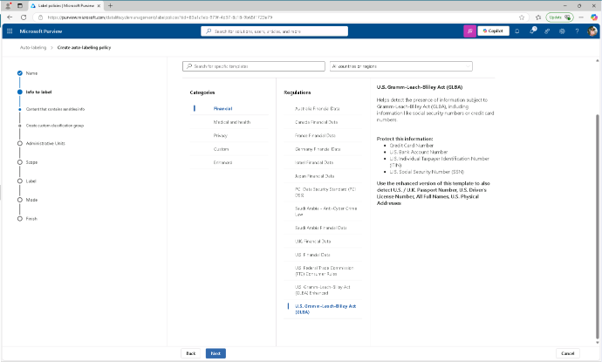

 
6.	민감한 정보가 포함된 콘텐츠 정의 페이지에서 [다음(Next)]을 클릭합니다.
  

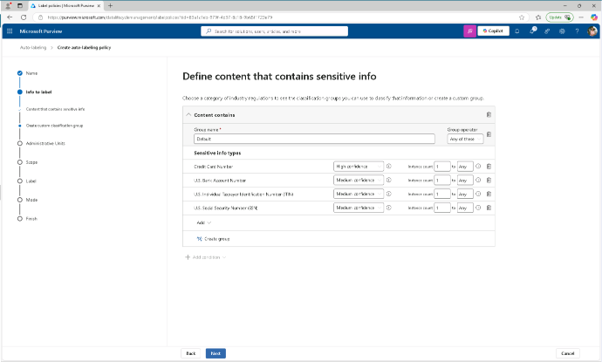
 
7.	정책 범위 페이지에서 [다음(Next)]을 클릭합니다.
  

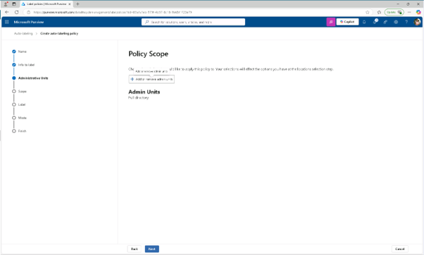
  
8.	'생성할 유지 정책 유형 선택' 페이지에서 [정적(static)]을 선택하고 [다음]을 클릭합니다.
  

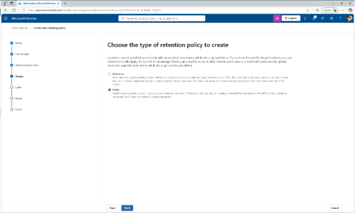

  
9.	라벨 게시 선택 페이지에서 다음을 선택하세요:

+ Exchange mailboxes
+ SharePoint 클래식 및 커뮤니티 사이트
+ OneDrive 계정
다른 모든 위치를 선택 해제하세요
  

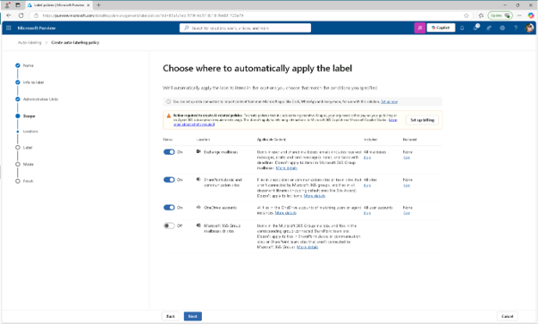

 
10.	'자동 적용 라벨 선택' 페이지에서 [라벨 추가(add label)]를 클릭합니다.
  

 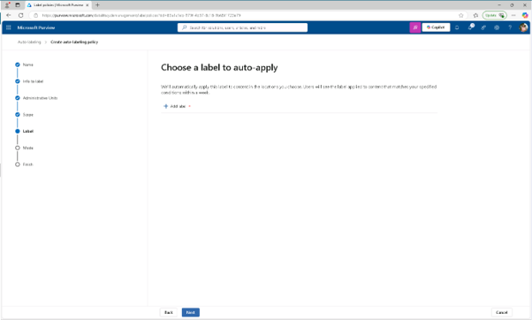

  

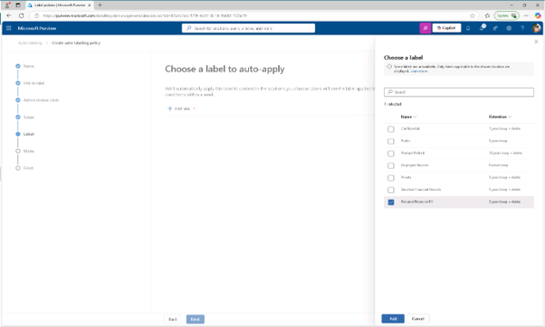
 

 
11.	라벨 선택 안내 화면에서 [개인 금융 개인 식별 정보(Personal Financial PII)]를 선택한 후 [추가(add)]를 클릭한후 자동 적용 라벨 선택 페이지에서 [다음(Next)]을 클릭합니다.
  

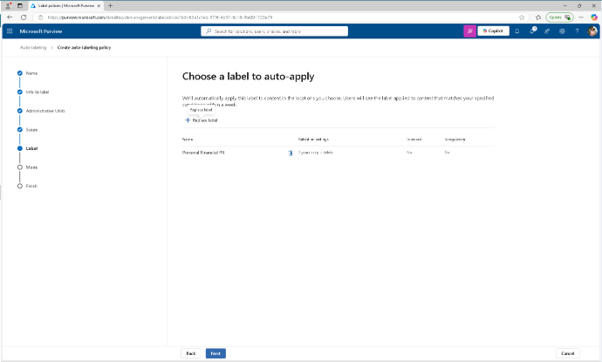

12.	'정책을 테스트할지 실행할지 결정'에서 실행 전에 [테스트 정책(Test the policy before running it)]을 선택하고, [다음]을 클릭합니다.
  

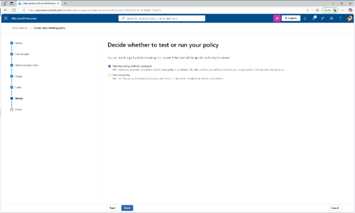

 
13.	검토 및 완료 페이지에서 [제출(summit)]을 클릭하고, 자동 라벨링 정책이 생성되었습니다 페이지에서 [완료]를 클릭합니다. 개인 금융 데이터를 식별하고 자동으로 보존 라벨을 적용하는 자동 적용 정책을 만들었습니다.
 
 
 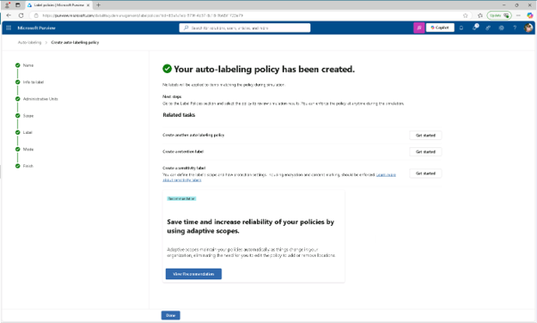

