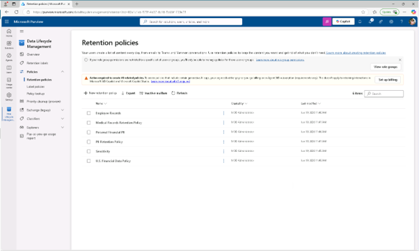
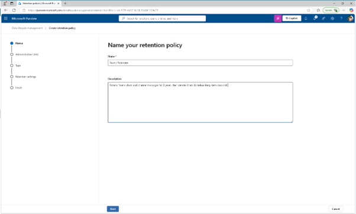
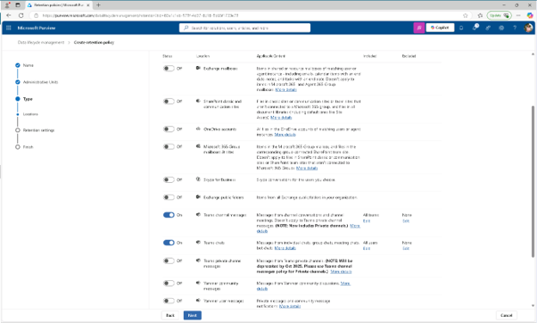
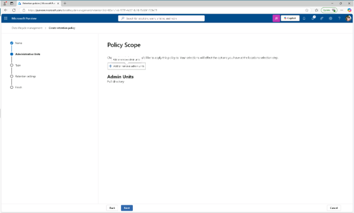
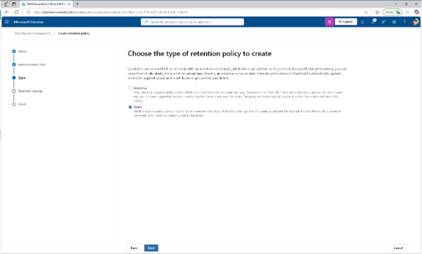
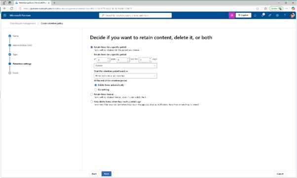
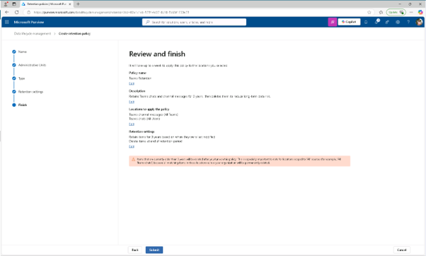
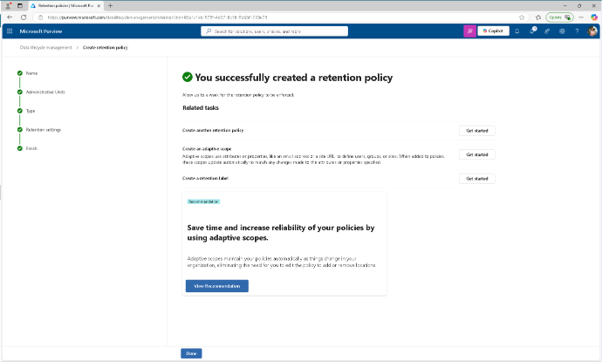

# 작업 4: 정적 보존 정책 생성
이 작업에서는 장기적인 데이터 위험을 줄이기 위해 Microsoft Teams 콘텐츠에 대한 정적 보존 정책을 생성하게 됩니다.

 
1.	Microsoft Purview에서 [솔루션] – [데이터 수명주기 관리] – [정책] – [보존 정책(Retention policies)]을 클릭합니다.
 
  

  
2.	유지 정책 페이지에서 [+새로운 유지 정책(new retention policy)]를 클릭합니다.
 

 
3.	'유지 정책 이름 지정' 페이지에서 다음을 입력하세요:

+ 이름: Teams Retention
+ 설명: Retains Teams chats and channel messages for 3 years, then deletes them to reduce long-term data risk.
 [다음(Next)]을 클릭합니다.
 

 

 
  
 
 
4.	정책 범위 페이지에서 [다음(Next)]을 클릭합니다.
  

 
5.	'보존 정책 유형 선택'에서 [정적(static)]을 선택한 후 [다음]을 클릭합니다.
  

 
6.	'선택 위치 선택 정책 적용' 페이지에서 다음 기능을 활성화하세요:

+ Teams 채널 메시지
+ Teams 채팅
+ 다른 모든 위치는 비활성화하세요.
 [다음(Next)]을 클릭합니다.
  

 
7.	콘텐츠를 유지할지, 삭제할지, 또는 두 페이지 모두 할지 결정할 때, 유지 설정에 대해 다음 값들이 설정 합니다. 

+ 특정 기간 동안 아이템을 보존(Retain items for a specific period)
+ 특정 기간 동안 아이템 보유 항목에서 드롭다운 목록에서 '커스텀'을 선택하고
+ 연도 필드 변경 : 3
+ 보존 기간은 다음 기준으로 시작하세요: 항목이 마지막으로 수정된 시기(When items were last modified)
+ 보존 기간이 끝나면: 항목을 자동으로 삭제(Delete items automatically)
 [다음(Next)]을 클릭합니다.
  

 
8.	검토 및 완료 페이지에서 [제출(summit)]을 클릭합니다. 
  

 
9.	정책 생성이 완료된 메시지를 확인 후 [완료]를 클릭합니다. Teams 메시지를 3년간 유지하다가 자동으로 삭제하는 정적 유지 정책을 설정하였습니다.
 
 

