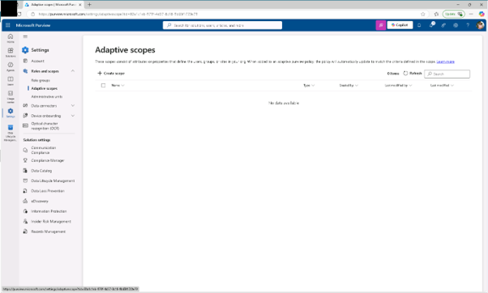
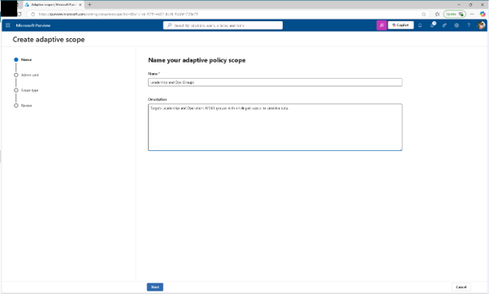
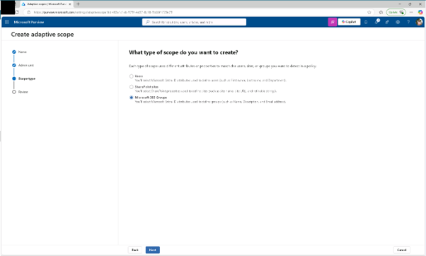
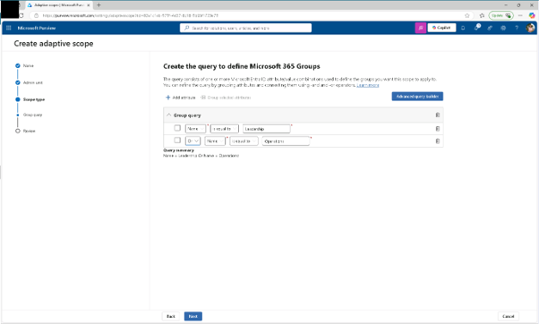
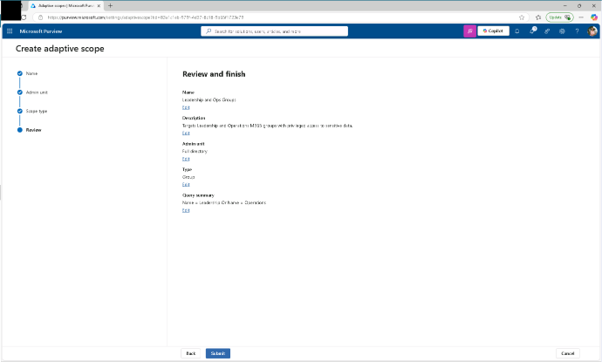
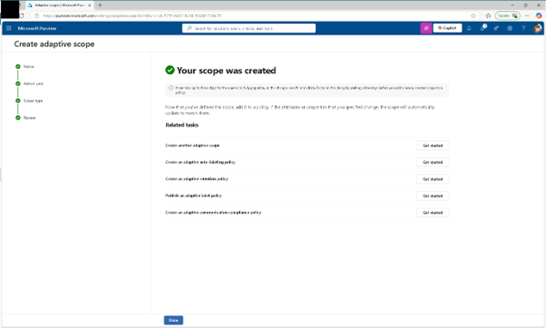

# 작업 5: 적응 범위 생성
이 과제에서는 리더십 및 운영 역할과 관련된 Microsoft 365 그룹을 대상으로 한 적응형 범위를 정의할 것입니다.

 
1.	Microsoft Purview에서는 [설정] – [역할과 범위(Roles and scopes) – [적용 범위(Adaptive scopes)를 클릭합니다.
 

 
2.	적응 범위 페이지에서 [+ 범위 생성(Create scope)]를 클릭합니다.
  

 
3.	적응형 정책 범위 페이지에 다음과 같은 입력을 입력하세요:

+ 이름: Leadership and Ops Groups
+ 설명:Targets Leadership and Operations M365 groups with privileged access to sensitive data.
 [다음(Next)]을 클릭합니다.
  

 
4.	관리자 단위 할당 페이지에서 [다음]을 클릭합니다.
 

 
5.	'어떤 유형의 범위를 만들고?' 페이지에서 [Microsoft 365 그룹]을 선택한 후 [다음]을 클릭합니다.
 

 

 
6.	Microsoft 365 그룹 정의 쿼리 생성 페이지의 사용자 속성 섹션에서, 사용자 속성 구성에 대해 다음 값들을 설정합니다. 

+ 이름 : Leadership  AND Operations
 [다음(Next)]을 클릭합니다.
  

 
7.	검토 및 완료 페이지에서 [제출]을 클릭합니다.
  

 
8.	적응형 범위가 생성되면 '귀하의 범위가 생성되었습니다' 페이지에서 [완료]를 클릭합니다. 조직 내 특권 그룹을 위한 목표 유지 기능을 지원하기 위한 적응형 범위를 만들었습니다.
  

