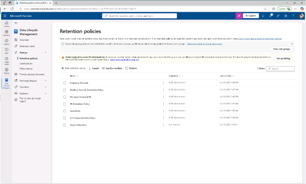
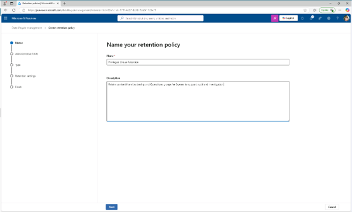
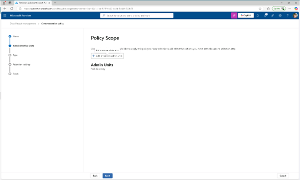
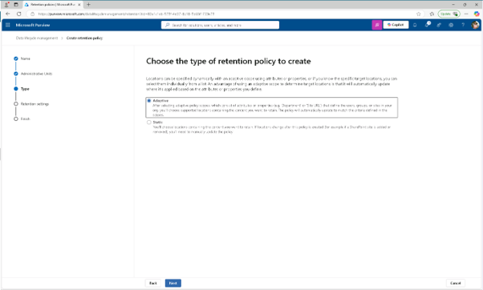
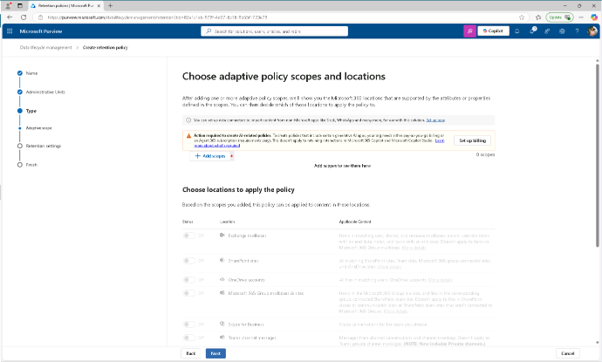
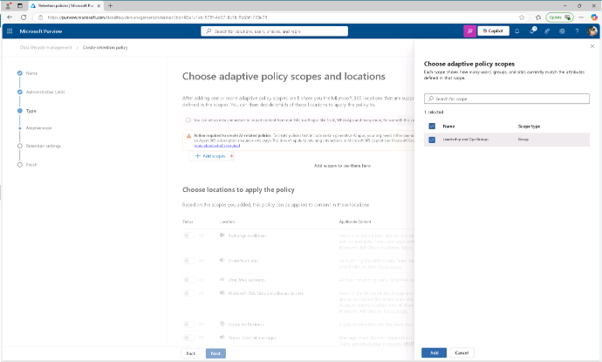
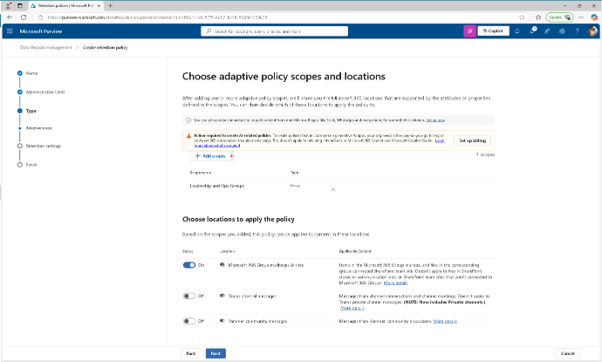
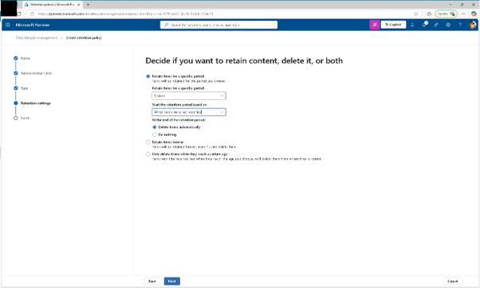
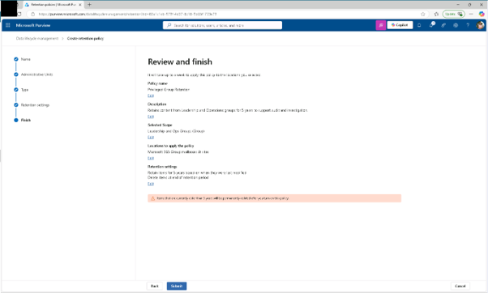
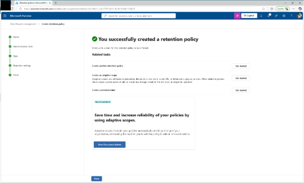

# 작업 6: 적응형 보존 정책 수립
이 작업에서는 사용자가 만든 적응형 범위를 사용하여 민감한 책임을 가진 Microsoft 365 그룹에 대한 유지 정책을 설정하게 됩니다.

 
1.	Microsoft Purview에서 [솔루션] - [데이터 수명주기 관리] – [정책] – [보존 정책]으로 클릭합니다.
 

 
2.	보존 정책 페이지에서 [+ 새로운 유지 정책(New retention policy)]를 클릭합니다.
 

 
 
3.	'보유 정책 이름 지정' 페이지에서 다음을 입력하세요:

+ 이름: Privileged Group Retention
+ 설명: Retains content from Leadership and Operations groups for 5 years to support audit and investigation.
 [다음(Next)]을 클릭합니다.
  

 
4.	정책 범위 페이지에서 [다음]을 클릭합니다.
  

 
5.	'보존 정책 유형을 선택하고, 생성 페이지에서 [적응형(Adaptive)]을 선택한 후 [다음(Next)]을 클릭합니다.
  

 
6.	'적응형 정책 범위 및 위치 선택' 페이지에서 [+ 범위 추가(add scope)]를 클릭합니다.
  

 
7.	적응형 정책 범위 선택 플라이아웃 패널에서 [리더십 및 운영 그룹(Leadership and Ops Groups)] 체크박스를 선택한 후 패널 하단의 [추가]를 클릭합니다.
  

 
8.	다시 돌아가서 정책을 적용할 수 있는 위치를 선택하세요:

+ Microsoft 365 그룹 메일박스 및 사이트
+ 다른 모든 위치는 비활성화하세요.
 [다음(Next)]을 클릭합니다.
  

 
9.	콘텐츠를 유지할지, 삭제할지, 또는 두 페이지 모두 할지 결정할 때, 유지 설정에 대해 다음 값들이 설정합니다.

+ 특정 기간 동안 아이템을 보유하기(Retain items for a specific period.)
+ 특정 기간 동안 항목을 보유 항목 : 5년을
+ 보존 기간은 다음 기준 : 항목이 마지막으로 수정된 시기(When items were last modified)
+ 보존 기간이 끝나면: 항목을 자동으로 삭제(Delete items automatically)
 [다음(Next)]을 클릭합니다.
  

 
10.	검토 및 완료 페이지에서 [제출(summit)]를 클릭합니다.
  

 
11.	정책이 생성되면 [완료]를 클릭합니다. 권한을 가진 그룹이 소유한 콘텐츠에 적용되는 보존 정책을 만들었으며, 삭제 후 5년간 유지하도록 설정 하였습니다.
  

