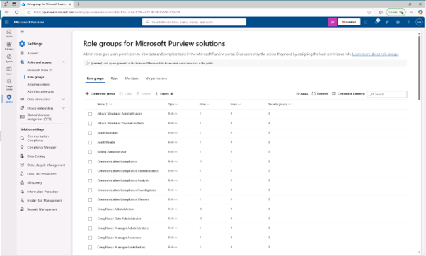
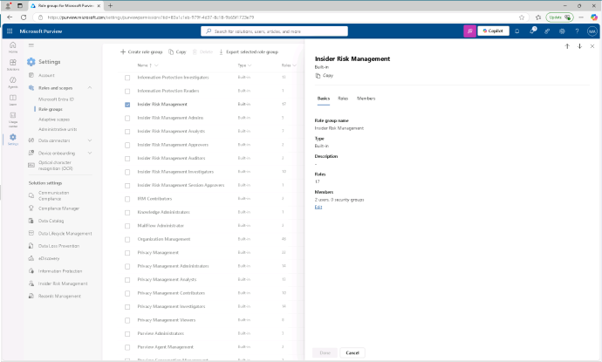
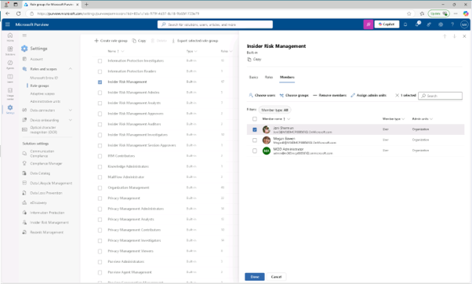
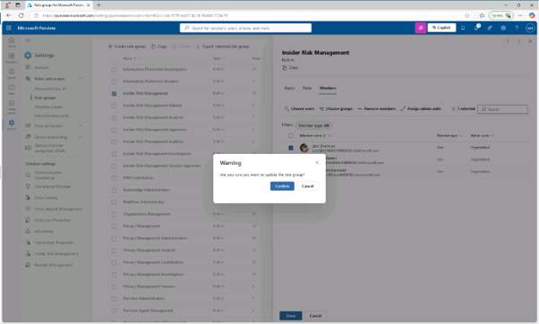

# Lab08 – 내부자 위험 관리 시스템 구현
귀하의 역할은 규제 준수를 보장하고 조직 내 민감한 정보를 보호하는 것입니다. 최근 민감한 데이터를 노출할 수 있는 비정상적인 브라우징 활동을 발견했습니다. 이 내부자 위험을 선제적으로 해결하기 위해 Microsoft Purview 내부자 위험 관리를 도입하여 잠재적 내부자 위협을 식별, 분석, 효과적으로 대응하는 데 중점을 두게 됩니다.

## 작업 1: 내부자 위험 관리 권한 할당
이 작업에서는 Joni Sherman에게 내부자 위험 관리 역할을 배정하여 Microsoft Purview의 내부자 위험 기능에 접근하고 관리할 수 있게 됩니다.

 
1.	https://purview.microsoft.com 로 이동하여 Microsoft Purview 포털에 MOD 관리자로 로그인하세요(Admin 계정) 하고, [설정] – [역할 및 범위(Roles and Scopes)] – [역할 그룹( Role groups)를 클릭합니다.
  

 
2.	Microsoft Purview 솔루션 역할 그룹 페이지에서 [내부자 위험 관리(Insider Risk Management)]를 클릭합니다.
 

 
3.	오른쪽의 Insider Risk Management 플라이아웃 패널에서 [편집]을 클릭합니다.
  

 
4.	역할 그룹의 멤버 편집 페이지에서 [+ 사용자 선택(choose users)]를 클릭하고, 사용자 선택 플라이아웃 패널에서 [조니 셔먼(jonis)]를 검색한 후 체크박스를 선택한 후 패널 하단의 [선택] 버튼을 클릭합니다.
 

 

 
5.	역할 그룹 내 멤버 편집 페이지에서 [다음(Next)]을 클릭합니다.
 
6.	역할 그룹 검토와 종료 페이지에서 [저장]을 클릭합니다. 
 
7.	Joni를 성공적으로 역할 그룹에 추가하면, 'You you successfully update of role group' 페이지에서 [완료] 버튼을 클릭합니다. 추가한 조니(jonis@)계정으로 Microsoft Purview 포털에서 내부자 리스크 관리를 할 수 있는 필요한 권한을 할당했습니다.
  

