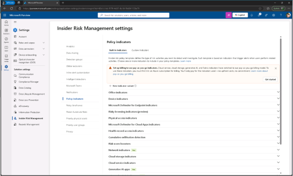
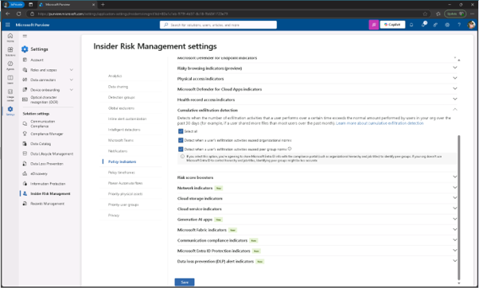

# 작업 2: 내부자 위험 지표 설정
내부자 위험 정책을 만들기 전에 탐지에 필요한 지표들을 켜야 합니다. 이 지표들은 시스템이 탐색할 위험 활동 유형을 정의합니다.

 
1.	Jonis 계정으로 Purview 관리자 사이트를 접속하여 [설정] - [내부자 위험 관리]를 클릭합니다. 

 
2.	왼쪽 메뉴의 정책 표시기(Policy indicators)탭을 클릭합니다.
  

 
3.	정책 지표 페이지에서 펼쳐 [모두 선택(All select)]을 클릭하여 모든 지표를 활성화합니다.

+ Office indicators
+ Cumulative exfiltration detection
   페이지 하단에서 [저장]을 클릭합니다.
  

 
4.	파일 유출이나 위험한 Office 활동 같은 민감한 행동을 감지할 수 있도록 주요 정책 표시기를 활성화했습니다.
 

