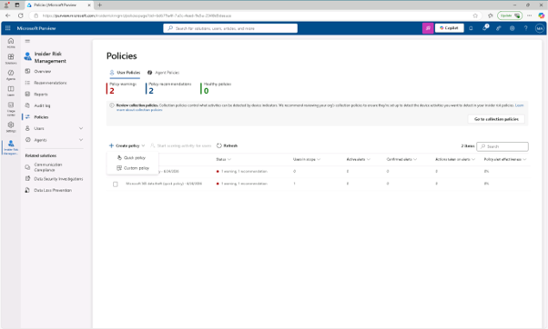
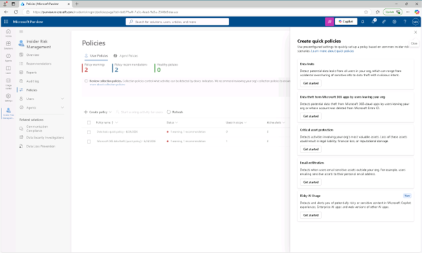
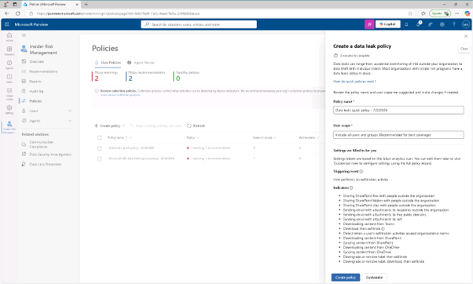
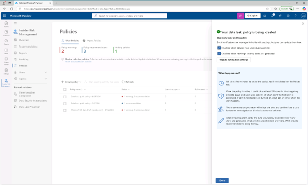
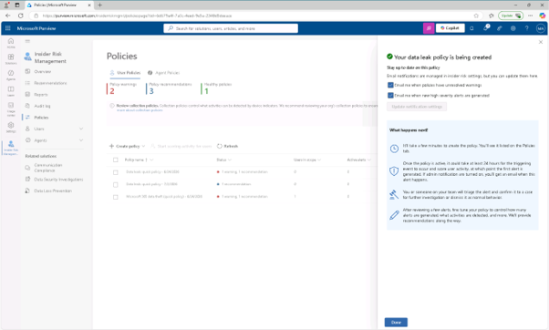

# 작업 3: 내부자 위험 정책 수립
이 작업에서는 데이터 유출과 관련된 위험한 사용자 행동을 자동으로 감지하고 대응하는 데이터 유출 신속 정책을 만듭니다. 빠른 정책은 내장 템플릿과 기본 임계값을 사용하여 설정을 단순화합니다.

 
1.	Microsoft Purview에서  [솔루션] –[내부자 위험 관리] – [정책(Policies)]를 클릭합니다.
 
 
 

 
2.	정책 페이지에서 [정책 생성(Create policy)] – [빠른 정책(Quick policy)]를 클릭합니다.
  

 
3.	'빠른 정책 생성' 플라이트에서 [데이터 유출(data leak)] 항목에서 [시작하기(get started)]를 클릭합니다.
  

 
4.	빠른 데이터 유출 화면에서 내용을 확인 후 [정책 생성(Create policy)]를 클릭합니다.
  

 
5.	'Your Data Leak policy' 작성 중이라는 페이지에서 다음 체크박스를 선택합니다.

+ 정책에 미해결 경고가 있을 때 이메일로 연락해 주세요
+ 새로운 고중도 경보가 생성되면 이메일로 연락해 주세요
 그 다음 [알림 설정 업데이트(Update notification settings)]를 클릭합니다.
  

 
6.	'Your Data Leak Policy is being being data' 페이지 하단에서 [완료(done)]를 클릭합니다.
  

 
7.	기본 설정을 사용해 잠재적인 데이터 유출을 감지하는 빠른 정책을 만들었습니다. 
 