# 작업 4: 데이터 유출 정책 맞춤화
일부 내부자 위험 보험은 제대로 작동하기 위해 추가 지표를 요구합니다. 이 작업에서는 정책을 수정하여 시퀀스 지표를 활성화하고 정책을 건강한 상태로 전환해야 합니다.
내부 위험 관리 정책 페이지에서 데이터 유출 정책에 권고사항이 있는 것을 확인할 수 있습니다.

 
1.	방금 만든 [데이터 유출 빠른 정책]을 클릭합니다.
  

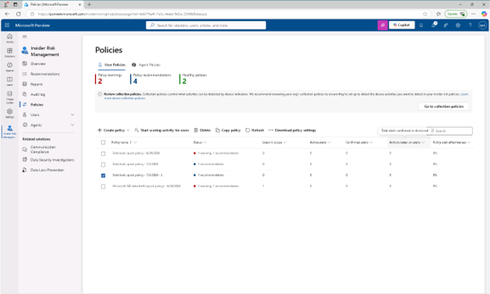
 
2.	정책 플라이아웃 페이지의 권고사항을 검토하세요. 시순서 트리거 필요 표시가 선택되지 않았다는 경고가 있습니다. 이 경고를 해결하려면 [정책 편집(edit policy)]를 클릭합니다.
  

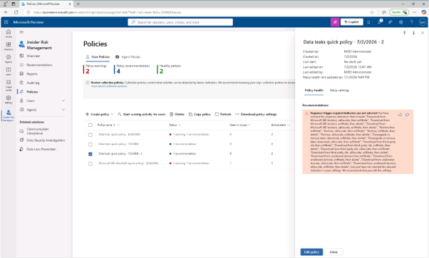

 
3.	'정책 템플릿 선택' 페이지에서 [다음(Next)]을 클릭합니다.
  

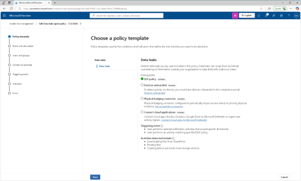
 
4.	정책 이름 페이지에서 [다음(Next)]을 클릭합니다.
  

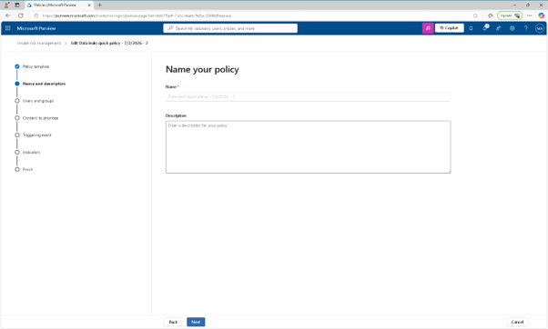
  
5.	'사용자, 그룹, 적응 범위 선택' 페이지에서 [다음(Next)]을 클릭합니다.
  

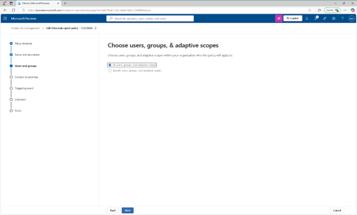

 
6.	사용자 및 그룹 제외(선택 사항) 페이지에서 [다음(Next)]을 클릭합니다.
  

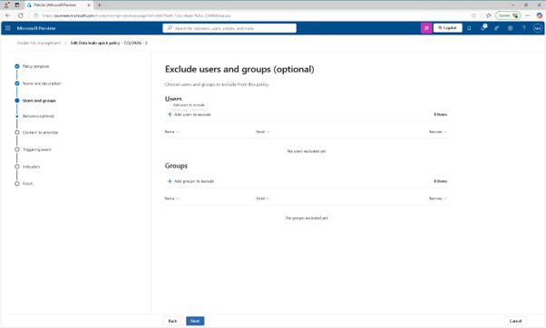

 
7.	'콘텐츠 우선순위 결정' 페이지에서 [다음(Next)]을 클릭합니다.
  

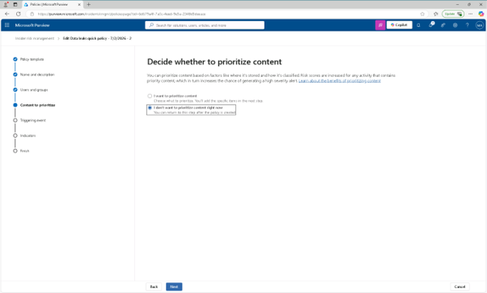

 
8.	이 정책 페이지의 트리거 선택 이벤트에서 해당 정책을 트리거할 시퀀스 선택 항목을 검토하시고, 일부 시퀀스는 선택 전에 '설정'에서 특정 표시를 켜야 선택 정보를 확인할 수 있습니다.
 

 
9.	이 정책에 필요한 순서 표시기를 활성화하려면 'Turn on indicators' 옵션을 클릭합니다.
  

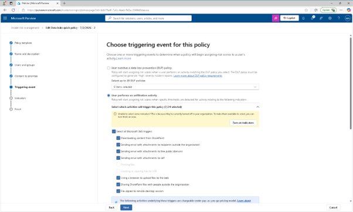

 

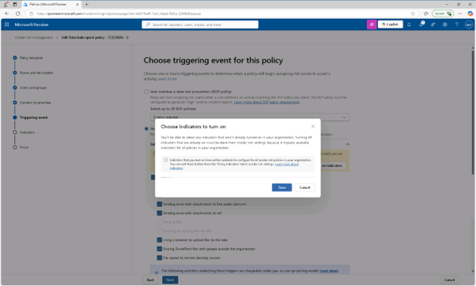
 
 
10.	데이터 유출은 주로 데이터 유출 내부자 위험 정책입니다. 시퀀스 표시기를 활성화하는 대화에서 [모두 선택]을 선택해 필요한 모든 탈출 표시기를 켜고, [저장]을 클릭합니다 .
  

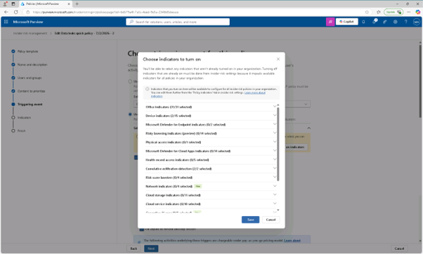

 
11.	이 정책 페이지의 트리거 선택 이벤트에서 [다음(Next)]을 클릭합니다.
  

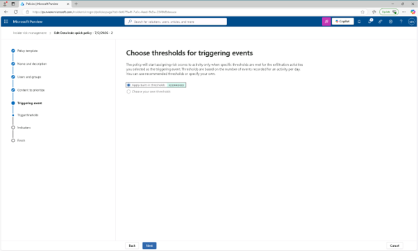
 
12.	이벤트 트리거 임계값 선택 페이지에서 [다음(Next)]을 클릭합니다. 

 
13.	지표 페이지에서 [다음(Next)]을 클릭합니다.
  

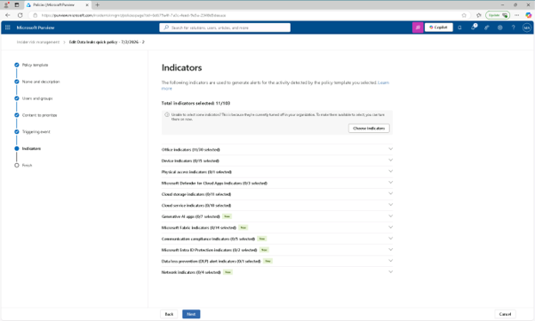
 
14.	Detection 옵션에서 [다음(Next)]을 클릭합니다.
  

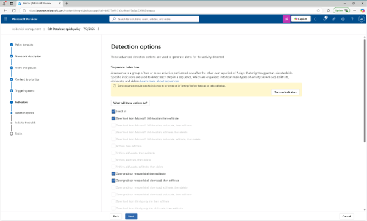
  
15.	지표 임계값 선택 페이지에서 [다음(Next)]을 클릭합니다.
  

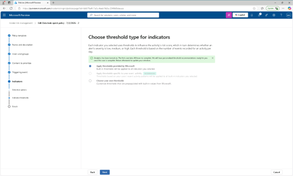

 
16.	이 정책은 내장된 트리거 이벤트와 지표를 사용합니다. Microsoft Defender for Endpoint가 방어 회피나 원치 않는 소프트웨어와 같은 위협을 감지할 때만 사용자 활동을 평가하기 시작합니다.
 

 
17.	리뷰 설정 및 완료 페이지에서 [제출(summit)]를 클릭합니다.
  

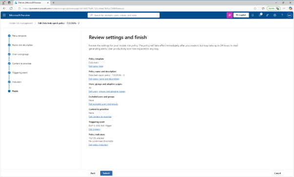
 
18.	'정책이 생성되었습니다' 페이지에서 [완료(Done)]를 클릭합니다.
  

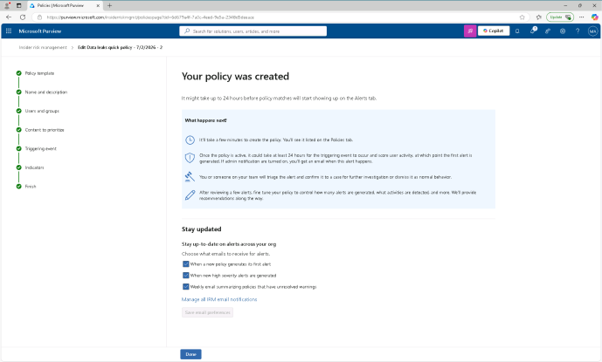

  
19.	정책 페이지로 돌아가면, 이제 귀하의 보험 상태가 건강(Healthy status)으로 설정되어 있을 것입니다. 내부자 위험 정책은 이제 건강하여 시퀀스 트리거와 활성화된 지표를 기반으로 위험 활동을 감지할 준비가 되었습니다.
  

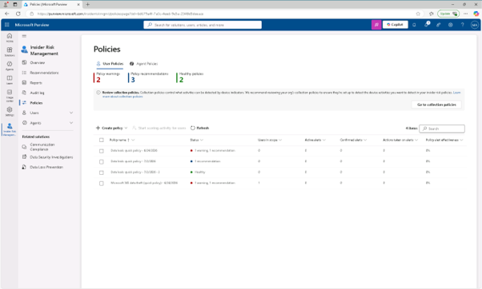