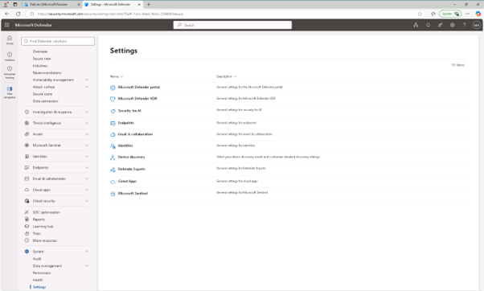
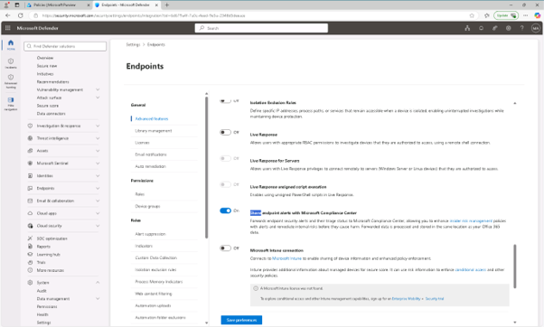

# 작업 5: Microsoft Defender for Endpoint와 Insider Risk Management의 통합 활성화

이 작업에서는 Microsoft Defender for Endpoint와 Microsoft Purview 간의 통합을 활성화하여 내부 위험 정책에 보안 경고를 사용할 수 있게 됩니다.

 
1.	Microsoft Edge에서 https://security.microsoft.com Microsoft Defender 관리 페이지로 이동합니다. 

 
2.	왼쪽 내비게이션 창에서 [시스템] – [설정] – [Endpoint]를 클릭합니다.
  

 
3.	Endpoints 설정 화면에서 [고급 기능(Advanced features)]에서 아래로 스크롤하여 [Microsoft 컴플라이언스 센터와 엔드포인트 알림 공유 켜기(Share endpoint alerts with Microsoft Compliance Center)] 설정 하고, 화면 하단에서 [저장]를 클릭합니다.
 

  
4.	Defender for Endpoint가 Microsoft Purview와 알림을 공유하도록 성공적으로 활성화하셨습니다.
 