# 작업 6: 표시기 활성화 및 우선순위 사용자 설정
이 작업에서는 정책 지표를 구성하고 내부자 위험 정책에 사용할 수 있는 우선순위 사용자 그룹을 생성해야 합니다.

 
1.	이전 작업의 통합이 완료되지 않은 경우, Microsoft Defender for Endpoint 표시기가 회색으로 비활성화되어 선택 불가능하게 표시될 수 있습니다. 그럴 경우 몇 분간 기다렸다가 페이지를 새로고침한 후 계속 진행하세요.
 

 
2.	Microsoft Edge에서 https://purview.microsoft.com 사이트에서 [내부자 위험 관리] – [설정]을 클릭합니다.
 
 
 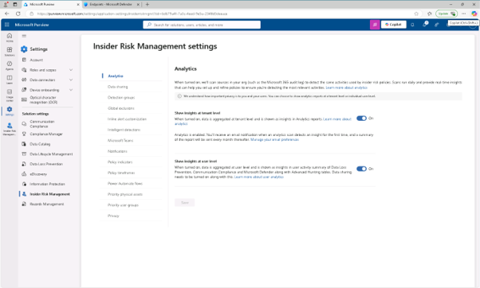

 
3.	내부자 위험 관리 설정 화면에서 [정책 표시기(Policy indicators)] 탭을 클릭합니다.
 
 
 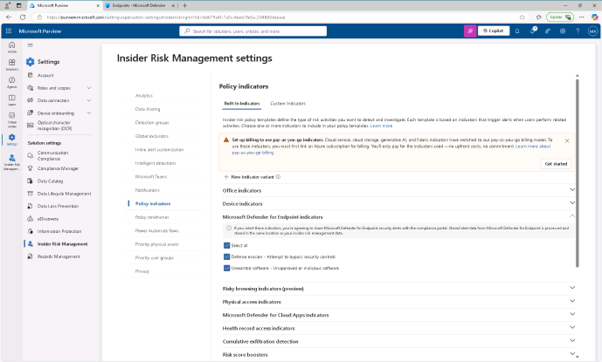

 
4.	정책 지표 페이지에서 다음 카테고리의 모든 지표를 활성화 합니다.

+ Microsoft Defender for Endpoint indicators
+ Risky browsing indicators (preview)
 페이지 하단에서 [저장]을 클릭합니다.
  

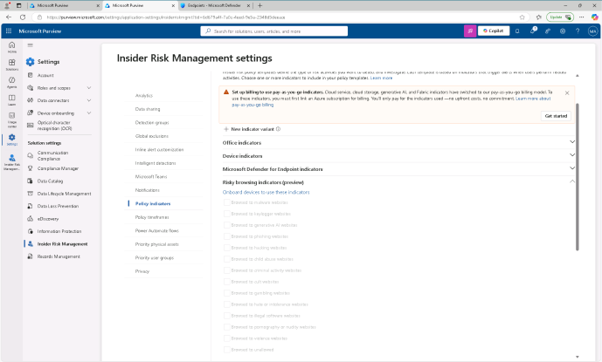

 
5.	우선순위 사용자 그룹 탭을 선택한 후 [+ 우선순위 사용자 그룹 생성(+ Create priority user group)]을 클릭합니다.
  

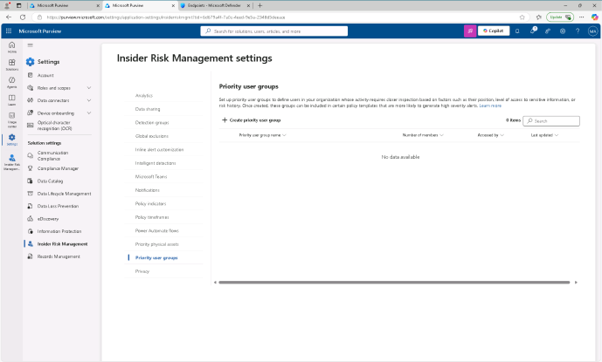
 
6.	이름 및 우선순위 사용자 그룹 설명 페이지에 다음과 같이 입력하세요:

+ 이름: Finance team
+ 설명: Team members who manage financial operations, budgeting, and payroll systems.
 [다음(Next)]을 클릭합니다.
  

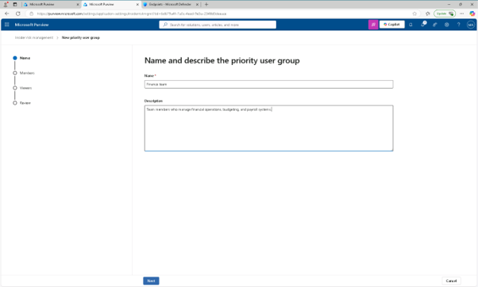
 
7.	멤버 페이지에서 [+멤버(member)]를 클릭합니다.
  

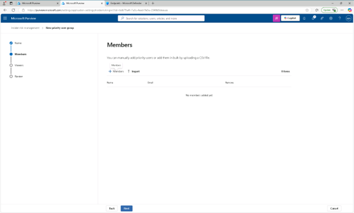
 
8.	멤버 플라이트에서 다음을 검색하여 선택하십시오:

+ Lynne Robbins
+ Debra Berger
+ Megan Bowen
 추가를 선택하여 세 명의 멤버를 재무팀 우선순위 그룹에 추가 한 후 [다음(Next)]을 클릭합니다.
  

 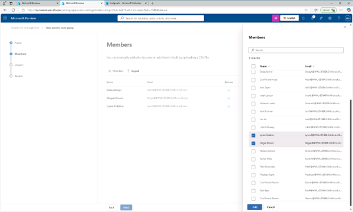

  

 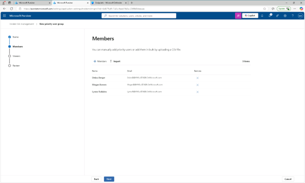

 
9.	이 우선순위 그룹에 포함된 데이터를 볼 수 있는 사람 선택 페이지에서 [+ 사용자 및 역할 그룹(+ Choose users and role groups)] 선택 버튼을 클릭합니다.
  

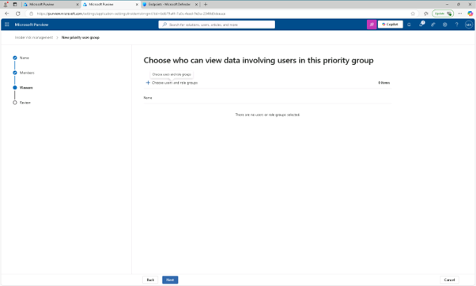
 
10.	플라이아웃에서 [내부자 위험 관리(Insider Risk Management)]체크박스를 선택한 후 [추가]하고, [다음(Next)]을 클릭합니다.
 
 
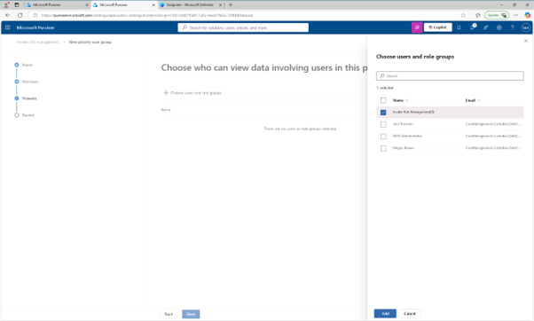
 
  

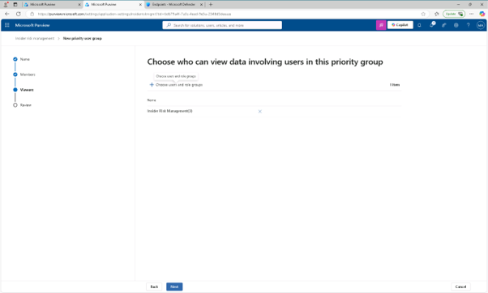
 
11.	설정을 검토하고 제출한 후, 우선 사용자 그룹이 생성되면 [완료]를 클릭합니다. 정책 지표를 설정하고 고위험 사용자를 모니터링하는 우선순위 그룹을 만들었습니다.
  

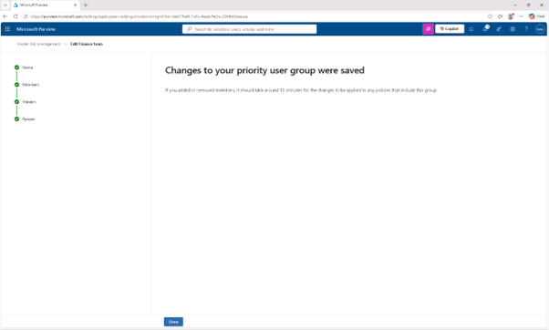
