# 작업 7: 우선순위 사용자의 보안 정책 위반에 대한 정책 생성
이 작업에서는 우선순위 사용자의 위험 활동에 대한 Defender for Endpoint 경고를 감지하는 내부자 위험 정책을 생성해야 합니다.

 
1.	Microsoft Purview에서 [솔루션] – [내부자 위험 관리] – [정책]을 클릭합니다.
  

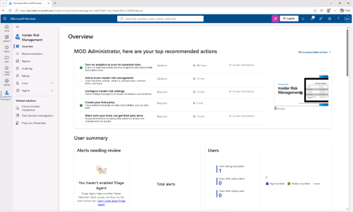
  
2.	정책 페이지에서 [정책 생성]을 선택한 후 [사용자 지정 정책]을 클릭합니다.
  

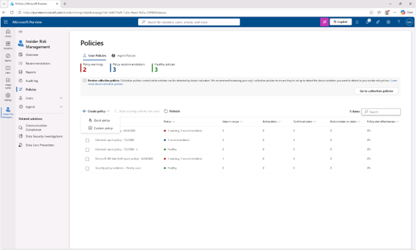
  
3.	'정책 템플릿 선택 페이지'에서 우선순위 [사용자별 보안 정책 위반(미리보기)( Security policy violations by priority users)]을 선택한 후 [다음]을 클릭합니다.
  

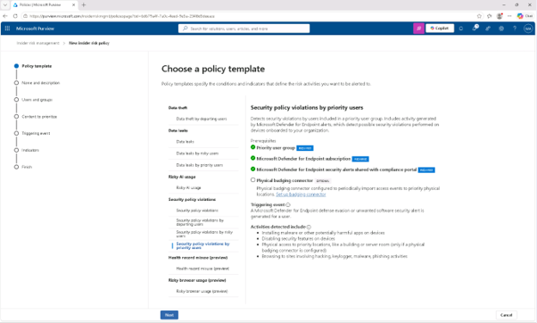

 
4.	'정책 이름 표시' 페이지에서 입력합니다.

+ 이름: Security policy violations - Priority users
+ 설명: Detects Defender for Endpoint alerts for risky activity by priority users, such as malware or disabled protections.
 [다음(Next)]을 클릭합니다. 
 

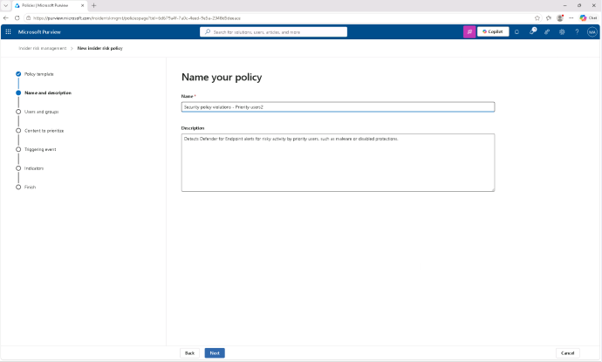

 
5.	사용자, 그룹, 적응 범위 선택(Choose users, groups, and adaptive scopes) 페이지에서 [우선순위 사용자 그룹 추가]를 클릭합니다.
  

 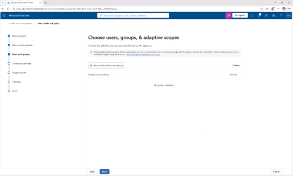

 

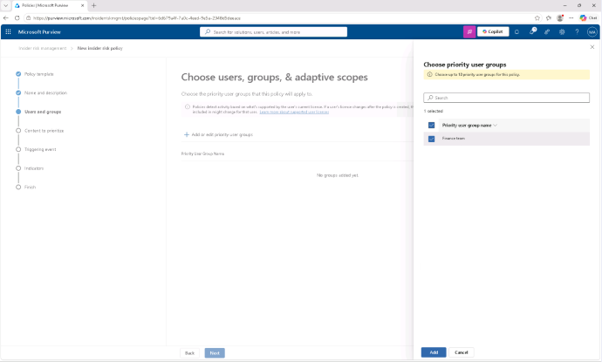

 
6.	우선순위 사용자 그룹 선택 프라이아웃에서 [재무 팀 그룹(Finance team)] 체크박스를 선택한 후 [추가]를 하고, [다음(Next)]을 클릭합니다.
  

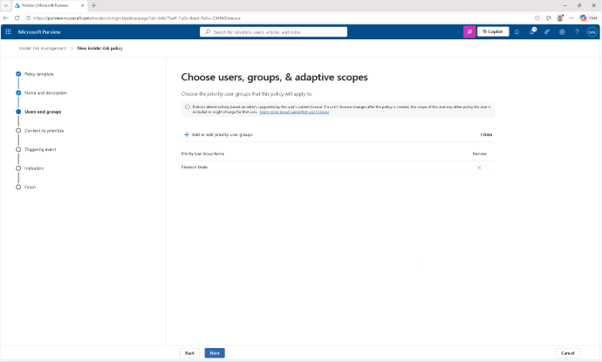

 
7.	'콘텐츠 우선순위 결정' 페이지에서 [다음(Next)]을 클릭합니다.
  

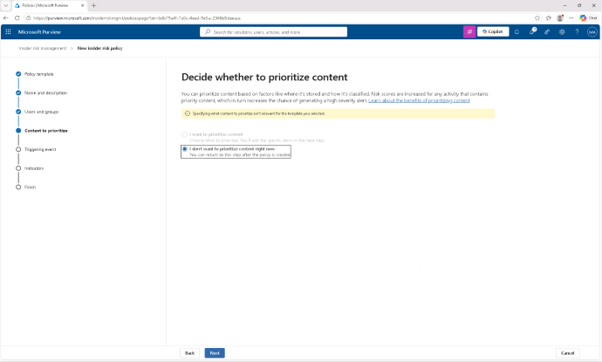
 
8.	이 정책 페이지의 트리거 이벤트 선택 페이지에서 [다음(Next)]을 클릭합니다.
 
 
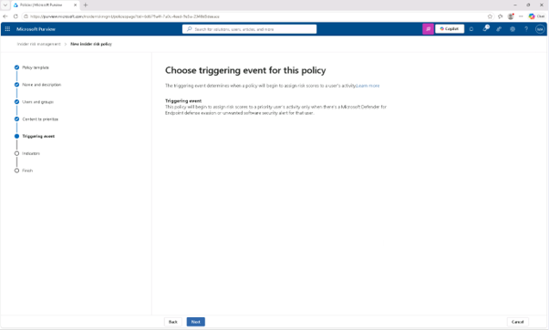
 
9.	지표 페이지에서 [다음(Next)]을 클릭합니다.
  

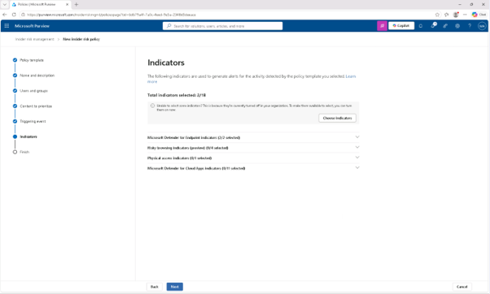
 
10.	지표 임계값 선택 페이지에서 Microsoft가 제공하는 기본 임계값을 적용 옵션을 선택해 둔 후 [다음(Next)]을 클릭합니다.
 

 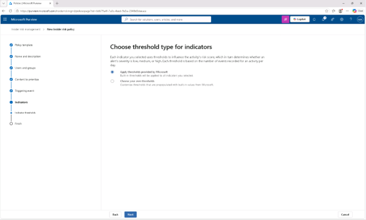

 
11.	리뷰 설정 및 완료 페이지에서 [제출]을 클릭합니다.
  
 
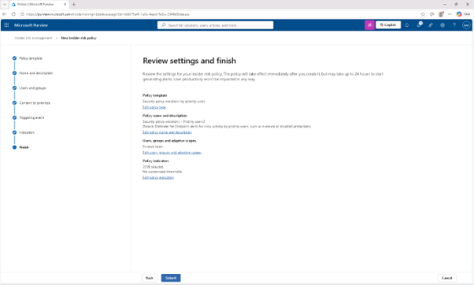

 
12.	'정책이 생성되었습니다' 페이지에서 [완료]를 클릭합니다. Defender for Endpoint 신호를 사용해 우선순위 사용자의 위험 활동을 감지하는 맞춤형 내부자 위험 정책을 만들었습니다.
  

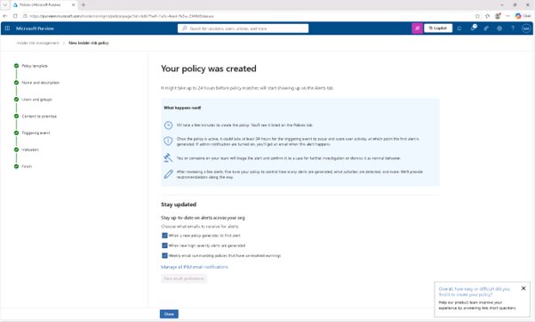