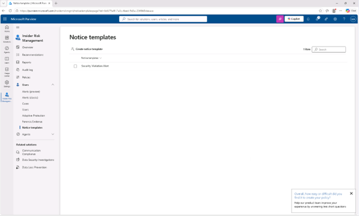
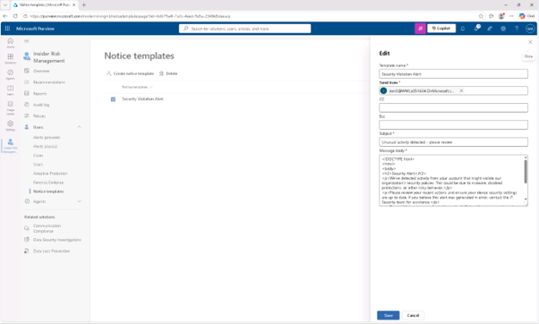
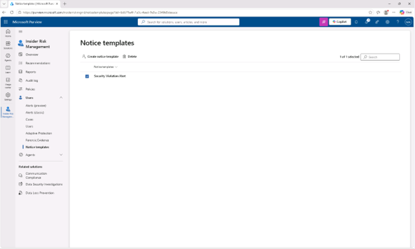

# 작업 8: 공지 템플릿 만들기
이 작업에서는 Microsoft Purview에서 내부자 위험 경고가 발생했을 때 사용자에게 알림을 주는 통지 템플릿을 만듭니다.


<br>
1.	Microsoft Purview에서 [솔루션] – [내부자 위험 관리(Insider Risk Management) > 사용자 > [알림(Notice templates)] 템플릿을 클릭합니다.
<br>


<br>
2.	알림 템플릿 페이지에서 [+ 알림 템플릿 만들기]를 클릭합니다.
 <br>



<br>
3.	오른쪽의 '새 통지 템플릿 만들기 플라이아웃' 패널에 필요한 정보를 입력하세요.

+ 템플릿 이름: Security Violation Alert
+ 보내기: Joni Sherman
+ 제목: Unusual activity detected - please review
+ 메시지 본문:
<br>

```html 
<!DOCTYPE html>
<html>
<body>
<h2>Security Alert</h2>
<p>We've detected activity from your account that might violate our organization's security policies. This could be due to malware, disabled protections, or other risky behavior.</p>
<p>Please review your recent actions and ensure your device security settings are up to date. If you believe this alert was generated in error, contact the IT Security team for assistance.</p>
<p>To avoid future issues, refer to the <a href="https://contoso.com/security-guidelines">Contoso Security Guidelines</a>.</p>
<p>Thank you,</p>
<p><em>Compliance and Security Team</em></p>
</body>
</html>
````

<br>

[만들기(create)]를 클릭합니다.
<br> 



<br>
4.	알림 템플릿 페이지로 돌아가면 방금 생성하신 보안 위반 경고 템플릿을 확인할 수 있습니다. 
 <br>




<br>
5.	Insider Risk Management가 사용자에게 보안 정책 위반을 알릴 수 있는 통지 템플릿을 만들었습니다.
<br>