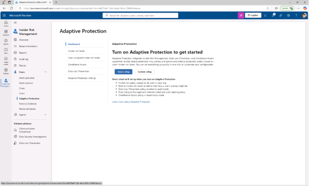
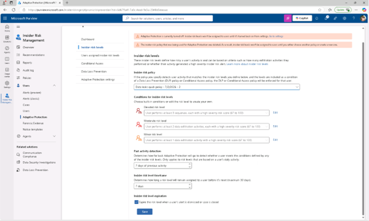
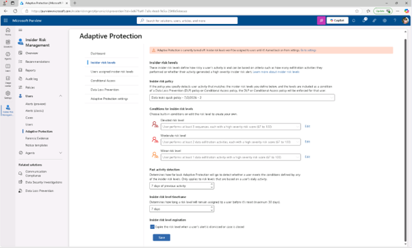

# Lab09 – 적응형 보호 기능을 구현
역할은 민감한 데이터를 보호하고 내부자 위험에 대응하는 것입니다. 보호를 강화하기 위해 Microsoft Purview 적응형 보호(Microsoft Purview Adaptive Protection)를 활성화하는데, 이는 내부자 위험 수준에 따라 데이터 손실 방지(DLP) 집행을 동적으로 조정합니다.

## 작업 1: 적응 보호에 내부자 위험 정책을 할당
이 작업에서는 내부자 위험 정책을 적응 보호(Adaptive Protection)와 연결하여 Microsoft Purview 전반에 걸쳐 동적 위험 기반 조치를 가능하게 합니다.

 
1.	Microsoft Edge에서는 https://purview.microsoft.com 로 이동하여 Joni Sherman으로 로그인하세요 

 
2.	Microsoft Purview 포털에서 [솔루션] – [내부자 위험 관리] – [사용자] – [적응 보호(Adaptive Protection)]을 클릭합니다.
  

 
3.	왼쪽 내비게이션 창에서 [내부자 위험 수준(Insider risk levels)]를 클릭합니다.
 

 
4.	내부자 위험 수준 페이지에서 내부자 위험 정책 드롭다운에서 이전 작업에서 만든 데이터 유출 신속 정책(Data leaks quick policy)]을 선택하세요.
  

 
5.	기본 위험 수준 설정은 변경하자 않고, [저장]을 클릭합니다. 
  

  
6.	내부자 위험 정책을 적응적 보호(Adaptive Protection)와 연동하여 Microsoft Purview 전반에 걸친 동적 위험 기반 조치를 가능하게 했습니다.
 
