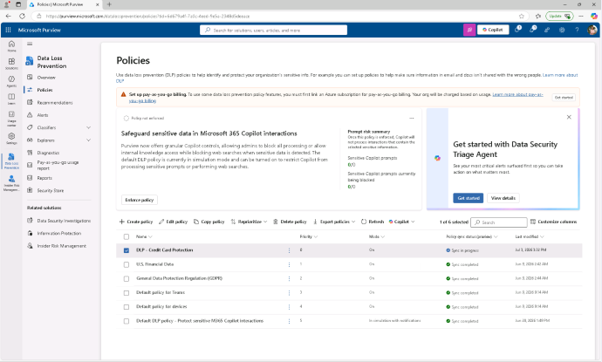
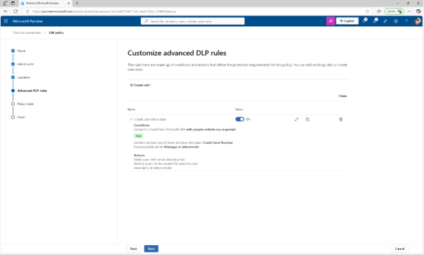
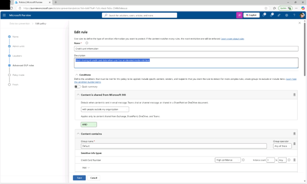
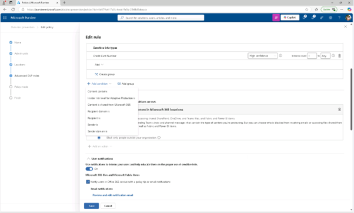
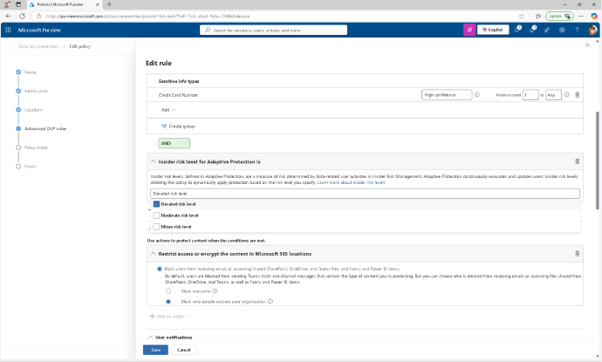
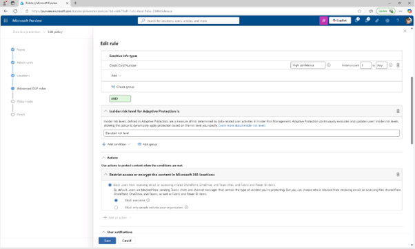
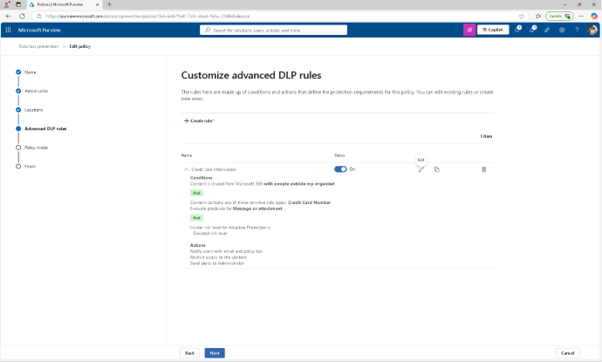
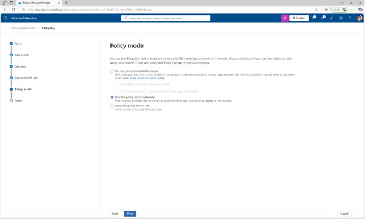
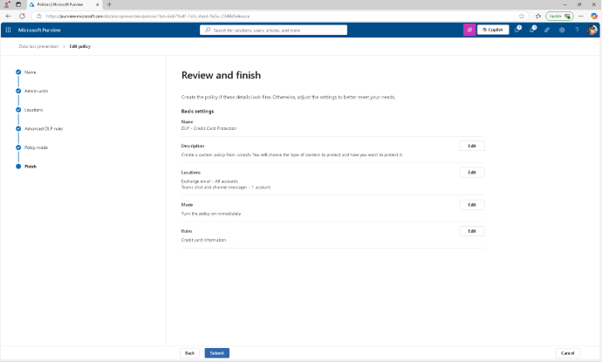
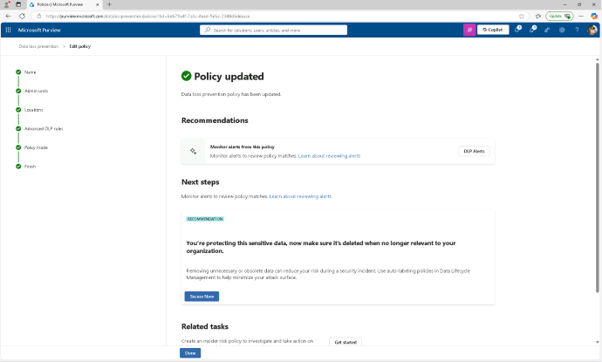

# 작업 2: DLP 정책에 대한 적응형 보호 설정
적응 보호가 내부자 위험 정책과 연동되었으므로, 민감한 데이터 공유를 차단하여 위험 수준이 높아질 경우 DLP 정책을 업데이트할 수 있습니다.

 
1.	Microsoft Purview에서 [솔루션] – [데이터 손실 방지] – [정책]을 클릭합니다.
 

 
2.	정책 페이지에서 이전 작업에서 생성된 [DLP - 신용카드 보호 정책]의 체크박스를 선택한 후 [정책 편집(Edit Policy)]를 클릭합니다. 
  

 
3.	DLP 설정에서 '다음'을 선택하다가 '고급 DLP 규칙 사용자 지정' 페이지까지 [다음]으로 진행합니다. 
 

 
4.	신용카드 정보 규칙 옆에 있는 연필 아이콘을 선택해서 편집합니다.
 

  
5.	편집 규칙 페이지에서

+ 설명: Block sharing of credit card data when user has an elevated insider risk level.
+ 조건: 적응 보호의 내부자 위험 수준(Insider risk level for Adaptive Protection is)
+ 새 섹션에서 [위험 증가(Elevated Risk)]를 선택하세요.
+ Action : Microsoft 365의 콘텐츠를 암호화(Restrict access or encrypt the content in Microsoft 365)] – 모든 사용자 제한(Block everyone)]
  규칙을 업데이트하려면 [저장(save)]를 클릭합니다.
  
 
 

  

 
 
  

 

  

 
6.	고급 DLP 규칙 사용자 지정 페이지에서 [다음(Next)]을 클릭합니다.
  

 
7.	정책 모드 페이지에서 정책을 활성화한 상태로 유지한 후 [다음(Next)]을 클릭합니다.
  

 
8.	검토 및 완료 페이지에서 [제출(summit)]을 클릭합니다.
  

 
9.	정책이 업데이트되면 [완료(Done)]를 클릭합니다. 내부자 위험이 높을 때 공유를 차단하도록 DLP 정책을 업데이트하여 사용자 행동에 따라 데이터 보호를 강화했습니다.
  

