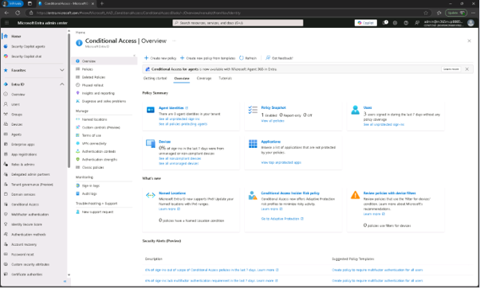
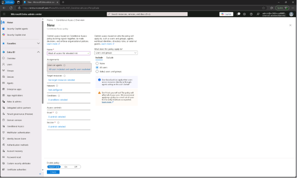
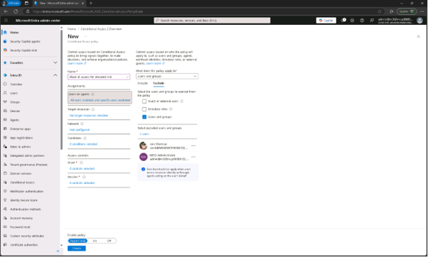
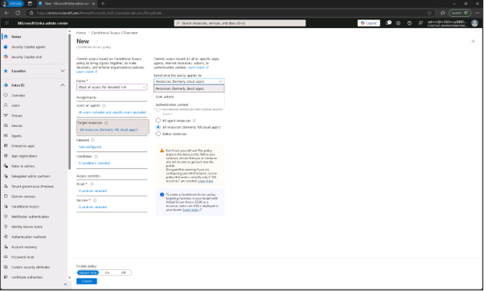
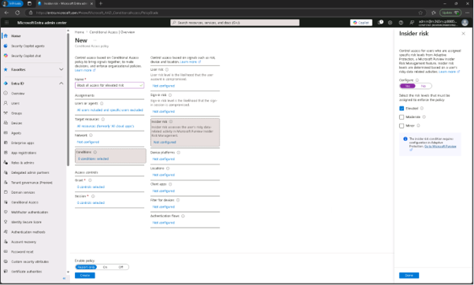
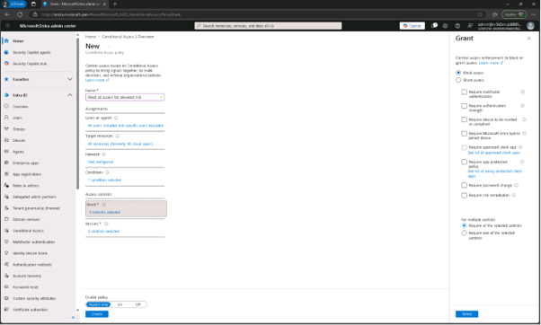
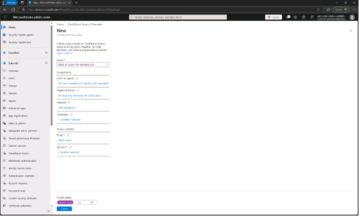
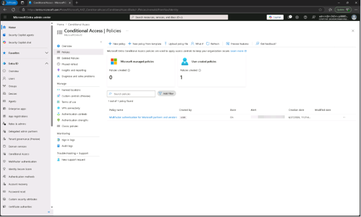

# 작업 3: 적응 보호가 포함된 조건부 접근 구성
또 다른 단속 차원을 위해 내부자 위험 수준을 이용해 조건부 접근을 제한할 수 있습니다. 이 작업에서는 내부자 위험 수준이 높은 사용자를 차단하는 정책을 만듭니다.

 
1.	Microsoft Entra 관리자 센터에서 MOD 관리자로 로그인하세요 

 
2.	Microsoft Entra 관리자 센터에서 [조건부 액세스] – [정책]을 클릭합니다.
  

 
3.	정책 페이지에서 [+ 새 정책(New Policy)]를 클릭합니다.

+ 정책 이름: Block all access for elevated risk
+ 할당 항목에서 사용자 섹션
  +	포함: 모든 사용자
  + 제외: Joni Sherman / MOD Administrator
+ Target 리소스 :  [Resources(이전 클라우드 앱)]로 설정되어 있는지 확인하고, [모든 리소스(All resources (formerly 'All cloud apps'))
+ 조건 항목 : [내부자 위험(Insider risk)]을 선택하고, 구성을 [예(Yes)]로 설정한 다음, 위험 수준을 [높음(Elevated)]
+ 접근 제어 : [접근 차단]을 선택한 후, 플라이아웃 하단에서 [선택]을 클릭
  페이지 하단에서 'Enable policy'가 'Report-only'로 설정되어 있는지 확인한 후 [생성(Create)]를 클릭합니다.
  

 
 
 

 
 
 

 
 
 

 
 

 
 

 
4.	조건부 접근 정책 페이지로 돌아가 새로 생성한 정책이 나타나는지 확인하려면 새로고침을 선택하세요. 보고서 전용 모드로 설정되어 있어 위험이 높은 사용자의 접근을 차단하는 조건부 접근 정책을 만들었는데, 이는 접근 자체에 즉각적인 영향을 주지 않습니다.
  

