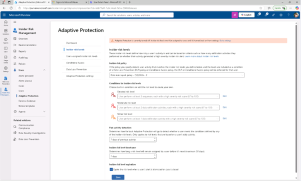
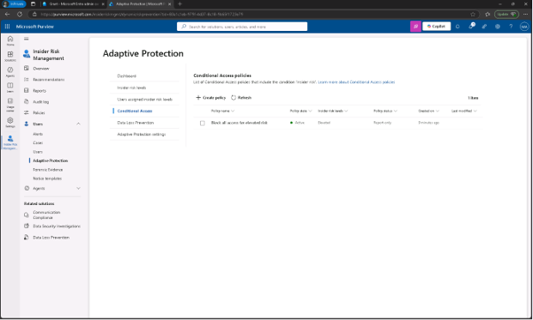
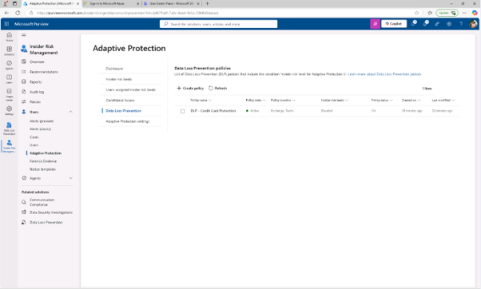
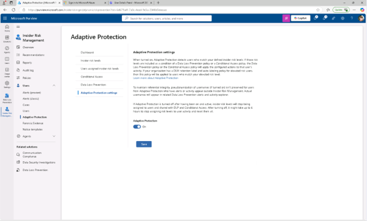

# 작업 4: 적응형 보호 활성화

마지막 작업에서는 적응 보호(Adaptive Protection)를 켜서 시스템이 내부자 위험에 기반한 동적 집행을 적용할 수 있게 됩니다.

 
1.	Purview 관리 센터에서 [솔루션] – [내부자 위험 관리] – [사용자] – [적응형 보호]를 클릭합니다.(Jonis 계정)
 

 
2.	구성 확인 합니다. 

+ 내부자 위험 수준 탭 : 데이터 유출 신속 정책(Data leaks quick policy)
  

 

+ 조건부 접근 탭 : 위험 증가에 대한 모든 접근 차단 정책(Block all access for elevated risk)
 

 
+ 데이터 손실 방지 탭 : DLP - 신용카드 보호 정책(DLP - Credit Card Protection policy)
  

 
3.	[적응형 보호 설정 탭]을 클릭합니다.
 

 
4.	적응형 보호를 [켜기]로 전환한 후 [저장]을 클릭합니다. 적응형 보호(Adaptive Protection)를 성공적으로 활성화하고, 실행 조치는 이제 사용자의 내부자 위험 수준에 따라 자동으로 조정됩니다.
  

