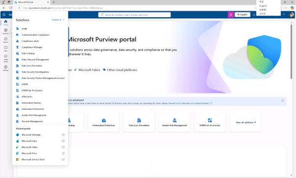
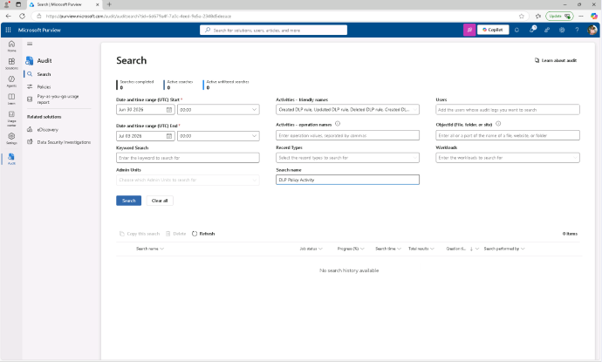
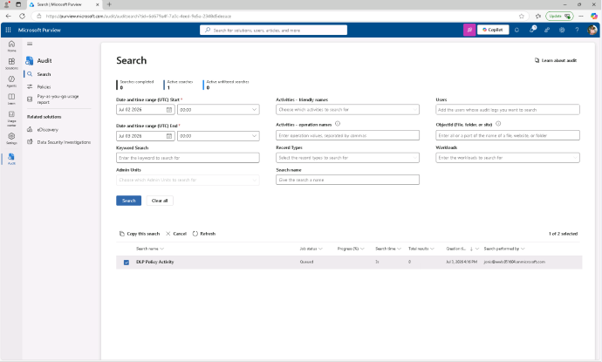

# Lab10 – 감사 로그를 검색
조직의 조사 및 준수 준비 태세를 강화하기 위해 Microsoft Purview Audit를 사용하여 DLP 구성 변경 사항을 검토하고 민감한 활동에 대한 감사 기록이 장기간 보존되도록 요청받았습니다. DLP 정책과 관련된 감사 이벤트를 검색하고, 결과를 오프라인 분석을 위해 내보내며, Exchange, SharePoint, 엔드포인트 활동 전반에 걸쳐 주요 레코드를 보존하는 감사 보존 정책을 설정해야 합니다.

## 작업 1: DLP 관련 활동 검색
이 작업에서는 Microsoft Purview 감사 솔루션을 사용하여 DLP 정책 및 규칙과 관련된 최근 감사 이벤트를 검색하게 됩니다.

 
1.	Microsoft Edge에서 Microsoft Purview 포털에 Joni Sherman으로 로그인하세요
 

 
2.	Microsoft Purview에서 [솔루션] – [감사]를 클릭합니다 .
  

 
3.	검색 페이지에서 검색을 설정하세요:

+  날짜 및 시간 범위 (UTC):
+ 시작일: 3일 전
+ 종료일: 오늘
+ 활동 - 친근한 이름(Activities - friendly names) : 정보 보호 및 DLP 활동 항목에서 다음 활동을 검색하여 선택하십시오:DLP
  +	Created DLP rule
  + Updated DLP rule
  + Deleted DLP rule
  + Created DLP policy
  + Updated DLP policy
  + Deleted DLP policy
  + 검색명: DLP Policy Activity
  [검색(search)]를 클릭합니다.
  

 
4.	검색이 완료되는 데 몇 분이 걸릴 수 있습니다. 감사가 검색 처리를 진행하는 동안 페이지를 새로고침하여 채용 상태, 진행 상황(%), 검색 시간을 확인합니다.
  

 
5.	완료 후 DLP 정책 활동을 선택하여 결과를 확인하세요.
 

 
6.	각 DLP 활동에 대한 상세 정보를 보려면 개별 결과를 선택하여 확인 합니다. 
 