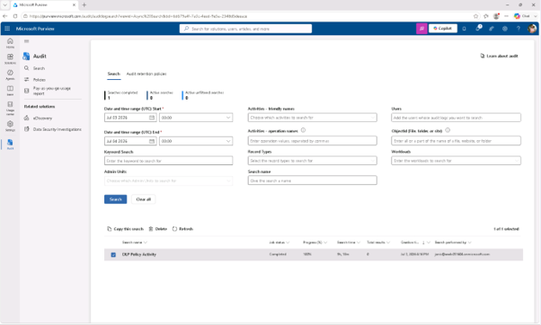
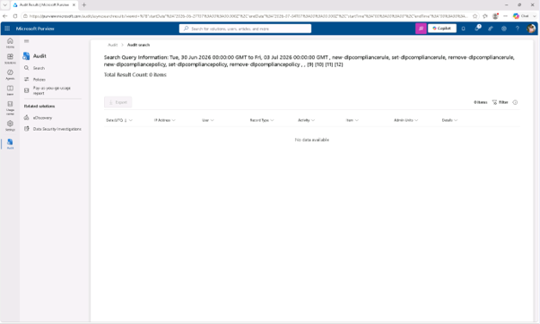

# 작업 2: 감사 검색 결과 내보내기
이 작업에서는 오프라인 분석이나 준수 기록 관리를 위해 DLP 감사 검색 결과를 내보내야 합니다.

 
1.	Microsoft Purview에서 [솔루션] – [감사]를 클릭합니다.
 

 
2.	검색 페이지에서 이전 작업에서 생성한 DLP 정책 활동 검색을 선택하고, 페이지 상단에서 [내보내기(Export)]를 클릭합니다.
 

 
 
3.	확인 대화상자에서 [확인]을 클릭하여 내보내기를 진행합니다.
 

 
4.	내보내기가 완료되면 녹색 배너에서 다운로드 파일 링크를 선택하세요. '내보내기가 완료되었습니다.
 

  
5.	감사 내보내기 파일은 CSV 형식으로 저장되며, 모든 텍스트 편집기나 스프레드시트 애플리케이션에서 열어 분석을 용이하게 할 수 있습니다. 
 
