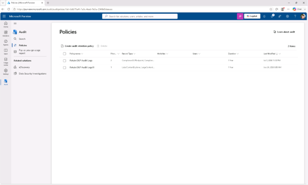
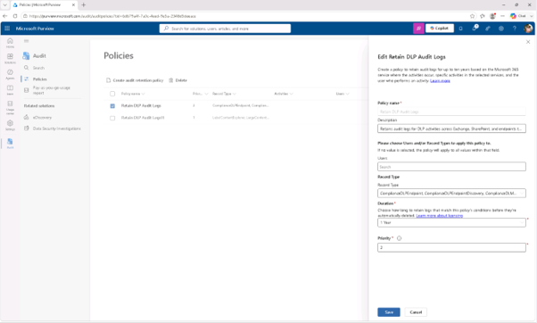

# 작업 3: 감사 유지 정책 수립
이 작업에서는 DLP 매칭과 행동과 관련된 로그를 장기 조사를 위해 보존하는 감사 보존 정책을 설정해야 합니다.

 
1.	Microsoft Purview에서 [솔루션] – [감사]를 클릭합니다. 
 

 
2.	왼쪽 사이드바에서 [정책]을 클릭합니다.
 

 
3.	정책 페이지에서 [감사 보존 정책 생성(Create audit retention policy)]을 클릭 합니다.
 
 

 
4.	새로운 감사 유지 정책 패널에 다음과 같은 내용을 소개합니다:

+ 정책 명칭: Retain DLP Audit Logs
+ 설명: Retains audit logs for DLP activities across Exchange, SharePoint, and endpoints to support investigation and compliance.
+ 사용자: 모든 사용자에게 적용하려면 빈칸으로 남겨두세요
+ 기록 유형:
  + ComplianceDLPEndpoint
  + ComplianceDLPExchange
  + ComplianceDLPExchangeClassification
  + ComplianceDLPSharePoint
  + ComplianceDLPSharePointClassification
+ 기간: 1년
+ 우선순위: 1
 

 
5.	감사 보존 정책을 생성하려면 [저장]을 클릭합니다. 1년간 DLP 매칭과 활동 로그를 보관하는 감사 유지 정책을 설정하였습니다. 
 