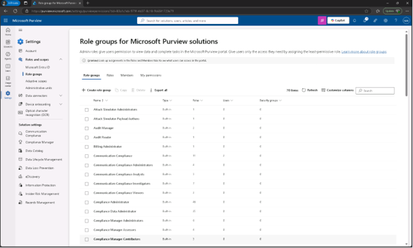
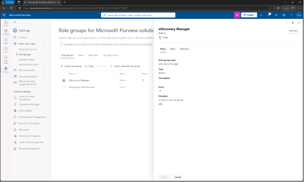
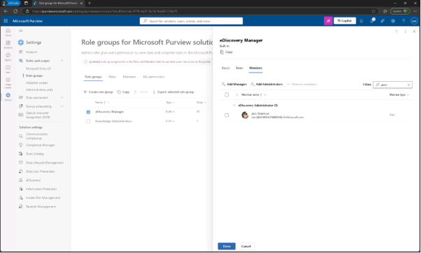
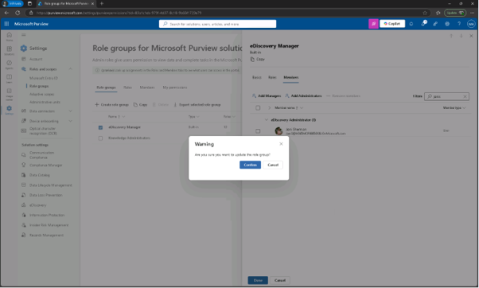

# Lab11 – 콘텐츠 검색
민감한 금융 데이터가 유출되었을 수 있다는 경고를 받았습니다. Microsoft Purview를 사용해 Microsoft 365 서비스에서 주요 금융 용어가 포함된 콘텐츠를 검색하라는 요청을 받았습니다. 귀하의 목표는 민감한 콘텐츠가 부적절하게 공유되었는지 확인하고 조사를 지원하는 것입니다.

## 작업 1: eDiscovery 권한 할당
이 작업에서는 Joni Sherman에게 전자 발견 권한을 할당하여 Microsoft Purview에서 콘텐츠 검색을 수행할 수 있게 합니다.

 
1.	https://purview.microsoft.com 로 이동하여 MOD 관리자로 로그인 합니다. 
 

 
2.	왼쪽 사이드바에서 [설정] – [역할 및 범위] – [역할 그룹(Role groups)]을 클릭합니다. 
  

 
3.	Microsoft Purview 솔루션 역할 그룹에서 를 검색한 후 [eDiscovery Manager]를 클릭합니다. 
 

 
4.	eDiscovery Manager flyout 패널에서 [편집]을 클릭합니다.
  

  
5.	[관리자 추가(Add Administrator)]를 클릭하고 jonis@ 계정을 선택하고, 추가합니다. 
  

 
6.	역할 검토 그룹과 완료 페이지에서 [저장]을 클릭합니다. 
  

 
7.	'역할 그룹 업데이트 완료' 페이지에서 [완료]를 클릭합니다.  Jonis@ 계정은 eDiscovery 권한을 부여하고, 이는 조사의 일환으로 민감한 콘텐츠를 검색할 수 있도록 설정하였습니다. 
 